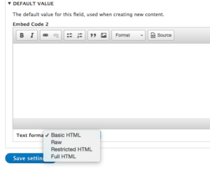
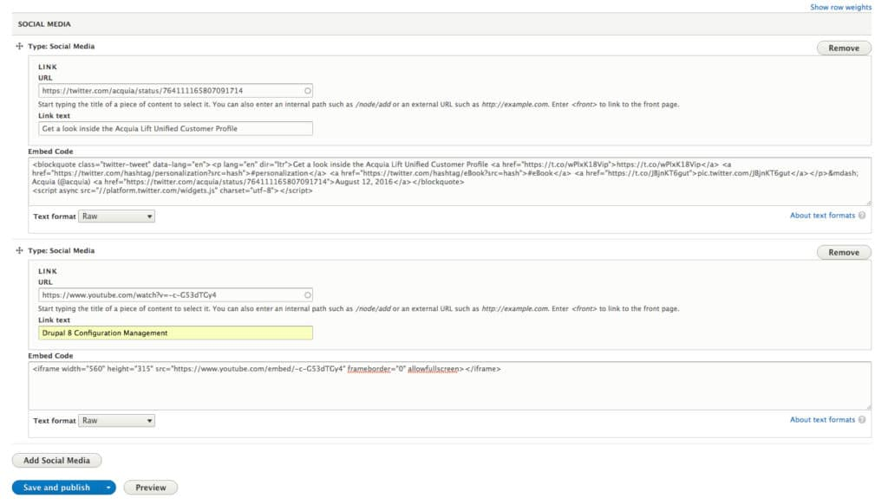
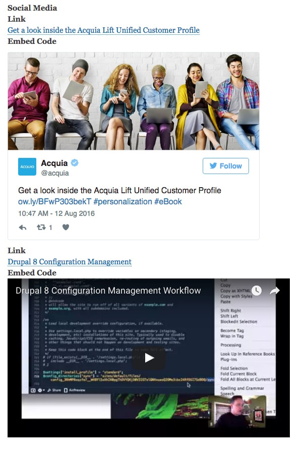

I have to be honest, before completing Day 2 tasks, I had never actually used the Paragraphs module before. I heard others mention it in the past and considered looking at it at some point, however until today I did not realize what I was missing in terms of the power and flexibility that this module has to offer. The d8cards.com Paragraphs Module card begins with directing you to YouTube tutorial by Zane Sensenig, embedded below.

https://www.youtube.com/watch?v=YqtCv7KEUis

This is a great tutorial for a quick overview of what Paragraphs can do for your Drupal site and how to integrate a basic example within a content type. Basically the module allows you to define and group fields that can then later be added to a content type of your choice. It provides a way to introduce more complex UI elements such as sliders, social media integration and other site assets that would traditionally involve coding. By using Paragraphs you can essentially control and provide a more user friendly experience for your content editors by providing the toolset they need right within the editor section of Drupal. Paragraphs essentially splits up an editing experience from relying too heavily on lots of embedded code in one editor, to a multitude of different fields and options that give the content author a more streamlined experience. The video above demonstrates some of these benefits.

## Paragraph Types

Referring back to Day 2, several tasks are provided to install the Paragraphs module and then configure it within the article content type to allow for embedded social media. One of the first things you'll end up doing with Paragraphs will be to create a 'Paragraph Type' which is essentially a set of fields. For the exercise you are tasked to create a social medial type which includes an embed code field as well as a link field. Once created you will see the new paragraph type as a field option when adding a new field inside a content type.

One of the first road blocks I hit was actually defining the embed code field. I tried first of all setting up a long plain text field and thought by adding a 'Raw' text format (as directed in the card) I could apply this to my new field. I quickly realized text formats can only be added to the text 'formatted' fields so I went back and corrected this.

## Editing and Viewing Paragraphs Content

After creating my new Paragraph Type titled 'Social Media' I proceed to add it as a field to the Article content type. After successfully doing this I was able to create new content using paragraphs.

As you can see from the screenshot above, the Paragraph field integrates seamlessly into the Drupal edit content form allowing the user to add as many paragraph fields as desired. The resulting output can be viewed below.

More work can be done here obviously with styling using the new Twig templating system in Drupal 8 and links are provided in Day 2 to get started with this. However in terms of functionality and getting started with Paragraphs, little time was needed to complete this basic example. I am sure the more I dig into the module the more applicable uses I will find in my own projects in the near future. In the meanwhile, if you want to learn more about Paragraphs and other Drupal 8 topics, be sure to check out d8cards.com.
