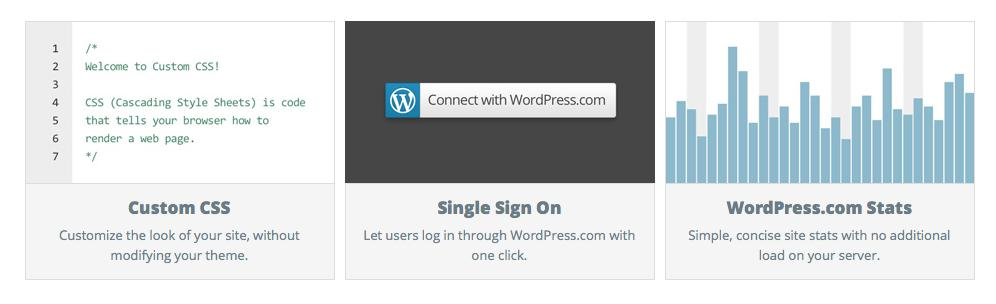
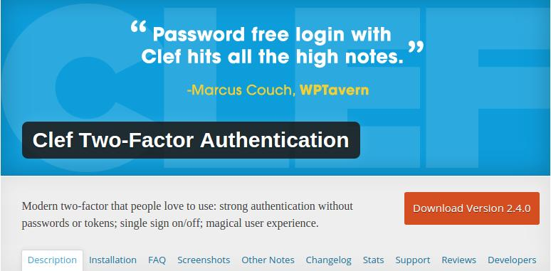

Dual factor authentication has become one of the most important security features in the last few years. Major websites like Google Mail, Outlook, Facebook are now protecting user accounts in a better way by allowing them to use a mobile device as their identity.

To activate 2 step authentication, the service provider will ask you to install Google Authenticator app (or any of its alternative). Some websites will ask you to verify the mobile phone number so that the authentication service will send a 4 or 5 digit code when required. This code will be used for one-time verification, and it will be valid only for a few hours.

If you’re using WordPress, you can easily protect your valuable website with a two-factor authenticator plugin. Before having a look at the plugins, let’s understand why this feature is important and useful:

**The site is secure**: Forget the login limiter or a security plugin, If 2 step authentication is enabled on your website, no one excluding you will have access to the WordPress dashboard. Even if someone gets your password, he will have to enter the authentication code generated by the app or send to your phone.

**Free**: 2 step authentication is free. You don’t have to buy any WordPress security plugin to protect the website. Follow the setup instructions and done!

### Best Plugins

**Jetpack**:

Yes, your favorite plugin can protect your website. If you’ve enabled JetPack, visit its settings page and turn on the single sign-on module. Now visit WordPress.com and enable two-factor authentication.

Follow this tutorial. Reconnect jetpack with your WordPress.com. Edit the WP-Config.php file and enter this filter code shared by Carolyn Sonnek. If the authentication service is active, you will find its confirmation message in the WordPress dashboard’s user profile page.

**Download Jetpack here.**

**Clef**:

If you don’t want to use Jetpack, install Clef. The plugin is highly secure as the RSA encryption algorithm powers it. It allows you to enable the password free login feature in WordPress. Like JetPack, Clef uses your mobile as your identity.

When you enable this plugin, your WordPress website will be protected from brute force login attempts. The site will also be safe from phishing attempts. You won’t have to worry about the password strength nor will you have to remember the password.

**Plugin Download link**

**Conclusion**: If your website is earning money online for you, make sure you strengthen its security by installing one of the above two plugins. Jetpack is awesome. You should use its SSO feature. Clef is a good alternative to JetPack SSO.
