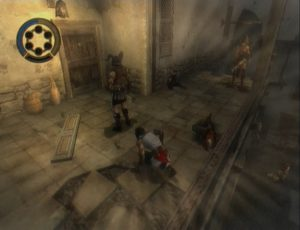
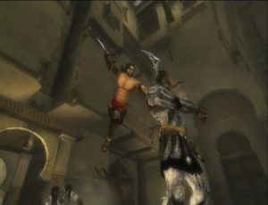

Too often adored and envied for their destiny out of the men elevated to hero often lead a life similar to that of the martyrs. Exhausted by years of wandering and fighting, he could push past his fight against the Dahaka and the curse of the sands of time, the Prince of Persia was an illusion to believe that he would finally know peace. But fate hounds brave men, and most recently, the tired hero takes up arms to face his worst enemy: himself. The scenario of evil Prince of Persia: Rival Swords is one of those who make you want to make a novel. All players who have overcome the hardships of the first two components together with the Prince know that we cannot forever endure such tortures without paying the price. Returned to Babylon with Kaileena, the Empress troubling time, the prince, nobody knows the name, discovers a city ravaged by war, a kingdom invaded by rivals more cruel than those which it has dealt so far. Therefore, the story starts quickly, leaving not even the soul time to break under the harsh fate that has befallen him. Victim of a conspiracy organized by a manipulative and tyrannical Vizier, Kaileena is killed in front of his eyes. Prince powerless to release the sands of time, even letting himself be contaminated by those who make the chew from the inside, corrupting his soul to bring out the evil that is in him and materialize in the form of sadistic entity: the Dark Prince. From a quality equivalent to the Two Kingdoms on GameCube, the achievement is as compelling and captivating. The opposition between the high and low quoted cities renews perfectly sets and the atmosphere that emanates from, and the animations are still among the very best at the moment.

In terms of gameplay, Rival Swords has a large number of assets that make the playing experience exciting. Impeccable handling with the Nunchuk and the Wiimote makes it more immersive than ever. The power of the sands of time, acrobatics, fighting inherited from the Soul of the Warrior, but the performances make sly adventure, including chariot races and confrontation against Dante bosses. The game has a characteristic lifetime of this type of games, neither too long nor too short, but enough to want to go without feeling the slightest fatigue. We still regret the absence of a progression, and the moderately interesting hunt to unlock bonus gallery of images.

The atmospheric sound has nothing to do with the previous element that had been shocked by her aggressiveness. Music is much better for the atmosphere of the game, even if the voices are usually silenced, especially during the cinematics. Even more than in the past, efforts to this valiant warrior who has felt able to defy fate and who now suffer the consequences. The secondary characters are few but they all have a story that deserves to be told and heard.

Because it is undoubtedly one of the best games in recent years, Rival Swords is a mandatory purchase for all those spent alongside Prince of Persia: The Two Kingdoms. The others did not find much new, but handling the Wiimote and the Nunchuk is so intuitive that takes obvious pleasure to relive the fascinating fate of the Prince of Persia cursed. Although it is regrettable not to have to deal with a new episode, the note should reflect primarily the undeniable quality of soft. From there, you realize that the title subjugates and impresses as much as in its first form in the two kingdoms, especially that he has really lost nothing of its superb.
