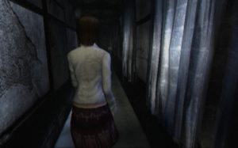
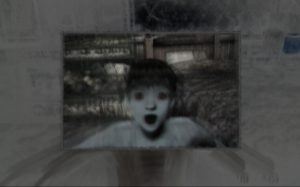

Remained in the shadow of Resident Evil (with whom it has little in common) and Silent Hill, Project Zero is still a safe bet in survival-horror. Better still, it is complementary to the two sets mentioned above in its construction based on the constant effects of surprise to even make you jump like a frightened virgin. Mask of the Lunar Eclipse is of course no exception to the rule and do not forget to maintain multiple links screenplay with his elders.

Using imagery conveyed by the Japanese and Korean horror film in the last ten years, Project Zero recycles at all costs. From Ring to Ju-On via Dark Water, the tetanize Two Sisters or the interesting Reincarnation, the series by Tecmo sprinkle each of its episodes with passages where the macabre poetry alongside the effects of style sometimes phoned but often striking. In fact, find anything on Wii that made the success of the series on PS2 is not a real surprise in itself.

Without revealing the ins and outs of the story, say it is closer in its atmosphere and architecture to the third episode in the sense that you can embody neither one nor two, but really three young ladies. Operating in the same space that is still looking like a gloomy mansion, lost on the island of misty Rogetsu and secondarily filled with ghosts a bit sticky, the ladies will have to visit the building to discover their past in a sacrificial ceremony. The adventure thus invites us to switch between them depending on the chapter composing this new Project Zero to seek the why and how. As I mentioned earlier, the way does not change an iota, the title playing on the same fears that its predecessors. In fact, do not be surprised to encounter moult ghosts always as receptive to your heavenly camera capable of photographing Amy Winehouse during her fifteenth detoxification wherever you are in the world. In short, a delight for the paparazzi that will be only and exclusive in Project Zero. As usual, you can customize your device and find different types of films more or less powerful.

For the gameplay, saying it does not really evolve because controls are only fitting to the new support. For example, to make a turnaround at 180°, you will need to make a rapid movement of the Wiimote, the object that will also be used to escape from the clutches of an ectoplasm. Of course, the Wiimote, coupled with the Nunchuck, will also move the camera angle to cover the phantoms. In this connection, the shooting remains the same and you will be asked to frame for a few seconds to achieve a picture more or less lethal. Knowing that normal mode, the ghosts have a very good constitution, providing for the departure of the 14 films to be ready for anything, especially during a battle taking place in a small space. In short, Project Zero: Mask of the Lunar Eclipse has copy and paste to capitalize a little more on a good franchise but beyond the feeling of déjà vu, it would be hypocritical not to admit that it works still devilishly good. As such, the atmosphere has much to achieve perfectly, fast and a scary sound is that playing heavy music and a multitude of small sound giving the suffocating atmosphere. It is regrettable that big delays when opening several doors probably mean hidden loadings. Despite this, it is hard to not shudder facing the parade millimeter spectra we determined to bury six feet under...
