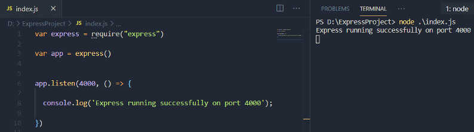
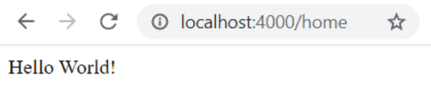
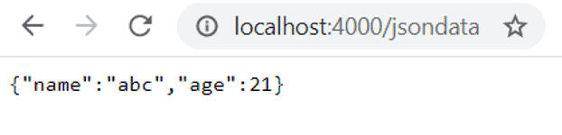
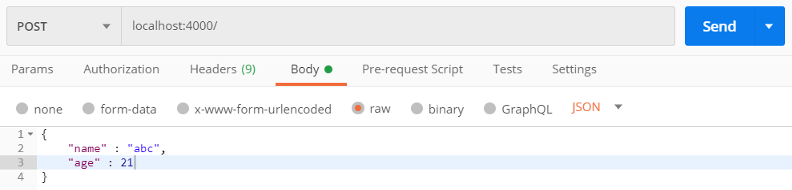
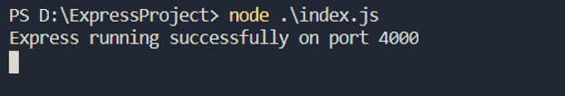
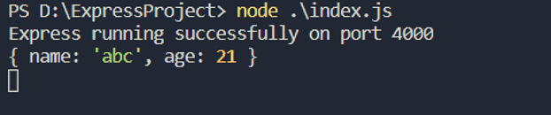
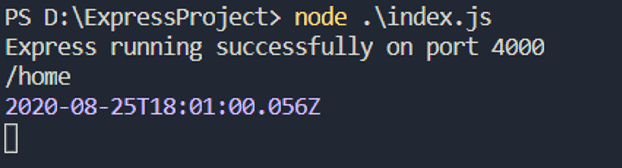
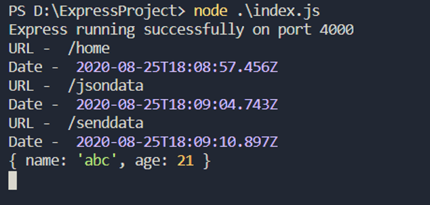

If you have ever come across Node.js, then you may have heard the word "Express.js". Express is also a part of popular full-stack web development stacks - MEAN and MERN. M, A/R, and N, meaning MongoDB, Angular/React, and Node.js, respectively are very popular in the web development community, while E, i.e. Express.js is unpopular. Many developers who work with MEAN or MERN stack don't even know what is the exact meaning of express. So in this article, we will discuss express.js with examples.

## What is express.js?

Before moving to express.js, let's take a brief look at node.js. Node.js is a JavaScript runtime environment that executes JavaScript outside the browser. In simple words, Express.js is a framework for node.js. It is the most popular framework which is used to create node applications. This framework offers many features. For example, it enables a developer to create web servers with ease, better readability, and flexibility.

The node HTTP library can also be used to create a server but is complicated. Express.js prevents such complications and lets us create servers with ease. So let's start by creating a web server using express.js.

## Creating a web server

Start by creating a new directory and then use the following command to create a package.json file.

```bash
npm init --yes
```

This file, package.json is a kind of manifest for the application. It holds the metadata relevant to the project.

Let's install express.js. It is available in NPM.

```bash
npm install express --save
```

Now we can create a server. Let's do it step by step.

Create a file and name it "index.js". To use express.js in the file, first, we need to import it.

```javascript
var express = require("express")
```

Next, we need the reference of express to set up the application.

```javascript
var express = require("express")
var app = express()
```

These two lines are very important. The "app" variable will be used in the file to create the server and do other important things. Now we need the application to run on a specific port. The "listen" function will help us.

```javascript
var express = require("express")
var app = express()

app.listen(4000, () => {
  console.log('Express running successfully on port 4000');
})
```

The "app.listen" has two parameters - port number and a callback function. Basically, this function informs the server to listen for connections at a particular port. In our case, the server will run on port 4000 and it will print "Express running successfully on port 4000" in the console if the connection is successful.

Let's execute the above code.



The connection is successful! Creating a web server with express is this easy and simple. The server is running on localhost. So we can also access it through a browser. For this, we need to understand Routing.

## Routing with express

Routing is a vital part of server-side development. It is a method in which routes are created so that the required function can be invoked. Every web application has several URLs or routes. For example, one for the homepage, another for the about page, and many more. Each of them has a different route. So controlling this navigation is routing.

There are four common methods - GET, POST, PUT, and Delete.

1. **GET** - It is used to handle a GET request. A GET request is used to fetch the data.
2. **POST** - It is used to handle a POST request. A POST request is used to send the data.
3. **PUT** - It is used to handle a PUT request. A PUT request is used to update the data.
4. **DELETE** - It is used to handle a DELETE request. A DELETE request is used to remove the data.

There are a few more methods. But these methods are used commonly.

Let's start with a simple example.

```javascript
var express = require("express")
var app = express()

app.get('/home', (req, res) => {
  res.send('Hello World!');
});

app.listen(4000, () => {
  console.log('Express running successfully on port 4000');
})
```

Observe the "get" method invoke using the "app".

```javascript
app.get('/home', (req, res) => {
  res.send('Hello World!');
});
```

This is called a route handler. It has two parameters - pathname and a callback function. The callback function, in turn, has two parameters - request and response. Whenever the path, '/home' will be executed, this route handler will be invoked. The request associated with this callback function has information sent by the client while the response has the information that we want to send back. Both of these are objects.

In the function body, we are using the response (res) to invoke the "send" method. So this line will send "Hello World!" back to the client. Let's start the server and then execute the following URL in the browser.

```bash
localhost:4000/home
```

The server is running on localhost 4000 and the route name is "/home". So this will invoke the route handler we created.



"Hello World!" is displayed on the screen.

In the real applications, you will rarely send a simple string to the client-side. Usually, it is a JSON object which is sent to the client, and then the client manipulates it according to the requirement. For example, if you are using MongoDB as the database, then the response from the DB will be in the JSON format. So let's understand how to serve JSON with express.

Let's create another route handler.

```javascript
app.get('/jsondata', (req, res) => {
});
```

Whenever the path "/jsondata" is executed, this route handler will be invoked. As we do not have a backend, we will send a static JSON from here only. For this, we need the "json" function.

```javascript
app.get('/jsondata', (req, res) => {
    res.json({ "name" : "abc", "age" : 21 })
});
```

So the JSON object will be replaced by the object coming from the backend in the real application. Let's add this to the "index.js" file.

```javascript
var express = require("express")
var app = express()

app.get('/home', (req, res) => {
    res.send('Hello World!');
});

app.get('/jsondata', (req, res) => {
    res.json({ "name" : "abc", "age" : 21 })
});

app.listen(4000, () => {
  console.log('Express running successfully on port 4000');
})
;
```

Now, when we restart the server and execute "localhost:4000/jsondata" in the browser, we will get the following response in the browser.



Well, this is simple but believe me, it plays a very important part while working in a real application.

Another important method is the POST method.

The POST request sends data to the server. As we do not have a client-side, we will use the postman tool to understand the POST request. The postman tool is very easy to use.

Let's create a new router handler to handle a POST request.

```javascript
app.post('/senddata', (req, res)=>{

})
```

For a POST request, we will use the "post" method. The parameters are similar to the get method. Let me add one line in this route handler and then we will discuss.

```javascript
app.post('/senddata', (req, res)=>{
    console.log(req.body)
})
```

Earlier, we were not using the first parameter of the callback function, i.e. request (req). The request is the information sent to the server. "req" contains the information with is present in the "body". It will be a JavaScript object.

Let's send a JSON from the postman tool to the server.



This JSON is coming as a request to the router handler we created. Let's add this to the "index.js" file.

```javascript
var express = require("express")

var app = express()
const bodyparser = require('body-parser')

app.get('/home', (req, res) => {
    res.send('Hello World!');
});

app.get('/jsondata', (req, res) => {
    res.json({ "name" : "abc", "age" : 21 })
});

app.post('/senddata', (req, res)=>{
    console.log(req.body)
})

app.listen(4000, () => {
    console.log('Express running successfully on port 4000');
})
```

Now, we will restart the server, execute the route from the postman (with the request body), and then check the console.



Nothing happens! But why? We need middleware to parse the JSON. We will discuss middleware shortly but first, let's install the "body-parser" middleware using NPM.

```bash
npm install body-parser --save
```

The "body-parser" will enable us to parse the data from the request body. Add the following lines of code in the file.

```javascript
const bodyparser = require('body-parser')
app.use(bodyparser.json())
```

First, the body-parser is imported and then used. Now, let's repeat the steps to execute the post route handler.



The same data we sent through the postman is displayed in the console.

Similarly, we can create PUT and DELETE requests using the "put" and "delete" methods, respectively.

## Middleware

A middleware is a function that has access to the request and response objects. It also has a "next" function which passes the execution to the next middleware or route handler. For example, the body-parser is a middleware that is installed through NPM. When the POST request was made, the body-parser middleware parsed the request object before passing it to the route handler. Well, we were already using

We can also create manual middleware functions. Let's create one.

```javascript
const demoMW = (req, res, next) =>{

}
```

A middleware function has three parameters - request, response, and next. We already know the first two, the third one is new. It is a function that will tell the execution to move to the next part.

Let's make some changes to the demoMW.

```javascript
const demoMW = (req, res, next) =>{
	console.log("URL - ", req.url)
    console.log("Date - ", new Date())
    next()

}
```

The "demoMW" will give the URL of the route and a timestamp when it is executed. Observe the last line of the middleware - next(). It is necessary to call the "next" function if you don't want the execution to stop at this point.

Now, say we want this middleware to be executed only when the path, "/home" is executed in the browser. We can simply pass this middle as a parameter in that route handler.

```javascript
var express = require("express")

var app = express()
const bodyparser = require('body-parser')
app.use(bodyparser.json())

const demoMW = (req, res, next) =>{
    console.log("URL - ", req.url)
    console.log("Date - ", new Date())
    next()
}

app.get('/home', demoMW, (req, res) => {
    res.send('Hello World!');
});

app.get('/jsondata', (req, res) => {
    res.json({ "name" : "abc", "age" : 21 })
});

app.post('/senddata', (req, res)=>{

    console.log(req.body)
})

app.listen(4000, () => {
    console.log('Express running successfully on port 4000');
})
```

Observe the route handler for '/home'.

```javascript
app.get('/home', demoMW, (req, res) => {
    res.send('Hello World!');
});
```

We can pass as many middlewares but only after the first parameter and before the callback function.

The middleware will only execute for '/home'.



Now, suppose we want to execute this middleware for every route. We can simply use the "app.use" method and pass the middleware to it. This way, the "demoMW" will execute every time a route is executed. Let's do it.

```javascript
var express = require("express")

var app = express()
const bodyparser = require('body-parser')
app.use(bodyparser.json())

const demoMW = (req, res, next) =>{
    console.log("URL - ", req.url)
    console.log("Date - ", new Date())
    next()
}

app.use(demoMW)

app.get('/home', (req, res) => {
    res.send('Hello World!');

});

app.get('/jsondata', (req, res) => {
    res.json({ "name" : "abc", "age" : 21 })
});

app.post('/senddata', (req, res)=>{
    console.log(req.body)
})

app.listen(4000, () => {
    console.log('Express running successfully on port 4000');
})
```

It is done in a similar way we used the body-parser middleware. Let's execute different routes and check if it works or not.



## Conclusion

Express.js is used for some really important tasks. Creating a server is one of the initial tasks and we discussed how easy and simple it is to create a web server using this framework. Another crucial task is routing, which Express also simplifies to a great extent. In this article, we discussed routing and its methods along with implementing GET and POST requests. PUT, and DELETE are constructed in a very similar way. Finally, we also covered Middleware and how it can be easily implemented in an Express application.

I hope the introduction helped your understanding of express.js and how it is used with node.js.
