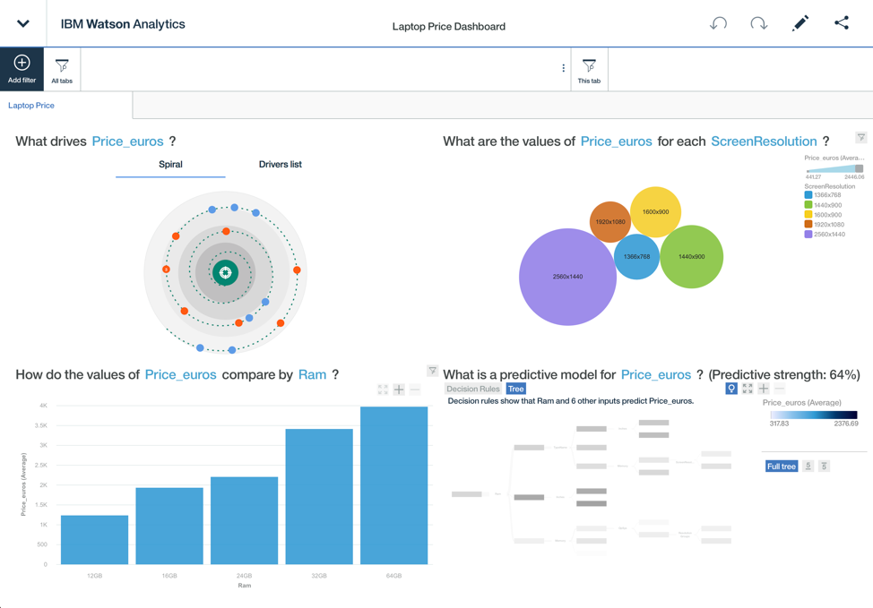
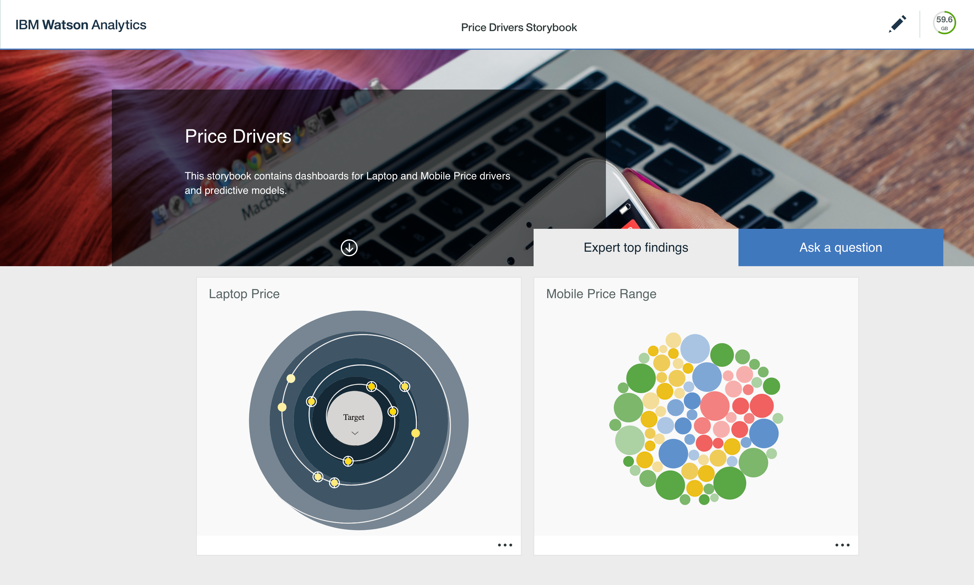

Watson Analytics provides a powerful suite of display and rapid reporting options. This article looks at two distinct datasets from Kaggle, Laptop Price and Mobile Price Classification. By using the display options available within Watson Analytics, the ability to create a compelling story possible. Both sets of analysis are focused around the target variable of price (or price\_range), and the details of these datasets have been included below for reference. Laptop Price consists of records of various laptop models, that were last updated six months ago from writing, adding additional laptop characteristics and prices. Mobile Price Classification provides data on mobile phones including price range classifications.  Analysis of data quality and cleansing will not be discussed in this article. Rather the focus of building compelling visualizations and telling a story are the priority here.

## Discoveries

Watson Analytics has been built to be accessible to non-technical users. It provides a set of tools for discovering patterns within datasets and building interactive visualizations. One of the key features of the application is Natural Language Processing. According to Liddy (2001), Natural Language Processing is a range of computational techniques for analyzing and representing naturally occurring texts at one or more levels of linguistic analysis for the purpose of achieving human-like language processing for a range of tasks or applications. In Watson Analytics, generating visualizations and reports for management is done in three main stages:

- Data Refinement: Cleansing and refining, and grouping datasets
- Discovery: Using NLP to generate visualizations and predictive models
- Display Generation: Building dashboards, infographics and expert storybooks

As mentioned earlier, no further cleansing or refinement of the data has been done for the purposes of this paper. We will be looking primarily at the second two stages, which include discovery and display generation.

### Laptop Discovery

In this discovery set, price\_euros (or price) was the target variable and is shown in the very first visualization below. Several other main visualizations were created as documented below, which focus on price drivers including a decision tree:

- Price Drivers: What drives price\_euros?
- Price by RAM & Price by RAM (Filtered): How do the values of price\_euros compare by ram?
- Price by Resolution & Price by Resolution (Filtered): What are the values of price\_euros for each screen resolution?
- Price Decision Tree: What is a predictive model for price\_euros?

In two of the discoveries, further filtering of the data was required to provide meaningful results. This was the case with both Price by RAM and Price by Resolution. For Price by RAM, the number of options of RAM was reduced to provide a greater understanding of the impact on price. This involved filtering out lower RAM amounts. In the dataset, the resolution value was combined with other attributes including the type screen, touch screen features, etc. In order to get a more meaningful visualization, only those values that contained the actual resolution was used in the filtered discovery.

### Mobile Phone Discovery

In this discovery set, price\_range was the target variable, complimented by several other visualizations including another decision tree model. All visualizations have been included in Appendix 5-8. The visualizations in this discovery include:

- Price Drivers: What drives price\_euros?
- Ram to Price: What are the values of ram for each price\_range?
- Battery Power to Price: What are the values of battery\_power for price\_range?
- Price Decision Tree: What is a predictive model for price\_range?

Each of the visualizations supported the story behind those factors that drove price range. The first visualization, Price Drivers, utilized a spiral chart to illustrate the top factors impacting price. This was later converted into a decision tree in the last visualization described above.

## Displays and the Expert Storybook

Once the main discoveries had been created, the next step was to publish these into displays that would be suitable for management or other project stakeholders. The display options in Watson Analytics provides various options for creating:

- **Dashboards**: Layouts that provide tabbing or grouping functionality and display of key discoveries
- **Infographics**: One-page layouts that provide a single formatted container for all key discoveries
- **Expert Storybooks**: Report style functionality that house multiple dashboards and infographics

Two main dashboard displays were created, laptop price dashboard, and mobile price range dashboard. Both of these dashboards were assembled using the drag and drop tools provided within Watson Analytics.

To create the dashboards, the various discoveries that were generated earlier were chosen and placed in the display. Each of the dashboards were broken down into four visualizations. Since they were both based off different datasets, but drew resemblance in the target variable, each started with the drivers of price on the top left-hand corner. Other charts supported the various drivers using different chart options to provide a visually appealing overview of the data. The visualization on the bottom right corner of each dashboard represented the predictive model in the form of a decision tree along with the associative predictive strength.

Bringing everything together was where Watson Analytics provided the greatest benefit in the form of an expert storybook. The story book, illustrated below, provided a professional looking cohesive reporting tool that was production ready for management review.

The story book encapsulated both dashboards created under displays, allowing the an easy to navigate format for the user, who could quickly switch within both datasets. In addition, the expert storybook also provided an interface for accessing the Natural Language Processing question functionality. This in itself is a very powerful addition to any report, allowing non-technical users to gather more insight from the datasets available within the story book.

## Usefulness of Information and Results from Displays In Real Life

In my organization, we manage a lot of projects that collect large amounts of data. There are sophisticated software and tools available to the project teams and analytics personnel, however they require expert technical understanding in order to use effectively. On the other hand, we also have a lot of staff with expert domain knowledge, who do not have the level of technical expertise needed to use these tools. Watson Analytics could effectively provide a way for non-technical project members to have greater access and insight into the data we manage. In addition to this, the value of being able to rapidly develop and distribute insightful dashboards and infographics would be extremely beneficial to the highly agile nature of our project teams.

The only resistance to using a tool like Watson Analytics would be from a security standpoint. Because the tool is cloud-based and a lot of the data we collect contains Personally Identifiable Information (PII), using Watson Analytics may not be possible within certain subsets of data, unless filtered or parsed before using on this platform. The benefits are however compelling and it would be interesting to see how Watson Analytics could provide value and insight to personnel that it was not previously accessible to.
