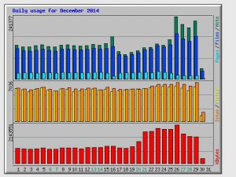

If you've signed up for a limited hosting limited plan, then follow the below tricks/methods to reduce the bandwidth usage for your site. I've successfully implemented the below tricks in one of my site, and the bandwidth usage has reduced by 25 percent.

## Reduce Image size

Using large images of a site can kill hosting bandwidth within a week unless you're signed up for an unlimited hosting plan. If you're using a content management system like WordPress, plugins like EWWW Image Optimizer or WP Smush it can take care of pictures you upload. If you've developed your site from scratch, then you should use Yahoo's smushit online tool. The tool will reduce image size without affecting its quality.

## Use Bootstrap CDN

It is a free service provided by Max CDN. This service allows webmasters to link JavaScript and CSS files hosted on MaxCDN servers to their websites. If your site has JS files of 100Kb size, then its bandwidth usage will cut down by 100 KB per 1 user visit if you use Bootstrap CDN. MAXCDN has data centers in many major countries. Thus, its performance is exceptional. You can also use Use Google hosted JavaScript and CSS libraries to reduce bandwidth usage for a site.

## Enable GZip Compression

Some hosting services will automatically compress your site in Gzip format before any byte of data is sent to the client's computer. If your hosting provider doesn't have this feature, then you follow this tutorial to enable Gzip compression for your site.

## Specify an Expiry time for static files

This is a crucial tip to reduce bandwidth usage for a site. If you add expiry time of 30+ days for .css, .png, .jpg and .js files then the visitor's browser will store all files in these four formats for 30+ days. Thus, when the same visitor opens your website, the static content will be loaded from his computer. Specifying expiry time will also improve your site's page loading time.

## Minify HTML, CSS and JavaScript files

Minification removes new line characters and redundant code from your website's assets. Thus reducing the size of the CSS, HTML, and JavaScript files. Users using the WordPress CMS can make use of W3TC (WordPress total cache) plugin. This code will reduce not only cache all your posts, pages but it will also minify JS, HTML, and CSS files.
