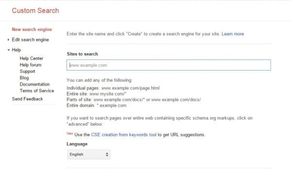
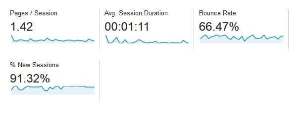

In my perspective, bounce rate (BR) is one of the major search engine ranking signals for a blog. If it's below 70, search engines like Bing, Google will love your site, and they'll rank it higher than low-quality sites. If your site's BR is high (above 90), it will rank low in search engines. If you're an owner of such website, use the below strategies to reduce bounce rate.

### Add a search widget in sidebar

Believe it or not guys! The search bar is one of the most important elements on a blog. All top blogs in the world will have a search utility. When a visitor lands on your website and doesn't find a relevant article, he/she will use the search utility to find a relevant article. If your blog navigation is not good, the search bar will come in rescue. If your site doesn't have it, add a search bar immediately. You can create one for your blog with Google CSE.

### Choose a template/theme with sticky navigation

If you're blogging or WordPress platform, make sure that you use a responsive theme with sticky navigation and sound design. Many top ranking and high traffic site have a good navigation system. Their owners make wise use of attractive and bright colors to improve user engagement. In sticky navigation (menu bar), add the hottest and most visited categories/tags as menu items. Doing this will ensure that the compelling content & menubar is always accessible to the visitor.

### Publish high-quality articles

A high bounce rate blog will always have low-quality posts. If the visitor finds that a blog post is not up to the mark or incomplete, he'll hit the back button of the browser immediately. If a visitor finds your article through search engines, such activity from him/her will hurt search engine rankings of your website. To avoid this scenario, make sure that you publish only well-written posts with complete information.

### Add Related post widget with thumbnails

Yarpp is an excellent free WordPress related post plugin. You can configure it to show thumbnails. To reduce bounce rate of a blog, just install this plugin and make it display relevant post immediately after the end of the article. If you have tried this strategy and had no luck with this strategy, add Yarpp widget to the sidebar. You can also use Outbrain, LinkWithin or Zemanta for the same.

Must Read: A small orange hosting review and coupon codes

### Reduce advertisements:

When a user or search engine visitor clicks on any ad on your blog, a new web page will be opened. Some advertising platforms don't add target=\_blank attribute to their ad units. Thus ads can be considered as a reason for high bounce rate. For example, if you've added AdSense ad unit immediately after the 1st paragraph of your article and if a visitor clicks on this unit, a new website will be loaded in the current tab of your web-browser. As the user has spent very less time and as he/she has not opened any other article on your site, the BR will increase.

I hope you've found the five tips to reduce blog bounce rate useful.
