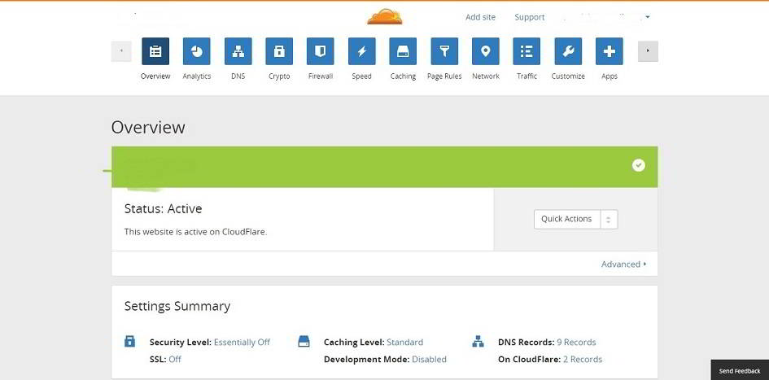

Shared hosting plans are relatively cheap as compared to VPS or dedicated hosting. This is because your site will be offered around 512MB RAM (or lower) and a CPU, which will be shared by many other websites.

Sites that are growing at a very fast rate should always be hosted on VPS servers (use dedicated if you require more RAM). If they're hosted on Shared platform, their account might be suspended because of very high CPU usage.

Website traffic is not the only reason why your site may be banned. Poorly written WordPress plugins or code modification by the user which results in an infinite loop are two main reasons for high CPU usage. Today, we'll share some useful tips that will reduce CPU usage in WordPress shared hosting environment. If your hosting provider has warned you because of your site's high server resource consumption, follow the tips we've shared below to avoid a permanent ban from the hosting service provider.

### Use plugins only when required:

Plugins are an integral part of the WordPress content management system. They are useful, but plugins can impact your website's loading time. They are also responsible for high CPU usage in WordPress.

GoDaddy's P3 performance profiler will make you aware of WordPress plugins that are causing high CPU or RAM usage problems. When you install any plugin, make sure that your run P3 to check its performance.

To avoid hosting related problems, you can also replace plugins with a desktop software.

For example, I have replaced WP Smush It alternative i.e., EWWW optimizer plugin with a desktop software that reduces the size of images without affecting the quality.

The online broken link checker is an excellent alternative to WordPress BLC. If you want to keep using this plugin, configure it in such a way that Broken link Checker plugin doesn't increase CPU load. If you're searching for its alternative, I would suggest you to download Xenu Link Sleuth.

Some premium themes will require you to regenerate thumbnails. There's a plugin for the same in WordPress repository. When I used this plugin after activating a premium WordPress template, My hosting provider dispatched a warning email to my inbox with a clear message that my site will be suspended if its causes CPU related problems in the future.

### Use CloudFlare or any other CDN service

Cloudflare is one of the best CDN providers in the world. It makes your blog blazing fast by allowing you to enable minification, rocket loader, etc. CloudFlare is free, but it also includes paid plans. If your website is getting massive traffic, you should upgrade your account.

Cloudflare has analytics feature. It has security settings. If you configure these settings correctly, your site will not be accessible to comment spammers, fake traffic or bots. CloudFlare allows you to set page rules. It is easy to configure. Setup is fast. You just have to update your DNS (Domain name servers) with that of Cloudflare. This free CDN is one of the best solutions to reduce CPU usage in WordPress.

Signup for CF here.

### Use WordPress caching plugin

A good caching plugin for WordPress will create a static version of all your blog posts. When a bot or user requests your blog page, the plugin will send the cache files instead of loading post data from the database. This reduces CPU usage to a great extent. I have used WP-Super cache. Try it out as it is fast and easy to configure. You can also install W3TC for the same.

**Conclusion**: As your site is hosted on a shared hosting platform, you should make sure that it is configured to use very less RAM and CPU. Follow the tips we've shared above and you'll never get any warnings from your hosting provider.
