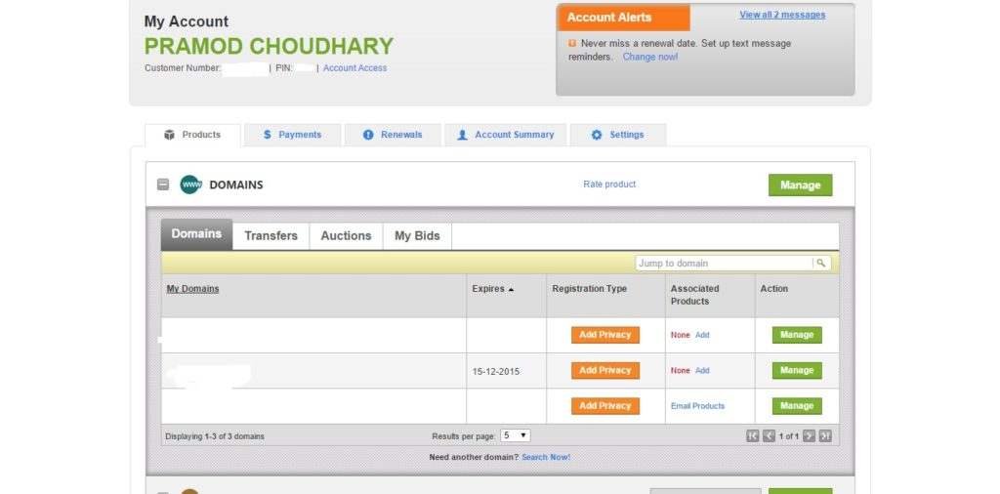

Registering a domain name is one of the most important activities of a person who wants to make an online career. But managing it and setting up a hosting service can be tricky. Name of a domain should be chosen wisely on the basis of below criteria.

**Keywords**: A DN should have one or 2 keywords that will kelp users understand what your blog/site is all about. The keywords should not contain the names of large enterprises (and their products). For example Microsoft, Google, Amazon, Windows, etc. If you ignore this, you'll face legal action in the future. The company might register a DMCA complaint against your site which will force search engines to remove your blog from their index.

**Exact match domain**: Google's EMD penalty targets low-quality websites that have an exact match domain name i.e. If your DN name is gsmsmartphone.net and your content length is below 200 words, believe me! Your site will be penalized by EMD algorithm as well as Google Panda. Make sure that your site was mapped to EMD has very high-quality content.

**Length**: The DN should be easy to remember, and it must not be lengthy. Make sure that the number of characters in it doesn't exceed above 15. The worst domain names would be like asj91298nsakd.com, aiud878731n.com, etc.

**Don't use who.Is guard:** Domain owner's data should be available when anyone uses a who.is. Don't mask it as many SEO specialists believe that the open who is data makes your blog or website trustworthy.

If you're planning to register a new top level domain, I would recommend you to signup with GoDaddy or NameCheap because of their below features:

**Security**: GoDaddy and NameCheap are the safest websites to register a domain name. If you've accessed your account on a public computer and if you forgot to sign out, you don't have to worry too much as the session will automatically expire after 300 seconds. Incase someone is trying to transfer the domain, he won't be able to do as moving/deleting a domain name requires a password.

**Customer support**: Godaddy's phone support better that its ticket based support system. For ticket resolution, you might have to wait for several hours.

**Easy to use dashboard**: Domain management in NameCheap and GoDaddy is a child's play. Whether you own 1 or 100 DN's, you'll have access to a powerful dashboard.

\[gallery columns="2" link="file" size="medium" ids="766,767"\]

**Alerts**: If your domain name expires or is about to expire, the registrar will make you aware of it on your mobile number, email address or by a phone call. If DN has expired, it will be deleted after 20 to 30 days automatically.

**Auto renews**: With this option, Godaddy and NameCheap will automatically renew the domain registration length before it gets removed/expired. To use this feature, you must add your credit/debit card details.

**Conclusion**: Use the above tips and register the perfect domain name for your online business, blog or new site
