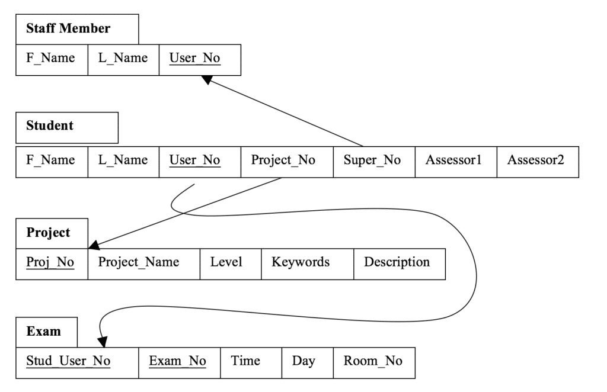
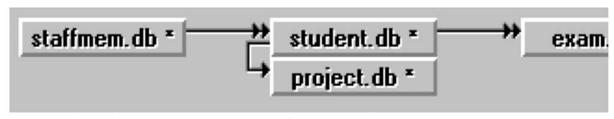

I produced this report for any user to understand how a database has been implemented and how it is to be used.  It will include the different diagrams needed to create a final user-friendly form to be used as the front end of the system.  The objective of the form is to allow the user access to the information stored, in a quick and useful manner so as they can use the information as needed.

## PROCEDURES

1. Design an Entity Relationship diagram to show how the entities within the system will be related and the attributes contained within them.
2. From the ER diagram design a relational schema to show the referential integrity’s between various tables that will be designed for the final system.
3. Check the schema to make sure that it will pass 3NF.
4. Create tables within Paradox to enter information into.
5. Design of front-end form to allow the user to enter details that will be stored in the above tables.

## **ENTITY RELATIONSHIP DIAGRAM (ER Diagram)**

The ER diagram is included within the next page followed by a key to identify the different entity names and their attributes.  The reason for this was to save space while designing the ER diagram in order to fit it all on the page.

This will show the relationships between the various entities and the attributes that are contained within them as well as the cardinality ratio between them.

Key To Letters and Numbers Used In ER Diagram

| **Letter** | **Description** |
| --- | --- |
| A | First Name |
| B | Last Name |
| C | User Number (Key Field) |
| D | Room Number |
| E | Time |
| F | Day |
| G | First Name |
| H | Last Name |
| I | User Name (Key Field) |
| J | Assessor Number 1 |
| K | Assessor Number 2 |
| L | Level |
| M | Project Number (Key Field) |
| N | Project Name |
| O | Keywords |
| P | Description |
| Q | Higher National Diploma Level |
| R | Ordinary Degree Level |
| S | Honours Degree Level |
|  |  |
| 1 | Suggests |
| 2 | Determines |
| 3 | Assigned |
| 4 | Suggests |
| 5 | Supervises |
| 6 | Assesses |
| 7 | Sits |
| 8 | Selects |

## DESIGN OF THE RELATIONAL SCHEMA

Before designing the Relational Schema a number of assumptions have been made.  These assumptions have been listed below:

1. All students will get their first choice of project.
2. The allocation of the student projects is automatically determined because no best mark or entry mark has been supplied.
3. Whoever is supervisor suggested the project – no student or external body suggested projects.

Using the assumptions the relational schema has been designed below.



At this stage it is vital to carry out checks to see if the relational schema will pass first, second and third normal form.

### **First Normal Form (1NF)**

To pass 1NF the attributes contained within the schema must not be able to be broken down, (Atomic).  For example:

Student (Fname, Lname, UserNo, ProjectNo, ProjectName, Level, Keyword, Description, (Super\_No, Fname, Lname), Assessor1, Assessor2) would not be able to contain the Project Details if it was to pass first normal form.

As the current Relational Schema stands, it will pass first normal form.

### **Second Normal Form (2NF)**

Once checks have been made to see if the schema has passed 1NF it is now necessary to move onto 2NF (Second Normal Form0.  This is involved mainly with ensuring the removal of any partial dependencies within the schema.

Any fields within the schema should not partially depend upon another one.  With the current schema it is possible to find the Project Number through the Student’s User Number. If however the Project Name was still on the Student table, the schema would fail 2NF as Name is a partial dependent of the number.

### **Third Normal Form (3NF)**

3NF deals with the removal of all the transitive dependencies between non-key attributes.  This basically means a non-key field from one part of the schema cannot directly relate to another non-key field within a different table.

Due to the fact that a student may not be allocated a project but will still find themselves with a supervisor then there is a possibility you can see that third normal form has not been achieved.

The schema used within this report already passes the third normal form however it could be argued that a relationship could exist between the day and time of an exam and the room the exam takes place in. But by going to a certain room it cannot be assumed that at a certain time there is more that one exam taking place.

### **CREATION OF THE FRONT-END**

The creation of a ‘bachman’ diagram is necessary for the implementation of the front-end and the necessary relationships.  A screen dump of the diagram used below in Paradox has been included to display the relationships.



**The relationships**

StaffMem – Student by User\_No to Super\_No

Student – Project, by Project\_No

Student – Exam, by Stud\_User\_No

**FRONT – END FORM**

Finally in the front-end the menus that have been created have been done using the following code:

```
method arrive(var eventInfo MoveEvent)

var

mainMenu Menu

filePop, editPop, recordPop PopUpMenu

endvar

; build the File Menu

filePop.addText("New")

filePop.addText("Exit")

mainMenu.addPopUp("File",filePop)

; build the Edit Menu

editPop.addText("Cut")

editPop.addText("Copy")

editPop.addText("Paste")

mainMenu.addPopUp("Edit",editPop)

; build the Record Menu

recordPop.addText("Next")

recordPop.addText("Prev")

recordPop.addSeparator()

recordPop.addText("Edit Data")

recordPop.addText("Insert")

recordPop.addText("Delete")

mainMenu.addPopUp("Record",recordPop)

; display the menu

mainMenu.show()

endmethod

method menuAction(var eventInfo MenuEvent)

var

theChoice String

formVar form

endvar

theChoice=eventInfo.menuChoice()

switch

; File menu

case theChoice="New" :FormVar.create()

case theChoice="Exit" : close()

; Edit menu

case theChoice="Cut" : active.action(EditCutSelection)

case theChoice="Copy" : active.action(EditCopySelection)

case theChoice="Paste" : active.action(EditPaste)

; Record menu

case theChoice="Next" : active.action(DataNextRecord)

case theChoice="Prev" : active.action(DataPriorRecord)

case theChoice="Edit Data" : active.action(DataToggleEdit)

case theChoice="Insert" : active.action(DataInsertRecord)

case theChoice="Delete" : active.action(DataDeleteRecord)

endSwitch

endmethod
```
