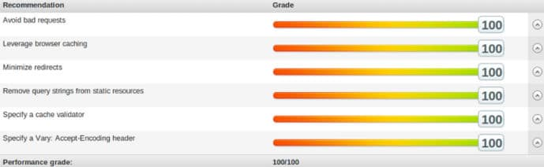

Yesterday, I was checking the performance of one of my sites with GTmetrix and Pingdom tools. Although my site takes about 1 second to open in any browser, the tools were reporting remove query strings from static resources warning.

Anything that follows after the question mark i.e "?" is called a query string. You'll find URLs with query strings on dynamic sites. If the site serves static content, it doesn't make sense to use them. The website I'm talking about is a small blog. Hence, I decided to get rid of the warning.

For some reasons, WordPress theme and plugin developers append query strings to the resource their code loads from third-party websites. I used HTML minifier plugin but it didn't have an option to remove query string from static resources.

Although you can remove query strings from static resources with a couple of lines of code, you should avoid editing PHP files if you don't know what you're doing.

If the code is poor, it may break the site or cause CPU spike and your shared hosting service provider may issue you a warning for the same.

If you're a programmer, you must write a code to generate clean permalinks and remove the version number from CSS or JS files. WordPress users must install one of the following plugins to fix the problem.

### Remove Query String from Static Resource

The plugin has 90000+ active installations. It is popular because RQSSR works like a charm. You don't have to configure the plugin. Simply install it on your site from the WordPress dashboard and activate it.

Once you do so, clear your website cache and test the pages again with the page speed tester tools. The error will now disappear.

Download RQSSR plugin

### WP Performance Score Booster

The WPPSB is a great plugin to boost the page speed score. It enables you to activate GZIP compression for your website. It can add vary and encoding headers to the HTTP response. The plugin fixes leverage browser caching error. It also eliminates the query string problem.

WPPSB is easy to use WordPress plugin. On its settings page, you'll find three checkboxes with labels. You must select the functions which you want to enable on your website. Then, click on the save changes button. That's it.

Download the plugin

**Conclusion**: Frankly speaking, the query string problem won't affect your site's performance. But if you want to score 100/100 on Pingdom, GTMetrix, you can get rid of this problem with the above plugins.
