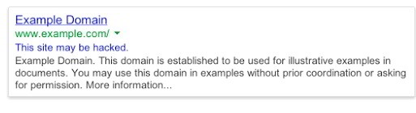

Google makes sure that the site which the user is about to visit is clean. It displays a warning message for the websites which are not safe. One of the most common messages that a search engine user see is "This site may be hacked"

The search engine will show this message in the search results in one of the below cases.

### Malicious code in web pages

The hacker may have inserted a malicious code in the web pages. When Google comes across this code and finds it suspicious, your site will be flagged as hacked. You can use the free AW Snap tool to find malicious pages.

### Domain name redirected to a bad site

The hacker may have the inserted a code in the configuration file of the web server of the htaccess file to redirect your domain to another domain name.

### Consequences of the hacked website message

If the hacked website message is shown for your site, the traffic will be down temporarily.

Visitors are concerned about their privacy and security. Hence, they will ignore your site in the search results.

Hacked message in SERPs also leaves a bad impression on the subscribers of your website. If you do not fix this issue, Google may deindex some pages or the entire site

I have seen the Google Webmaster forums flooded with forum post in which the webmaster is pleading for help. In case your site has fallen prey to a hacker, follow the below steps to get the "site hacked" message removed from the Google search pages.

## Removing hacked site message from Google pages:

### Step 1) Block IP address of the hacker:

Use the putty or Linux terminal and log into your server. Navigate to the directory where the raw access log file is stored. Fire one of the below command:

`tail -50 access.log | grep "wp-login"`

`grep wp-login access.log`

wp-login is the default login URL of the WordPress site. Change it as per your site's structure.

Check the results shown on the terminal. If you see an IP other than yours accessing your site's login page frequently, block it.

If the hacker has changed the root password, contact the tech support of your hosting provider, and request them to reset the password.

### Step 2) Install WordFence or its alternative:

Wordfence has a special utility which analyzes WP installation files for changes. If it finds a changed file, the plugin will make you aware of it. Make sure that you run the file analyzer tool of Wordfence free security plugin.

If this plugin does not find modified WP files, you must reinstall the theme.

Backup the theme settings and reinstall the theme.

Check the plugins folder and remove the suspicious plugins.

### Step 3) Resubmit the sitemap

Open the Google search console and visit the sitemaps page under the crawl option. Now, resubmit the sitemap to make Google crawl your entire site.

Once Google finishes indexing the pages of your site, it will remove the "This site is hacked message" from its pages.

Image credits: Pixabay
