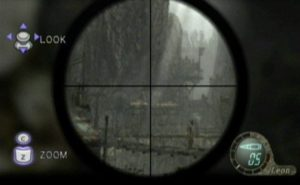
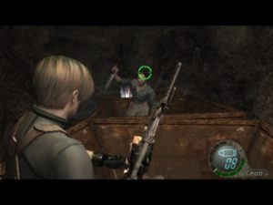

Begin by the end if you want: a direct reply to the question of terminating the preamble to this test. So if Resident Evil 4 is still an excellent title on Wii, there is nothing new to his colleagues if not at the game console to own. Out of this, so it will still be entitled to the entire positive that this adjustment has the additions of the PS2 and PC versions starting with a game mode missing from the GameCube version: Separate Ways. The latter, like the assignment mode, you will lead the beautiful Ada throughout five missions. From the pure value added, especially the way that we proposed to visit a new decor and new looking kinematics. But before discussing this in detail, let us look at the original script.

If we can complete the main adventure in ten hours in all kinematic skipping, avoiding enemies and knowing the game by heart, you will need about twice during your first trip. In addition, add about 5 hours to complete the unpublished Separate Ways mode. Of course, the challenges and Mercenaries Ada assigment ostensibly increase the longevity of the title. In the end, we are left with a life span of nearly 30-35 hours.

The Wii version is the level of the GameCube version, with a good management of lights and beautiful special effects. The result leaves ruffled as long as the environments are eclectic (village, castle, sewers, island, base, temple ...) and cannot tire the player. In addition, the bestiary has been completely revised and bosses are impressive in more ways than one. Regrettably however, the inability to strafe, to benefit current or heaviness with which Leon turns on itself. However, the Wii game is very good, what is more synonymous with head-shots easier to place through a shift in the viewfinder and faster contextual actions slightly more interactive with handling specific to the Nintendo console.

The sounds are realistic as possible, the English dubbing is in the tone and the musical themes are perfectly adapted to situations. Indeed, the music is sophisticated in the sense that music is often way to long beaches of silence, when the need arises. Atmosphere creates a clear sound that owes as much to partitions nerve tracks more than darkness.

WE cannot deny that the cinematics are beautifully staged, but the story itself leaves a bitter taste in the mouth. Krauser is only there to make a surplus of action and if the game takes advantage of a cozy European architecture screenplay is almost identical in every other Resident Evil, Final countdown timer included. In addition, the Separate Ways mode does not really water mill. Nevertheless, I see the scenario of more RE 4 as a starting point for a future episode that will be worthy of this suggests that the end of the game

Difficult to affix a note to the Wii version in the sense that the game itself is nothing really new compared to other versions but that's still good. If the main differences lie in the gameplay, which proposes greater accuracy if we succeed in taming the Wiimote and Nunchuk can also be disappointed that it sounds like an obligation for Capcom to offer this type of gameplay to justify the adaptation. However, at 40 dollars, one wonders what might prevent someone who did not touch this masterpiece on GameCube, PS2 or PC to acquire this perfectly. This Wii adaptation will likely be assessed as if we may regret the absence of actual new content, the small purchase price and the intrinsic quality of the game you should Mikami enough to take the plunge.
