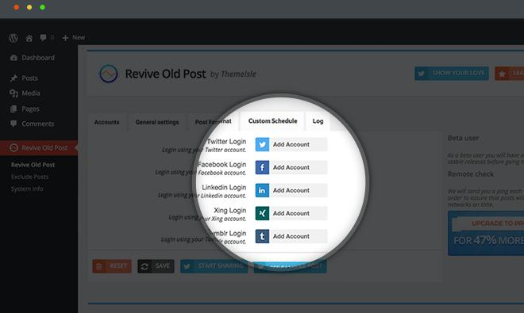
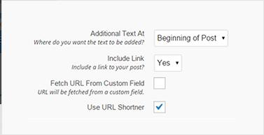

Unlike search engines that rank pages on the basis of various factors, Social networking portals display posts in groups and on pages in first-in-last-out order. If the page is old, you'll have to scroll down the group until you find it. If the title of the post is interesting, people will share the post on their profiles or in groups they've joined. Such pages are called viral posts. They have the potential of bringing a large amount of traffic to a website.

Social Media platforms don't crawl and index web-pages of other sites. The only way to get traffic from social networking sites is to share pages in communities or on your profile. To do so, you must copy the URL/permalink, login to Facebook, Twitter, LinkedIn and create a new post. If your site has 100s of posts, then finding a post to share won't be an easy task.

Sharing pages manually is a waste of time. Here's when the plugin Revive Old Posts comes in handy.

ROP is a WP plugin that increases social traffic by sharing old pages or blog posts automatically. In other words, ROP makes life easier for the user. To get started with the ROP, you must install/activate the plugin. Then, you must navigate to the ROP's setting page and link your Facebook, Twitter, Tumblr, LinkedIn account.

**Download the plugin**

### Features

The plugin enables you to add text at the beginning or end of the post. It provides an option to exclude or include a link to the posts. ROP lets you specify the number of posts it should share in a day.

ROP supports a variety of URL shortening services. When you use this feature, Revive Social will mask the original URL with a shorter one. The plugin makes you aware of the number of clicks the post has received when it was shared on the social media site.

Another interesting feature of ROP plugin is that can automatically create hashtags from the blog post tags. Apart from posts, Revive Social enables users to automate page sharing.

### Difference between the free and premium versions of the plugin

The major difference between the two plugins is the number of accounts you can link to your site.

Free variant supports just 1 Twitter and Facebook accounts. Premium version of the plugin supports up to 50 social networking accounts.

If you want to get a lot of traffic from social media platforms, grab the Revive Social Premium plugin. If you're getting started with blogging, use the plugin's free version.

**Download the plugin**

### Benefits of using this plugin

**Saves your time**: As it is a WordPress plugin, ROP saves your time by finding and sharing old blog posts automatically.

**Good exposure**: ROP supports the world's most popular social networks i.e. Linkedin, Facebook, Twitter, etc. It allows you to work with multiple accounts.

**Customization**: Revive Social lets users specify the time when it should share the posts. You can also insert text at the beginning or end of the post.

### Who uses the plugin?

Although the free version of Revive social has some restrictions, it is used by 70000 WordPress users. Revive Social's premium version has about 12000 users.

**Download the plugin**

### Support

The ROP plugin's official WordPress page has a support section where users can post their queries. If you'll explore the forum, you'll find that almost all threads have been marked as resolved. This indicates that Revive Social plugin authors provide top-notch support to the users of the Revive Old Posts plugin. If you're using the premium edition of ROP, you can open a support ticket to get the issue resolved.

Also read: Best viral WordPress themes
