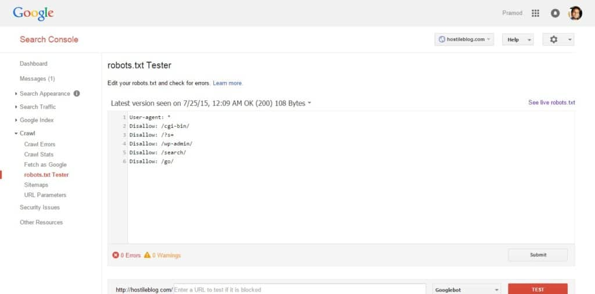

Google bot and other search spiders will visit the robots.txt file of your website immediately after they hit the htaccess file. Both these files are crucial as they can affect your site's organic presence. Htaccess has rules to block IP addresses, redirect URLs, enable gzip compression, etc. The robots.txt will have a set of rules for the search engines. It has few lines that will either block or allow crawling of files and directories. Google has been penalizing blogs with thin content. If you're a WordPress user, you should be aware of the taxonomies of the CMS. If you have generated many tags on your site, make sure that you make then no index as they'll cause duplicate content issues on your blog. Don't block them in the robots.txt file if you've enabled tags on single posts. If you don't do this, page rank and link juice will be wasted. No index attribute for tags can be easily added via Yoast plugin.

Google has started penalizing websites that block the crawling of js and CSS files of a website. The JavaScript and cascading style sheets are responsible for rendering your site, and they handle forms, fire events, etc. If the JS is blocked, Google bot will not be able to crawl the code, nd it will consider the code as spam or violation of link schemes. The same logic applies to the CSS files. Google has a fetch and renders utility in GWT that will make you aware of crawling problems. GWT also has a blocked resources tool that will display URLs that are not accessible.

### How to fix blocked resources error?

You can quickly correct the above-stated errors by using the below robots.txt code: `User-agent: * Disallow: /?s= Disallow: /wp-admin/ Disallow: /search/`

**What this code will do?** Well, the line 1 makes sure that the rules specified below it are applicable for all search engine spiders. The 2nd line, i.e., Disallow: /?s /search/ role will prevent bots from accessing search utility of your site. Sometimes the search can result in soft 404 errors. Thus I've blocked it.

Disallow: /wp-admin/ This line will prevent bots from accessing and indexing wp-admin page. Remove this code If some plugins on your site are using WordPress admin-ajax.

If your theme doesn't display's tags on single posts, add Disallow: /tag/ line to the above code.

If Googlebot is crawling and indexing WordPress feed, insert Disallow: /feeds line to the robots.txt. Replytocom issue can be easily fixed using Yoast WordPress SEO plugin. You just have to enable the remove replytocom variable on the Yoast settings page.

After you modify your blog's robots.txt file, test any URL of your website with the robots.txt tester of Google webmaster tools. If you find any errors or if Googlebot is not able to crawl a resource, the tool will highlight the line that is causing the error. To remove the issue, delete the highlighted line.
