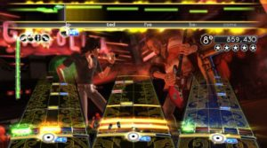
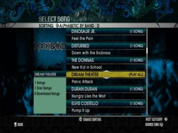

The first Rock Band has hit the headlines, it's the least we can say. We know you suffered and the video game world has a scale of change of its own. As required, the most obvious change in this new version is aesthetic. Guitars, always drawn by the contours of a Fender, have inherited a sunburst finish that will clear copper brown in the center burned on the edges. There is also an effort at the handle to give it a wood effect. On a more technical note the arrival of a tiny camera and microphone to facilitate synchronization with the scores scrolling on the screen.

For its part, the battery changes with the addition of two cymbals. Also note that it has been completely renovated so that the impact of the bucket is less noisy. Moreover, this new generation battery will be sensitive to the strength with which the strikes. This should please any experts who seek to adjust their game that the developers had not specified whether this search for perfection will be rewarded in the game Another improvement on the battery: the pedal which seemed far more robust, more responsive and finally, attached to the crossbar which connects the media drums. We will be able to move the instrument by taking a hand, action facilitated by the news that the battery will be connected to the console through a wireless connection. Regarding the game itself, Rock Band 2 will offer a on total one hundred and four songs. Eighty-four will be available on the disc and the other twenty may be downloaded for free. To this, do not forget to add all of those for the first opus, which will be reflected in this suite. In terms of artists, developers have taken up the idea of playing entire albums, namely those of No Doubt and Foo Fighters among others. Also welcome the arrival of two big elders: Bob Dylan and the excellent Creedence Clearwater Revival with "Fortunate Son". Oddly, the biggest group so far had been a major missing from games of this type also appears in the tracklist of Guitar Hero: World Tour with a different title, "Up Around The Bend". So the two rival licenses are still drawing a wad, no doubt to the benefit of players.

At the pure gaming level, Rock Band also innovates in the basic principle of the game with some nice options. We will initiate an accountant who finds us the most lucrative contracts and, therefore, increase your cash flow. Prudence, however, since this gentleman is not always honest. In the same vein, it will be possible to utilize the services of a talented tattoo artist to increase the sex appeal of the group. As you can see, we'll have to see this part of recruiting game as an investment, the fourteen employees cost some money can also increase the cash flow of you rock band. Also note that the Tour mode will now be played online, it will be possible to establish several tracklist of songs before going on stage and the publisher will allow you to perfect the looks of your music but also to design their held in the smallest detail. And although this result will give fans their services in advance, beginners will not be forgotten. Indeed, it will be possible to activate the "No Fail Mode" already seen elsewhere and, especially, to practice the drums. All this will give you the need to plunge into the hell of rock? Like a concert, it depends on the price of admission...
