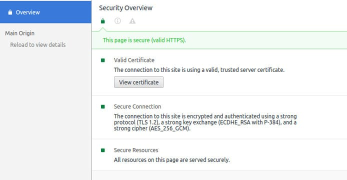

HTTPS protocol makes your website secure. Google had declared HTTPS as a ranking signal last year which means that secure sites can have higher organic visibility than nonsecure websites.

If your site is selling products online, you'll see a boost in conversion because the browsers will mark your website as safe.

Before you go ahead and enable HTTPS on your website, you must learn the Google Content Guidelines.

Once you enable HTTP secure protocol, Google will crawl and index all HTTPS URLS it finds on your website. It then checks the HTTP version of the URLS to learn whether the webmaster has implemented proper redirects or not.

Incorrect implementation of HTTPS protocol on a website can lead to duplicate content issues and steep fall in organic traffic. Unfortunately, the traffic of many websites has dropped significantly after they switched to HTTP Secure. According to Google, the drop is traffic is temporary. Your website traffic should be back to normal after a few weeks.

In case your site's traffic has plummeted post HTTPS implementation and hasn't been restored, below solutions should fix your problem

### Redirect Issue

The major reason why people see a drop in search engine traffic is that they don't implement redirects properly.

To avoid or fix the issue, make sure that the URLs of the following versions redirect to the destination URL with proper 301 HTTP code.

After implementing HTTPS, if your website URL structure is of the following type: https://example.com/

Then, URLS of the following type must redirect to https://example.com

1. http://example.com
2. http://www.example.com
3. https://www.example.com

To check whether the redirects are working properly or not, you can use the free redirect checker tool.

Make sure that all internal links on your website (including the links to images) are direct URLS.

### Improper canonical URLs

If you're using a content management system such as WordPress, Drupal, Magento, Joomla, the SEO plugin should automatically update the canonical URLS for each page on your website.

The canonical URLS must be of HTTPS type. See the HTML code of the live version of your web page and verify the canonical links.

### High load time

If your website is taking over 2 seconds to open on the desktop or mobile phone browser, you should check the server configuration. Sites with a good Time To First Byte are faster and rank better than slower sites. The best tools to check website speed will make you aware of the loading times of various resources of your site.

**Conclusion**: Google search engine is very complex. It takes into account 100s of factors to rank web pages the Googlebot indexes and HTTP Secure protocol is one of the important factors. If the HTTPS version of your site is not performing well in search engines, the above three solutions will fix the problem for you.
