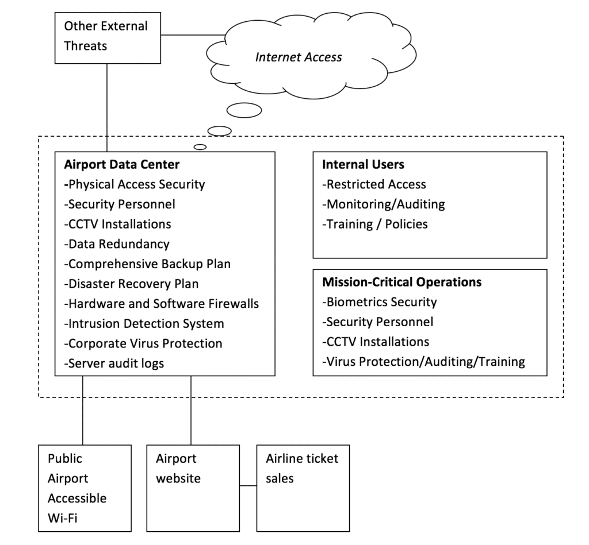

As information systems in airports continue to grow in both size and complexity, so too do the risks associated with security vulnerabilities and threats.  Since the terrorist attacks on September 2001, airport security has substantially increased in day to day operations to address modern threats that the transportation infrastructure faces.  Terrorist attacks however are only a portion of the security threats that an international airport faces.

Advanced systems used in airports from customer ticketing and check-in, immigration and customs to air traffic control are all depended on daily to maintain operations involving vast numbers of customers travelling throughout the world.  These systems must be secured from a number of threats.  First and foremost, an international airport must be prepared for threats to its physical infrastructure including natural disasters as well as the danger of deliberate attacks.  Risks involved with untrustworthy employees or consultants should be appropriately mitigated through necessary systems permissions and auditing.  External threats of cyber attacks either through the airport’s website booking system or other vulnerable gaps within the information systems must be adequately addressed.  Operations within an airport that are vital to human safety must take a high priority with regards to security investment.

This article proposes an approach to improving information systems security within an international airport that addresses each of the areas listed above.  This approach involves the creation of a comprehensive security plan and audit of the vital systems within the airport that need to be secured.  It explores the advantages and disadvantages of proposing a large scale security approach and provides recommendations to combat internal, external, operations and physical risks to the airport.

## Recommended Approach to Security

In order to begin a process of mitigating the risk of cyber attacks or threats to an international airport, it is necessary to develop comprehensive security plan that encompasses the airport operations.  Valacich (2009) outlines a security plan that involves assessment of risks, planning to reduce those risks, implementation of the plan and continuous monitoring.

### Assessing Risks and Development of a Security Plan

A security plan should be ongoing and updated periodically to address new challenges faced by the organization.  The recommended approach to mitigate risks associated with the internal information systems airport infrastructure of an international begins with developing a risk analysis and security plan.  Pfleeger (2005) describes a risk analysis as a “careful investigation of the system, its environment and the things that might go wrong.”  It should describe the current state of the security and analyze the various parts of the airport’s internal information systems infrastructure.  In an international airport, the highest priority for security should fall within those areas that include human safety.  The audit should include a complete review of the following:

- Airport physical infrastructure including data center facilities and access to restricted areas
- Risks associated with internal employee access privileges to the computer systems
- External threats to information systems including the airport’s website and publically accessible resources
- Mission critical operations including air-traffic control, communications and alert systems

The purpose of the audit is to determine the extent of risks to the various parts of the airport’s infrastructure and the costs to mitigate them.  Certain operations will require a much greater investment as in the case of mission critical systems and physical airport security against terrorist attacks.  After the risk analysis has been completed the rest of the security plan should be developed.  This plan should include internal policies and procedures, implementation of security measures, personnel training and on-going auditing of the plan.

### Addressing the Security Threats

After a risk analysis has been carried out and a comprehensive security plan has been developed, each of the main risk areas should be addressed including the physical infrastructure, internal, external and mission critical threats.

In terms of securing the physical infrastructure of the airport, this paper will focus on the data center facilities as well as mission-critical areas.  Chang (Chang et. al, 2007) carried out research on the security of Incheon International Airport and discovered several important concerns with their physical infrastructure security.  First of all Incheon lacked a comprehensive response plan in the case of an emergency as well as proper implementation of their emergency response systems.  Valacich (2009) discusses the importance of backup sites and redundant data centers.  Provided the airport has the financial resources and based on the findings of the risk analysis, adequate measures should be put in place in those areas deemed most appropriate by threat level and cost.

Internal threats should be mitigated in terms of risks associated with internal workers at the airport.  The types of risks associated with internal threats include compromising of restricted information resources, deliberate sabotage to internal systems and insider collaboration with unauthorized external entities.  In the case at Incheon, lack of protection of corporate information was the third problem discovered in the research which could have potentially led to malicious internal employees sharing information unauthorized people or organizations.  Proper security measures must be put in place to prevent malicious employees from gaining unauthorized access to systems.

The third type of threat includes risks with external entities attempting to gain unauthorized access to the airport’s information systems.  Areas of concern including the airport’s web site and any holes in security leading to potential external intrusion should be adequately secured.   Common forms of web site attacks including cross-site scripting and SQL injections are commonplace among large corporate sites and must be considered at the application level as well as the sever level.

While mission critical systems can be considered within the above areas, for the purpose of this paper it will be treated as a separate concern due to the safety considerations within an airport.  Systems such as communications and air traffic control must be adequately secured ensuring no disruption in service and most importantly maintaining customer safety at all times.  In order to accomplish this, proper procedures must be put in place to only allow access to these systems by authorized personnel.

Recommendations to enhance security in the above areas will be involve a large investment by the airport in terms of financial cost as well as time taken from current employees for implementation and training.  While the cost of security is high, without implementing a comprehensive program, the airport could risk much greater cost in terms of reputation if restricted information is stolen or worse the safety of its customers and workers.

## Implementation

Various measures need to be put in place in order to mitigate risks associated with the internal information systems infrastructure of the airport.  The basic components of the information system are shown in the diagram to better understand the recommendations that will be provided.

### Protection of the Physical Infrastructure

**Physical Protection**

In an international airport, the data center should be located in a restricted area separate from the main public airport locations.  The center should only allow access to those personnel who need to work directly on the systems located there.  A combination of biometric and keycard access controls should be implemented for all workers.  Security personnel should be present at all times at the entrance of the data center.  In addition to these measures, Closed Circuit Television Cameras (CCTVs) should be installed both on the exterior and interior of the data center.

**Technology**

A combination of hardware and software-based firewalls should be installed to help prevent unauthorized connections reaching the main servers.  Implementation of an off-site data center for redundancy should be considered in order to reduce the chances of a large amount of downtime in the event of an onsite disaster.  A reliable back-up system should be installed and maintained in the event of data loss.

Intrusion Detection Systems (IDS) should be installed and monitored by personnel at all times.  (Fleeger & Fleeger, 2007) describes an Intrusion Detection System as “a device, typically another computer, that monitors activity to identify malicious or suspicious events.”  An IDS reviews patterns of normal system usage and raises an alarm if something out of the ordinary occurs.  The data center should also maintain complete audit logs, however intrusion detection systems are more efficient at catching abnormal or malicious behavior than manually reviewing logs.

Finally a combination of virus, malware and spyware protection software should be installed and distributed throughout the entire network to help reduce the chances of the internal systems becoming infected.  Enterprise level virus suites are commonly available to large network systems and should be maintained and updated on a regular basis.

**Mission Critical Areas of the Airport**

Mission critical areas within the airport including air traffic control, customer check-in and ticketing and immigration and customs should all be treated with high importance in the security plan.  Access control systems including physical access cards and biometric technology should be used accordingly within areas of the airport that involve activities that are vital to the overall running of the airport.  Operations such as air traffic control where safety remains a high priority should be given additional attention to security and risk mitigation.  Immigration and customs should already be adequately staffed with security personnel, however the information systems used within these areas should also be adequately protected.

### Employees, Consultants and Internal Protection

According to Vacca (2009) the disgruntled insider, working from within an organization, is the principle source of computer crimes.  While external security threats to an airport should be closely monitored, internal threats should be given even more attention.  These types of threats can fall into two main categories, those employees who seek to harm and those who do so unknowingly.  Those who seek to harm pose a major threat do so by sabotaging information resources, stealing confidential data or modifying information to serve their own purposes.  Those employees who cause harm unknowingly include those personnel who access websites and resources that could potentially lead to the spread of viruses and worms within the organization.  In order to mitigate these threats, proper access restrictions should be enforced, adequate monitoring or auditing software should be installed and security training should be provided to employees.  An effective security plan should have included proper policies and procedures for employee access to information resources, which should be part of the training they receive.

**Access Restriction**

Proper access restrictions should be implemented at all levels of the airport’s organizational structure.  Those higher risk areas, identified in the risk analysis, will require more sophisticated security.  All personnel working at the airport should only be given access to the systems they need in order to carry out their job.  Access to mission critical services or highly restricted systems should involve the use of keycards, biometric logins or a mixture of both.

Keycards are relatively inexpensive and should be implemented in all restricted areas of the airport.  Biometrics equipment is however more expensive and should be reserved for the higher risk areas.  According to Vacca (2009) “Biometrics can be used to create automated ways of recognizing a person based on her physical or behavioral characteristics.”  Typically finger print and retina scans can be made to determine the authenticity of the person accessing the system.  While biometric authentication is arguably safer than a keycard, which could be stolen, the cost is much greater and hackers will continue to find new ways to break biometric systems.

**Encryption**

Proper levels of data encryption should be implemented across all parts of the airport where sensitive and restricted information will be accessed.  All airport issued hardware such as laptop computers should be encrypted so that in the event of lost or stolen equipment, the data will not be accessible.  Symantic provide commercial software called “Symantec Endpoint Encryption,” which can be used to easily encrypt a computer hard disk.  Other forms of encryption should be implemented where appropriate including e-mail systems where sensitive information may be transmitted by employees.

**Virus Protection and Auditing**

All employee workstations should be fully protected with anti-virus software distributed from and updated by the main data center servers.  In addition, restrictions should be placed on access from these workstations to the Internet to prevent browsing of unacceptable websites or resources that could further increase the risk of virus infection or spread.  Audit logs of employee access should be maintained and monitored carefully alerting systems administrators if a potential malicious attack may be in progress.

**Security Training**

All employees should undergo systems training with an emphasis on security in order to become familiar with the airport information systems policies and procedures.  This training should highlight the dangers of accessing suspicious websites, opening suspicious e-mail attachments and general anti-virus education.  Ethics training should also be provided in an attempt to mitigate the chances of an employee turning to crime or carrying out malicious activities.

#### Managing External Threats

External cyber threats can come in the form of outside hackers attempting to gain unauthorized access to the main airport information systems through a number of different ways.  Anywhere the airport provides access to the public there is a potential risk of attack and intrusion.

**Website Security**

The airports website provides a wealth of information to customers and the general public.  The typical international airport will provide a combination of information and services through their website presence.  Malicious code attacks such as cross-site scripting and SQL injections provide a path for hackers to gain unauthorized access to restricted information resources.  Websites should be carefully protected both at the application and server layers.  SSL encryption should be used where appropriate in any online transactions or connections to airline ticket suppliers.

**Publicly** **Accessible Wi-Fi Services**

Most airports offer free and paid public wi-fi services and while such networks should remain in isolation to the main information systems infrastructure, they are still prone to security vulnerabilities present in all wireless networks.  In a paper regarding wireless security, Miller, S (2009) discusses the security issues with current wireless technology.  “As wireless platforms mature, grow in popularity, and store valuable information, hackers are stepping up their attacks on these new targets.”  Wireless LAN control should be implemented on any wi-fi network within the airport to mitigate the risk of unauthorized intrusion or intentional harm caused by the attacker.

## Conclusion

As technology continues to advance and the information systems deployed at international airports increase in complexity, the means to secure these systems will also become more advanced.  A comprehensive security plan should be implemented and continually updated in order to address the ever changing technological landscape.  Appropriate security measures distributed across all information systems within the airport with higher security measures in place at mission critical areas.

New systems vulnerabilities are being discovered and exploited daily and while the cost of implementing a comprehensive security program can be high, the costs of not implementing such a program could very likely exceed this.  Not only is corporate reputation at risk in an airport environment, the safety of customers, employees and anyone involved with the airport should also be considered.

## References

Pfleeger, P., & Fleeger, S., L. (2007). _Security in Computing Fourth Edition_. Upper Saddle River: NJ. Prentice Hall.

Polzin, S. (2003). _Security Considerations in Transportation Planning: A White Paper._  Retrieved from: http://www.planning.dot.gov/documents/SecurityPapers/SecurityConsiderations\_Polzin.htm

Hangbae, C., Moonoh, K., Hyuk-jun, K., & Byungwan, H. (2007). The Case Study of Information Security System for International Airports. _Emerging Direction in Embedded and Ubiquitous Computing: EUC 2007 Workshops._ Retrieved from: http://books.google.com/books?hl=en&lr=&id=WMGx9xA10VwC&oi=fnd&pg=PA1&dq=Emerging+Directions+in+Embedded+and+Ubiquitous+Computing+EUC+2007+Workshops:+TRUST,+WSOC,+NCUS,+UUWSN,+USN,+ESO,+and+SECUBIQ,+Taipei,+Taiwan,+December+17-20,+2007.+Proceedings&ots=QnHrlv12ti&sig=WqO2YLrvukIXPVQpzGO4qYqkj84#v=onepage&q&f=false

Emerging Direction in Embedded and Ubiquitous Computing: EUC 2007 Workshops ... By Mieso K. Denko, Chi-Sheng Shih, International Federation for Information Processing, Kuan-Ching Li

Miller, S., K. (2001) “Facing the challenges of wireless security,” _IEEE Computer, pp. 46–48_ Retrieved from http://ieeexplore.ieee.org.ezproxy.umuc.edu/xpls/abs\_all.jsp?arnumber=933495

Symantec End Point Encryption. Retrieved from: http://www.symantec.com/business/endpoint-encryption

Transportation Center_, USDOT, Federal Highway  Administration_. (2003).  Retrieved from: http://www.planning.dot.gov/documents/SecurityPapers/SecurityConsiderations\_Polzin.htm

Vacca, J. (2009). _Computer and Information Security Handbook._ Burlington, MA: Morgan Kaufmann Publications.

Valacich, L. & Shneider, C. (2010). _Information Systems Today Managing the Digital World_. Upper Saddle River: NJ. Prentice Hall.
