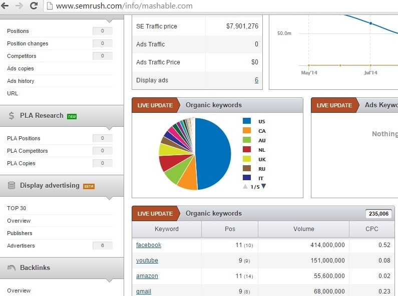

Professional bloggers are successful because they make wise use of SEO tools. For example, Pat Flynn, the owner of smart passive income has launched a few niche blogs that earn him over 5000 dollars every month. Patt is one of the most intelligent bloggers in the world. He makes more than 50000 dollars every month by promoting various products. He makes use of different keyword research tools.

Amit Agarwal, the top Indian blogger, initially used Google Keyword Planner to find relevant and high traffic keywords, as a result, his blog labnol generates more 2.5 million INR revenue through AdSense. Most of the articles on his site labnol.org rank on 1st page of Google.

If you're a newbie blogger, you can't compete with labnol or smart passive income. But you can focus on writing articles whose title has low competition keywords. This technique will bring traffic to your blog. Or if you've published a lot of articles and your site is generating just 100 to 150 dollars income through Adsense, you should focus on increasing Adsense CPC & CTR.

Researching high paying keywords on keyword planner is a time-consuming task. If you use an SEO tool like SEMRUSH, your time will be saved. SEM RUSH is an all in one SEO tool that can make you aware of keywords that bring traffic to the competitors site. It also displays the keyword CPC. This website offers more than ten useful tools. But many people use to it analyze competitor keywords.

## How to use SEMRUSH?

Click here to signup for a free trial of the latest edition of SEMRUSH (2016). Enter the URL of your competitor sites in the text-box of SEMRUSH tool. Now click on the search button. If this tool is not showing any data, enter the URL of your another competitor. When SEMRush displays the result, scroll down and go to the organic keywords section. Here you'll find a list of all keywords that's bringing traffic to your competitor site.

If your competitor is an established brand, select a low search volume and high cost per click keyword. Now open your site's or WordPress dashboard and create a new post. Create a meaningful title that contains the keyword you've copied from SEMRush.

Write a high-quality blog post that contains more than 500 words. And all other target keywords. Before clicking on the publish button, find the keyword density of your post. Adjust the keyword frequency if it is more than 4.5.

**Important features of SEM RUSH:** **Backlinks**: We've already shared a list of best backlink checker tools. I think I need to update the list as SEMRUSH can display all links to your site just as ahrefs, majestic in a neat interface. This utility will also show anchor text, last, first seen date, nofollow/dofollow attribute for each backlink.

**CountryWise SERP rankings**: Use this tool if you are writing blog posts for people in specific countries.SEMRush can display keyword rankings for English speaking nations like United States, UK, Canada, etc. The CPC from users in these countries is the highest. If you use this tool in SEMRUSH wisely, your Adsense earning will increase.

**Competitors**: This is the most important feature of SEMRush. With this utility, you can discover high search volume keywords within a few seconds. To do this, click on a competitor with a good SEMRush rank and go through the data generated in organic keywords section. When you find a good keyword, don't waste your time. Write a blog post with minimum 500 words on it. The post will rank on 1st, 2nd or 3rd page of Google within a month or 2.

**My Final Thoughts:** SEMRush is one of the best SEO tools that you can use. It can be used free of cost for a limited time. Newbies can use SEMRush to get traffic from US, UK, Canada to improve their AdSense earnings. If you don't have Adsense account, apply for it, Experienced bloggers can use this site to better their website's ranking in Google. I've discovered some very high CPC keywords with SEMRush, and I'll publish a blog post featuring these keywords. If you want to do the same, signup for SEMRush free trial here.

If you already know the benefit or competitors keyword research and features of SEMRush, I would recommend you to signup for SEMRush Pro account. For a limited time, you can save up to 140$ on amount plans for SEMrush.

Some bloggers are suggesting their readers to sign up for guru trial account which is valid for 14 days. To be honest, 14 days is not enough to unearth all competitor keywords. Thus, you should signup for the Pro version plan of SEMrush. Use the link we've shared below to avail good discount on annual plans of this powerful competitors keyword research tool.

Get SEMRush Pro account with a great discount.

**Good News**: Semrush has made its Indian keywords database accessible to all. If you're a blogger targeting Indian audiences, you can use this tool to find high paying keywords. Adding a new DB is a good move by  SEM rush as India has millions of bloggers and its tool will be immensely useful.
