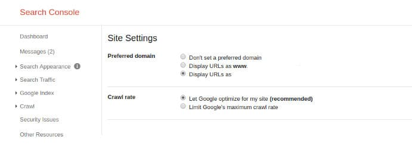

Setting a preferred domain is one of the most important things to do after launching a new site. It takes few seconds to set a PD. Before setting a preferred domain, you should make sure that Google indexes only the URLS which you want to appear in search results. To do so, you must set up a 301 redirect.

A 301 redirect will prevent duplicate content issues. It will tell search engines that they should index the correct web pages.

Webmasters should make sure that the following variants of their domain redirect with HTTP status code 301 to one which they want to set as preferred.

WWW only, HTTP only, HTTP+WWW

If you don't configure the 301 redirects correctly, Google and other search engines will crawl and index non-WWW as well the WWW version of your website and they'll be confused to rank your website pages in search results.

After entering the redirect rule in the Nginx or Apache configuration file, test your website URLS using the CURL command or with redirect checker tools.

If you've enabled SSL on your website, you should configure the web server to listen to HTTP requests on port 80 and HTTPS requests on port 443.

If the web server has received a request for an HTTP URL, it should serve the HTTPS URL.

## Preferred domain www or non-www which is better?

Frankly speaking, unless your server configuration is incorrect or you're allowing search engines to index thin and useless pages on your site, you won't see any difference in the ranking of WWW or non-www URLs.

### How to set preferred domain in GSC?

Before you set up the preferred version of your site, GSC will ask you to verify the website.

Verifying a website is easy. All you have to do is add the Google Analytics code to the head or footer section of the site or place the HTML code provided by the search console to the website's header section.

Once GSC verifies the ownership of the website, open the settings interface in Google Search Console and select one option from the list. Once you set preferred version of your site, you must make Google aware of the location of your sitemap file. To do so, click on the crawl option in the Google Search Console interface and select the sitemap option

Enter the name of the sitemap file in the text box you find on the page and click on submit button. Once you've submitted a valid sitemap file, Google will index the URL for the preferred version of the website.
