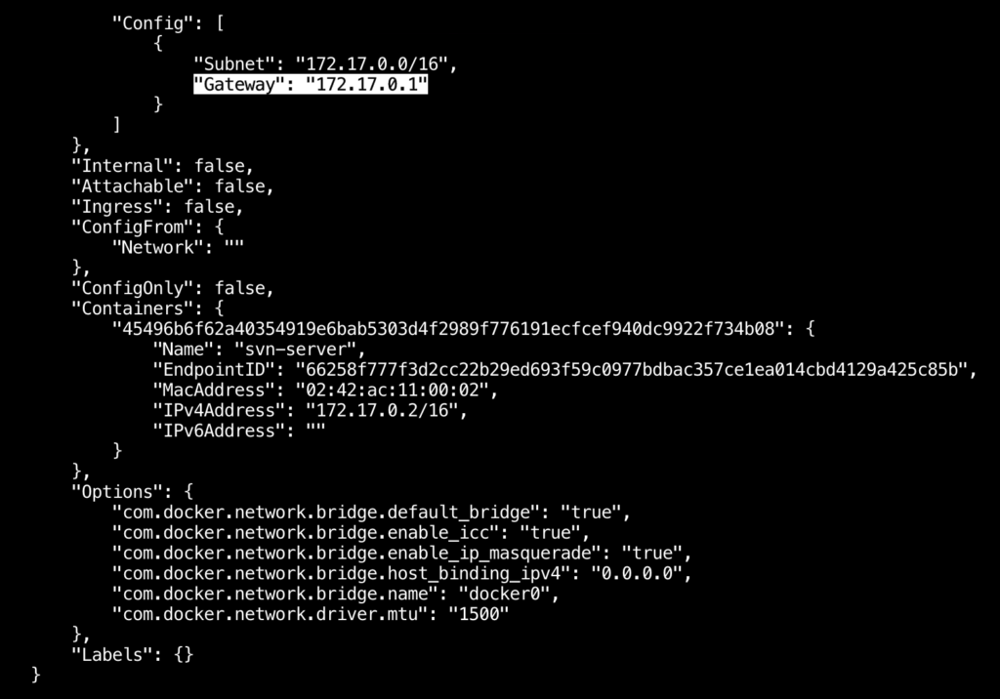
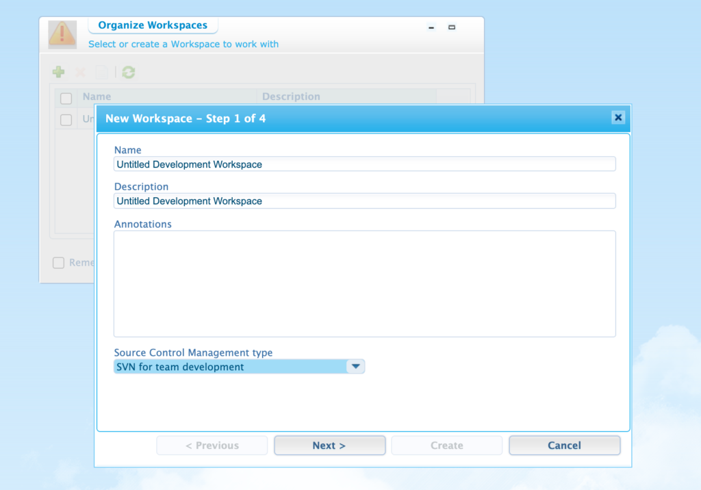
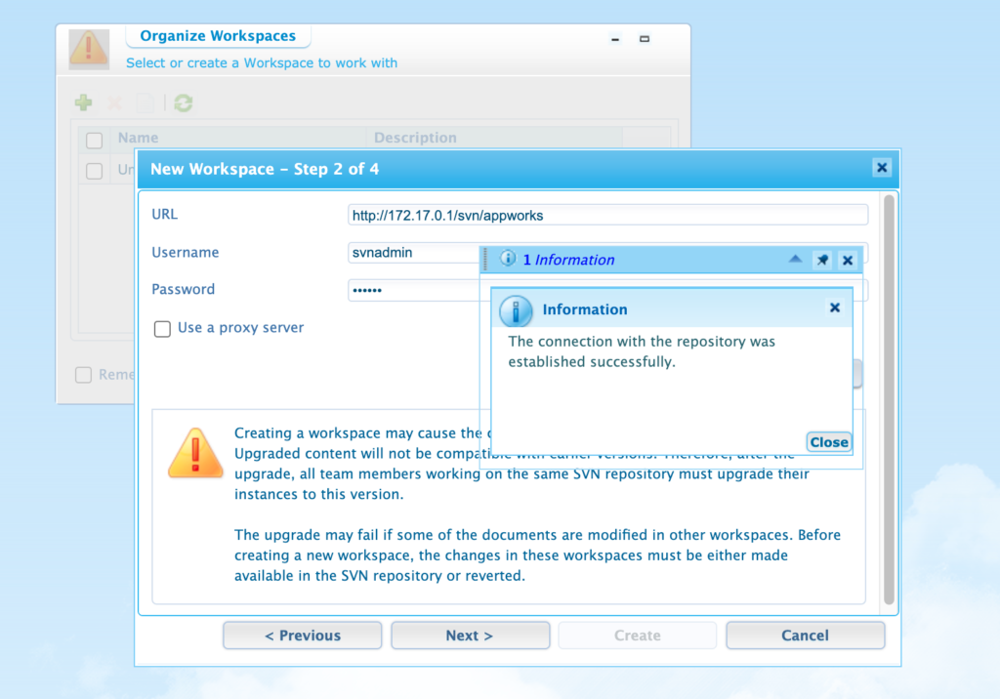

In my last post I walked through the process of setting up a local instance of AppWorks 20.2 using the container image from OpenText. Any development work ideally should be managed in Version Control System (VCS). The preferred VCS for OpenText AppWorks is Subversion (SVN). It has been a long time since I used SVN so I needed to quickly bring myself up to speed. Thankfully there is a handy quick start guide at Apache that walks through the various SVN commands. Once you have SVN installed, the 'svn help' command also provides a nice breakdown of everything you would need to know to successfully navigate an SVN repository. Since I'm already using Docker for my AppWorks installation, it makes sense that I would also want to use this platform to run my SVN server.

A quick Google search yielded a number of different Docker containers for running SVN. In my opinion, the best (and easiest) solution seems to be the image created by Lucio Florio, who provides an overview of his approach in an excellent article called The SVN Dockerization. He provides a completed Docker image at https://hub.docker.com/r/elleflorio/svn-server/ along with simple to follow instructions. I was able to get up and running quickly by using these basic instructions and then adding a few steps to complete my AppWorks repository along with user and permissions setup.

## Downloading and Standing up the SVN Container

In order to setup SVN, you'll need to have Docker installed. Once you have Docker, you should be able to run the following commands from your terminal:

```bash
docker run -d --name svn-server -p 80:80 -p 3690:3690 elleflorio/svn-server
```

This first command runs the Docker image. If you have previously downloaded elleflorio/svn-server, your container will be provisioned right away, otherwise Docker will fetch and download the required files. Next you will need to set a server username and password by issuing the following docker exec command:

```bash
docker exec -t svn-server htpasswd -b /etc/subversion/passwd svnadmin myPassword
```

You should now be able to log directly into your new SVN sever via the web at http://localhost/svn (for a list of repositories) or http://localhost/svnadmin for your SVN web admin settings. **For basic setup, you should not need to alter anything here**. Next you will want to create your SVN repository by entering the following svn-server command via Docker exec:

```bash
docker exec -it svn-server svnadmin create /home/svn/appworks
```

I used appworks as the name for my repository, however you can use any name you like. The important thing here is to make sure the location of your new repository is created inside /home/svn. You are all set with the basic repository setup. The last step is to configure your access and permissions. Use the Docker exec command to gain access to your container's file system:

```bash
docker exec -it svn-server /bin/sh
```

Once you are in the file system, you will need to make a few changes. First of all, edit the /etc/subversion/subversion-access-control, changing \*=r to \*=rw. This will provide global read write on your SVN repository for the svnadmin user (who you created earlier).

```bash
vi /etc/subversion/subversion-access-control
```

Next you will need to change permissions of the newly created repository (in my case appworks:

```bash
chmod 777 -R /home/svn/appworks
```

**Both of the above should never be done in a production environment**. I am providing full read write access. In a local container dev instance, this is fine. In a production environment you would not provide global read-write, instead you would define individual users, groups and permissions using path based authorization within each individual repository. See the SVN Book for more details. Once you have completed the above steps, you should be able to access your repository using an SVN client on your local computer via http://localhost/svn/appworks.

## Connecting to SVN from the AppWorks Container

If you previously stood up an AppWorks container, you should be able to connect from it to your new SVN container from AppWorks. The first thing you will need is grab gateway address from Docker. You will replace the earlier localhost address with your gateway IP which is needed to connect from one container to another. You can obtain this by running the

```bash
docker network inspect bridge
```

You should end up with output similar to below. Look for the "Gateway": ... line, which should provide your IP address.

<figure>



<figcaption>

docker inspect output

</figcaption>

</figure>

When referencing your svn repository from your appworks container, instead of using http://localhost/svn/appworks, you will reference your repository using the new gateway IP address, which in my case would be http://172.17.0.1/svn/appworks. Lets connect everything together next.

From your local AppWorks installation, login and navigate to Workspace Documents. In the Organize Workspaces panel, select the green plus icon (insert) and name your new workspace. In the Source Control Management type dropdown, select SVN for team development and click next.

<figure>



<figcaption>

New Workspace in AppWorks

</figcaption>

</figure>

In the next step you will be asked to provide credentials to your svn repository. To keep it simple I'm just using the earlier created svnadmin account (setup above) along with the SVN repository address using my Docker gateway IP, which is http://172.17.0.1/svn/appworks. To verify your setup, click on 'Test connection' and you should hopefully get a confirmation similar to the screen below. If you did not, go back and check your credentials and Docker gateway address.

<figure>



<figcaption>

Adding SVN Credentials

</figcaption>

</figure>

You should be able to completed the remaining steps clicking 'Next' and then 'Complete'. You will now be able to use version control in your application development. In a real life setting you would mostly likely have an SVN server setup for your entire development team, which would not only be secured better than the steps described above, but would be publically available to access within your network. For learning purposes or pure local development, I've found using an SVN container to be helpful. Hopefully you found this useful.
