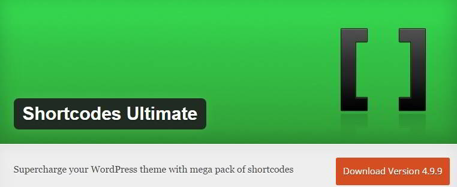
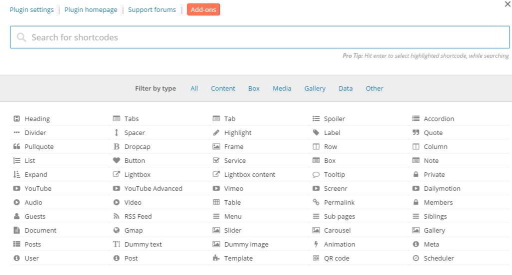
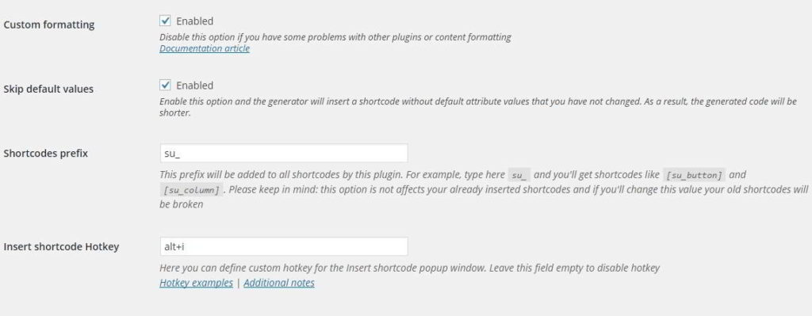
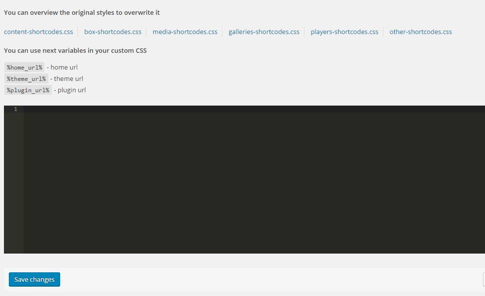
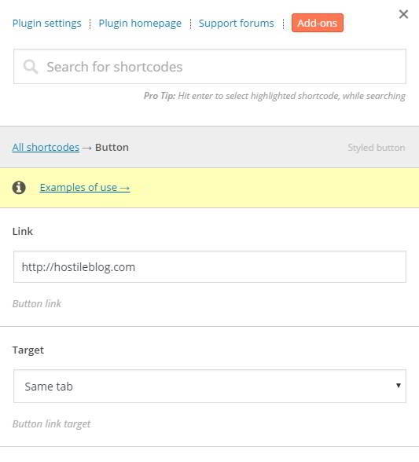
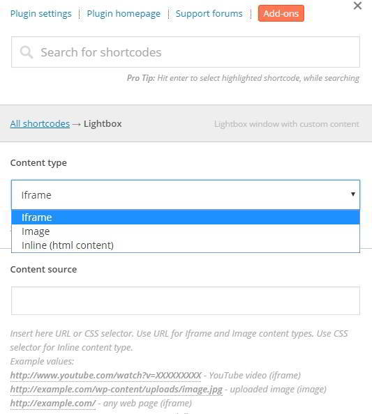

Shortcodes Ultimate by Vladimir Anokhin is a top rated WordPress plugin with 700000+ downloads. It allows you to generate and use HTML shortcodes of various styles and colors. The plugin allows customization. The code created by this is responsive and clean. Thus, it will work with all types of plugins.

WordPress Shortcodes Ultimate is compatible with other plugins as well. It supports multiple languages and RTL. The plugin supports extensions. For styling, it uses CSS3.

Because of its several inbuilt features, you can easily give your free WordPress theme a premium look.

**How to use this fantastic plugin?**

Open the WordPress dashboard and open the plugins page. Now enter shortcodes ultimate in the search box, install and activate the free plugin.

The SCU plugin has an examples section where can you check demo implementation of WP shortcodes.

SU plugin has a settings page in which the user will find documentations, link to the plugins official GitHub page, changelog, link to the support forum and some useful tutorials.

In settings section, you'll also find options to enable custom formatting, skip default values, set shortcodes prefix and hotkey.

The shortcodes ultimate plugin comes with a Custom CSS section in which user can enter his CSS codes.

To get started with SCU, Edit or open a new post. Besides the add media button, the user fills the "find an insert button" shortcode which on clicked will open a popup window.

The window has a search option to shortlist or find a shortcode easily. It also displays six filters and more than 50 types of HTML shortcodes.

To insert an SC, click on any of the items that you find in the popup. Below you'll find a tutorial  to add a shortcode of a button:

Use the search tool to find and insert the button shortcode. When you do this, the plugin will load a window that allows you to customize the design.

The Window will display fields to enter:

1. Hyperlink.
2. Options to open link in a new or the same tab.
3. Option to choose button style.
4. Color ( a color chooser utility will be displayed).
5. Sizer.
6. Alignment.
7. Radius.
8. Custom icon.
9. Text shadow.
10. On click action (user must enter JavaScript here).
11. Rel nofollow or dofollow attribute.
12. Title and text.

When you've customized the shortcode object, you can check how it looks by clicking on the preview link. When your SC is ready, click on the insert button. Now you'll find a line of code in the post.

Don't edit the shortcode as it may break the article and will make it look sluggish.

Apart from buttons, this free WordPress plugin supports the below HTML shortcodes:

- Heading.
- Divider.
- Tab
- Spacer.
- Lightbox content.
- YouTube videos.
- Quote.
- QR codes.
- Tables.
- Documents.
- Highlighter.
- Accordion.
- Scheduler.
- Frame.
- Tabs.
- Spoilers.
- Animation
- Google Map.
- Frame.
- DropCap.
- Label.
- Slider.
- RSS Feeds, etc.

SCU Download link.

**Conclusion**: As you can see above, the Shortcodes Ultimate WordPress plugin includes several unique and exciting features due to which it is a must have plugin for websites that are powered by the free responsive themes. SCU works well on the shared as well as VPS hosting servers.
