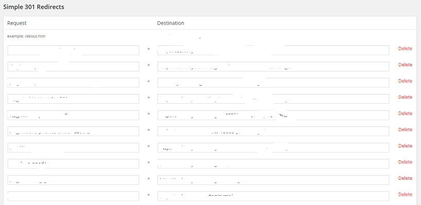

The Google Search Console tool make us aware of various errors that Google encountered while crawling our website.

404 errors don't have any impact on the ranking of a website. But if the error is generated because of change in permalink or its structure, you'll lose traffic from the search engines as well as the social networks. Page Rank will be lost as well.

For the best experience of the search bot and user, it is important that we fix the reported error.

We can quickly fix 404 errors by adding a 301 redirect rule to the htaccess or Nginx configuration file. These two files are crucial. If you enter an incorrect rule, your website will become nonfunctional. The best way to manage redirects in the website is by using a plugin.

In my perspective, the simple 301 WordPress redirect is the best plugin to do this job. I've been using this plugin for two years and have faced no issues with it.

Simple 301 redirects plugin use PHP to handle the task of redirecting broken URLs to valid URLs. When you install it, this redirect plugin will add a settings page that allows a user to set up the redirects. This page has two fields, request, and destination.

In the request field, you must enter the permalink of the 404 URL. In destination's field, the user must enter the target URL.

Once you fill these two fields, click on the save buttons. Redirect for the broken URL has now been set up.

This plugin allows you to specify wildcards. Thus, if URL generates a lot of 404 URLs with some specific keywords, you don't have to enter multiple sources and target URLs.

The Google search console will not display the related 404 error anymore. The error will disappear from the search console once Google recrawls the page.

There are a lot of WordPress redirect plugins that log details of the broken links and redirection. This feature wastes the time of the user and server resources. If the redirect is working, the user should forget about the broken URL.

**Conclusion**: A lot of 404 errors can lead to poor user experience. To fix them, make sure that you download and install free Simple 301 redirects plugin. To download it, visit the WordPress.org repository.
