This article focuses on two different predictive models built from two different data sources from Kaggle, Laptop Price and Mobile Price Classification. Laptop Price consists of records of various laptop models, which was last updated six months ago from writing, adding additional laptop characteristics and prices. Mobile Price Classification provides data on mobile phones including price range classifications. The Laptop Prices data consists of the following variables:

| **Column Name** | **Data Type** | **Description** |
| --- | --- | --- |
| Company | String | Producer of Laptop |
| Product | String | Make and Model |
| TypeName | String | Type (Notebook, Ultrabook, Gaming, etc.) |
| Inches | Numeric | Screen Size |
| ScreenResolution | String | Screen Resolution |
| Cpu | String | Laptop CPU |
| Ram | String | Laptop RAM |
| Memory | String | Hard Disk / SSD Memory |
| GPU | String | Graphics Processing Unit |
| OpSys | String | Operating System |
| Weight | String | Laptop Weight |
| Price\_euros | Numeric | Price (In Euros) |

The Mobile Price Classification data consists of the following variables:

| **Column Name** | **Data Type** | **Description** |
| --- | --- | --- |
| blue | Boolean (0 or 1) | Bluetooth feature |
| dual\_sim | Boolean (0 or 1) | Dual SIM feature |
| four\_g | Boolean (0 or 1) | 4G Connectivity |
| three\_g | Boolean (0 or 1) | 3G Connectivity |
| price\_range | Text (Classification) | Low, medium, high, very high |
| touch\_screen | Boolean (0 or 1) | Touch Screen feature |
| wifi | Boolean (0 or 1) | WiFi |
| battery\_power | Number | Battery Power |
| front\_camera | Number | Front Camera |
| internal\_memory | Number | Internal Memory |
| mobile\_depth | Number | Depth |
| n\_cores | Number | Processor |
| pixel\_resulotion | Number | Resolution |
| primary\_camera | Number | Primary Camera |
| ram | Number | RAM |
| screen\_height | Number | Screen Height |
| screen\_width | Number | Screen Width |
| talk\_time | Number | Talk Time |
| clock\_speed | Number | Clock Speed |
| mobile\_weight | Number | Mobile Weight |

### Data Quality

The columns for Laptop Prices are displayed with their respective quality scores:

| **Column Name** | **Quality Score** |
| --- | --- |
| Company | Medium Quality (67) |
| Product | Unique values |
| TypeName | Medium Quality (60) |
| Inches | High Quality (74) |
| ScreenResolution | Medium Quality (61) |
| Cpu | Unique Values |
| Ram | Medium Quality (60) |
| Memory | Medium Quality (63) |
| GPU | Unique Values |
| OpSys | Medium Quality (54) |
| Weight | Unique Values |
| **Price\_euros** | **Medium Quality (63)** |

The columns for Mobile Price Classification are displayed with their respective quality scores:

| **Column Name** | **Quality Score** |
| --- | --- |
| blue | High Quality (100) |
| Dual\_sim | High Quality (100) |
| Four\_g | High Quality (100) |
| **Price\_range** | **High Quality (100)** |
| Three\_g | High Quality (70) |
| Touch\_screen | High Quality (100) |
| Wifi | High Quality (100) |
| Battery\_power | High Quality (98) |
| Front\_camera | High Quality (73) |
| Internal\_memory | High Quality (96) |
| Mobile\_depth | High Quality (93) |
| N\_cores | High Quality (100) |
| Pixel\_resolution | High Quality (75) |
| Primary\_camera | High Quality (99) |
| Ram | High Quality (100) |
| Screen\_height | High Quality (93) |
| Screen\_width | High Quality (76) |
| Talk\_time | High Quality (99) |
| Clock\_speed | High Quality (86) |
| Mobile\_weight | High Quality (100) |

### Predictive Model Development

The classification predictive model was built from the mobile price classifications dataset. The target variable was ‘price\_range’, which was reported in Watson Analytics to have a quality score of 100%. The price range variable classifications included low cost, medium cost, high cost, and very high cost. It served as the categorical target variable. Using Watson Analytics, a predictive model was built to determine what drives price range. A spiral model showing what drives price can be seen below.

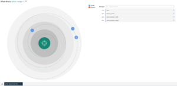

From the spiral model, it is apparent that RAM is the biggest driver of the price range. To dig into this further an analysis of how price range is impacted solely by RAM, showing a strong relationship between higher amounts of RAM resulting in price range of very high cost.

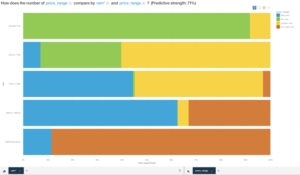

Next, a decision tree was generated, which yielded a classification table shown below. The decision tree had a predictor importance of RAM at 0.97 and battery power at 0.02. All records were included in the model.

| Classification table |  |  |  |  |  |  |  |
| --- | --- | --- | --- | --- | --- | --- | --- |
|  |  | **Predicted** |  |  |  | **Percent correct** |  |
| high\_cost | low\_cost | medium\_cost | very\_high\_cost |  |
| **Actual** | **high\_cost** | 314 | 0 | 95 | 91 | 63% |  |
| **low\_cost** | 0 | 450 | 50 | 0 | 90% |  |
| **medium\_cost** | 48 | 48 | 404 | 0 | 81% |  |
| **very\_high\_cost** | 50 | 0 | 1 | 449 | 90% |  |

From the table, the percent of records correctly predicted were highest for very high cost and low cost, both at 90% correct. Medium cost was predicted at 81% correct, and high cost was the lowest at 63%. The decision rules for very high cost, high cost, medium and low cost were also interesting as shown in the following diagrams.

Decision Rules - Very High Cost

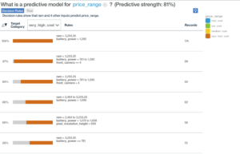

Decision Rules - High Cost

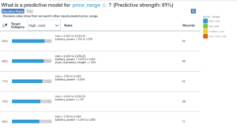

Decision Rules - Medium Cost

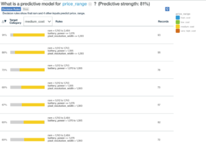

Decision Rules - Low Cost

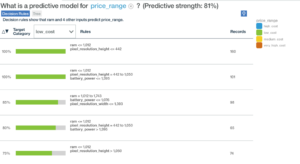

For very high cost, 100% of records with RAM higher than 3,255.25 fell into this category. It is clear that the other variables of battery power, front camera, and resolution contributed to very high cost in a much smaller way. RAM was also the predominant force in for high, medium and low price ranges. The decision tree illustrates this below.

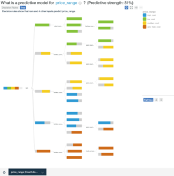

The continuous predictive model was built from the laptop price dataset. The target variable was price\_euros, which was reported within Watson Analytics of having a medium quality score of 63. This variable was a continuous target variable with different prices assigned to each record. The spiral diagram, shown below demonstrates that RAM is the top single driver of price.

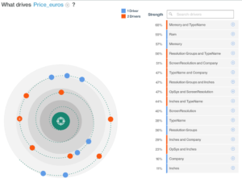

The diagram below shows this relationship singled out into a bar chart. The predictive strength is however overall lower than the earlier classification model above at only 59%.

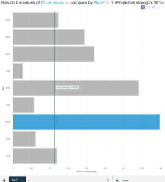

The predictor importance table below illustrates the significant strength of RAM as a predictor compared to the other variables.

| Predictor importance |  |
| --- | --- |
| Input | Value |
| Ram | 0.66 |
| Memory | 0.16 |
| TypeName | 0.10 |
| Resolution Groups | 0.03 |
| ScreenResolution | 0.03 |
| OpSys | 0.02 |

The analysis drew on all records in the record set with none excluded from the model. The decision rules were also interesting as demonstrated below.

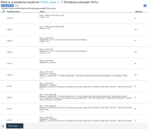

Ram was at the forefront of predicting price along with less significant variables across the various price points illustrated in the table. The decision tree for the price euros predictive model can be seen in below.

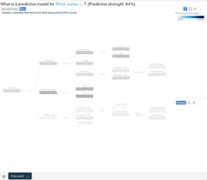

Overall this model did not give as strong an indication of drivers for price as the classification model, however it was clear that RAM was again the top driving variable.
