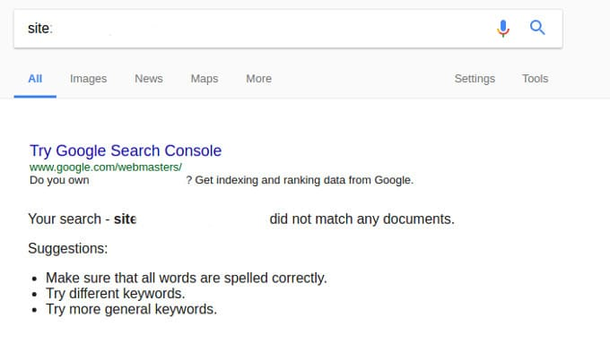

Site deindexed from Google is the worst nightmare for any blogger or business owner. When Google removes your site from its index, your AdSense earnings are down by 70 to 90%.

If traffic from social networks to your site is high, you can recover the earnings by becoming an affiliate marketer. If your site doesn't get good traffic from Facebook, Twitter or any other social site, your website will be of no use.

You think that you've worked hard but in Google eyes, you've violated the Google Webmaster Guidelines.

## Why has Google removed your site?

### Aggressive link building

Google Engineers have caught you red handed for building backlinks aggressively. As a result, your site suffers manual action penalty.

The message of the manual action penalty appears within 3 to 4 days in the Google Search Console.

When your site is deindexed, Google gives you a great chance of getting your site back in the search results.

The manual action message contains a button/link to notify Engineers that you've removed the backlinks from your site. Read the reconsideration request article published by Google for more information.

### Scraping content from other sites

Google can easily find scrapper sites. Once it finds a site which publishes others copyrighted work, it may remove the site from its index. The search engine also detects spun content. In most of the cases, the site suffers Google Panda algorithm penalty.

### Thin content

Google ranks websites that contain high-quality content. If you've published 100s of pages having a couple of lines, Google may have deindexed your website.

To remove thin content, you can employ the following two strategies:

1. Merge two to more pages with thin content into one and redirect the old URLS to the new page/post.
2. Add a no-index robots meta tag to thin pages.

### Too many DMCA notices

If you are sharing copyrighted images, license keys for premium software, links to download songs or videos through your site, various companies may have registered DMCA complaint against your site.

Suppose your website has 100 pages that contain copyrighted material. If the company has filed 100 DMCA complaints, Google may remove all your pages.

### Human Error

If you have never built backlinks and your site has good quality content, you should check the robots.txt file or the header section of your site. The robots.txt file may have been modified to block search bots from crawling and indexing your content. The header section may have the deadly "noindex" robots meta tag.

Fix these two problems and resubmit the sitemap to Google using the search console tool.

**Conclusion**: Google is the world's largest search engine. To make sure that your site gets traffic and performs well in SERPS, you should obey the Webmaster Guidelines.

Don't indulge yourself in any blackhat techniques. Focus o improving your website quality by publishing original in-depth articles.
