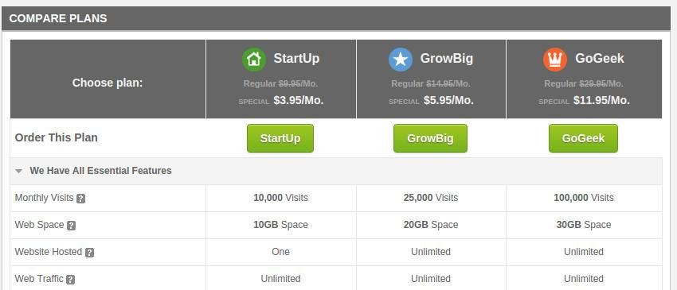
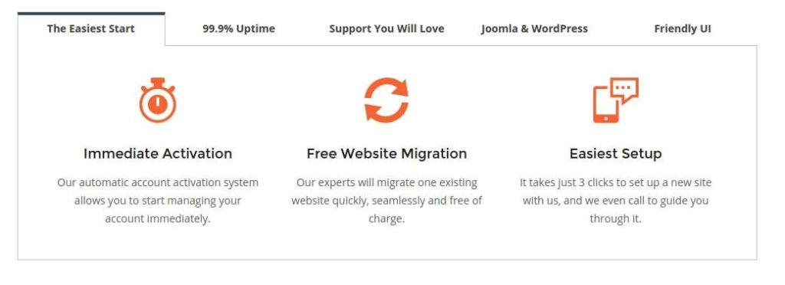

Siteground hosting offers various plans that are suitable for deploying new or established websites. Like many other hosting platforms, SG claims to offer 99.9 percent uptime for your site. This is impressive because your blog will be hardly down. Thus your online earnings and revenue will not be impacted by unnecessary downtime.

Once my high traffic site was down for 3 hours when it was hosted on ASO, my Adsense earnings for the day were down by a few dollars. With SG, you will never experience such issues because the infrastructure of Siteground hosting company is good.

The great thing about site ground is that you've to pay for the resource you use. For example, the cheapest hosting plan, i.e., startup costs around 4 dollars, and it is suitable for sites with 10000 visitors per month. This plan comes with a limitation that you can host a single domain with it.

If your blog is getting 25k visitors per month, Siteground has a special 5.95 dollars GrowBig plan for you. For growing blogs with less than 100K visitors, there's a powerful 11.9 USD GoGeek plan. GrowBig and GoGeek can be used to deploy more than one websites.

**Check full details and features of siteGround hosting plans here.**

Siteground allows you to configure CloudFlare, the best free CDN service provider from the Cpanel. CF CDN will reduce the load on your server as it can cache your entire website.

SG gives you a domain name for free when you sign up for any of their plans mentioned above. Thus, if you're beginning your online career, Siteground is a good option to consider.

This website hosting service includes 30 days money back guarantee. Whether it's daytime or night, SG support team will always be ready to help you. If you want help, just raise a ticket or use the live chat system to get in touch with the technical support expert. For immediate help, you can contact Siteground using a phone.

Support is one of the most important points to consider while buying a hosting plan and SG scores 4.5 out of 5 in this.

Siteground Hosting offers a GrowBig plan that costs 5 dollar ships with a free SSL certificate. To make your blog blazing fast, it also includes a super cache module.

The GoGeek plan offers all the above features and its servers host fewer accounts. Its hardware is much more powerful (advanced). GIT module comes preinstalled on the servers.

When you're using SG, you don't have to install WP backup plugins as the server will automatically create and save your website data in a folder. Many popular hosting platforms lack this feature.

**Signup for the cheap premium Siteground hosting plans here.**

Siteground has one click installers for Joomla and WordPress. Thus it takes hardly a minute or two to launch your website. To make sure that your blog is powered by the latest version of the content management system, Siteground hosting has an auto updater software that runs every day. The CPanel is well designed and you can easily upgrade your hosting plan with it.

You're allowed to log into the server using SSH protocol. If you are an advanced Linux user, this is a useful feature as you can monitor logs, check which processes are using a lot of RAM, CPU, etc.

Siteground has many datacenters. Thus their servers are located in different parts of the world. While buying a hosting service from them, you will be prompted to choose a location where you want to deploy the site. Always choose a location which is nearby to the country from which your blog gets maximum visitors.

Siteground servers are secure. They come loaded with anti-spam systems. Their anti-hacking module ensures that no one (excluding its other users) gains access to the CPanel.

SG has entitled itself as the number 1 website hosting service in the world. **Visit Siteground and sign up for a hosting plan** to experience premium service.
