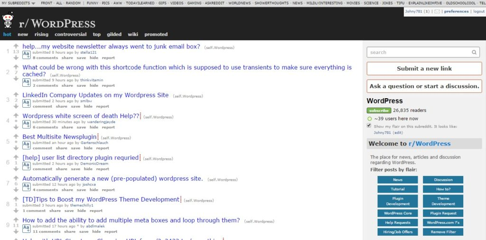
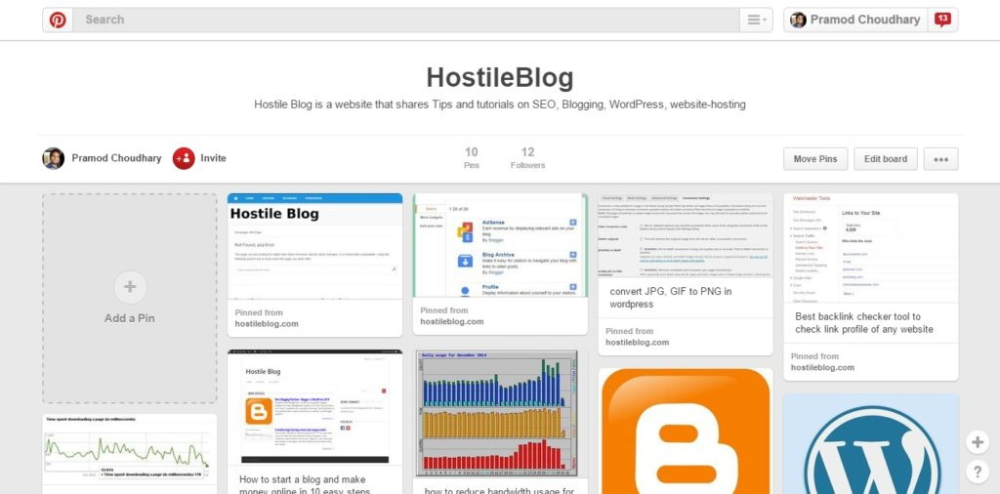
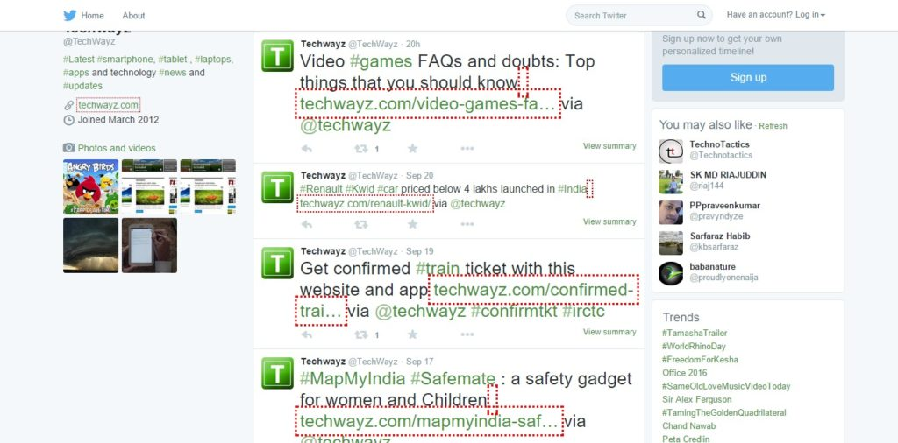
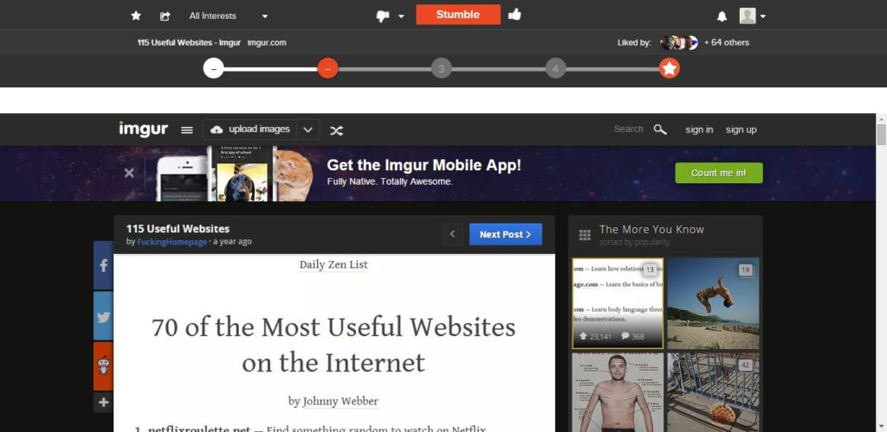
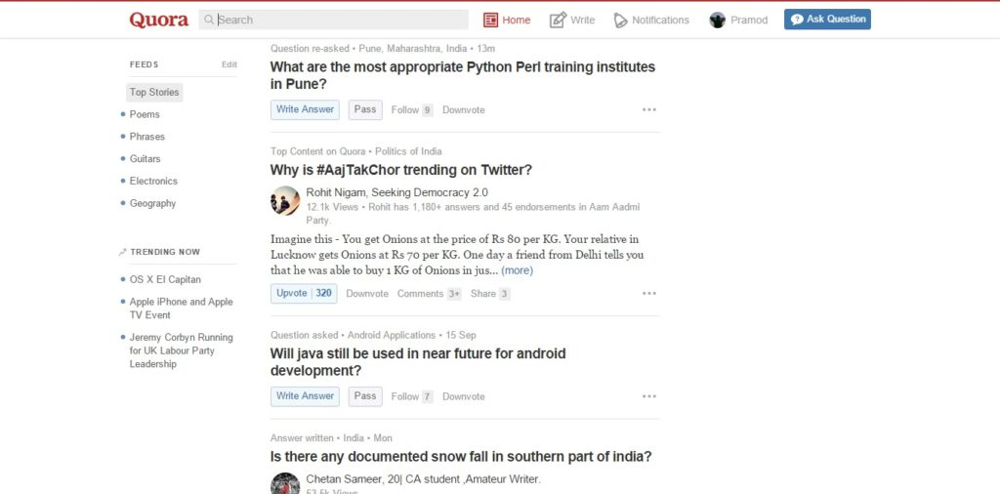
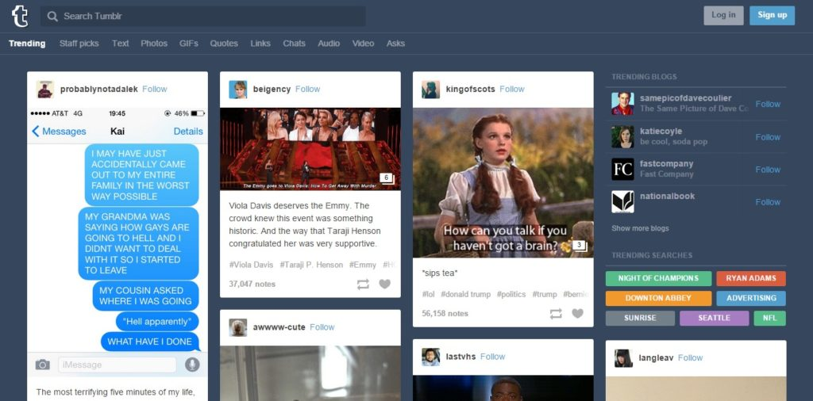

Social bookmarking websites are important as they can bring tons of visitors to your blog. They will also increase your post's ranking and visibility in search engines. There are two categories of bookmarking sites, i.e., nofollow and dofollow.

Most do follow sites that allow you to share links are considered as spam by Google. Sites that link to such bookmarking portals are penalized, and they don't rank anywhere in top 20 to 25 pages of the search engine. People promoting these websites don't know SEO, and you should avoid following their tips.

Most social bookmarking sites are penalized because they promote link schemes - a violation of Google guidelines. For best results, the link user shares should be attributed as nofollow.

Nofollow bookmarking portals are safe, and they're found all over the web because these sites follow Google webmaster guidelines. They don't promote spam nor do they pass juice to external links. If you use them often, these sites will bring traffic to your blog. Below are the top sites for bookmarking and sharing your articles.

## Top 10 Best social bookmarking sites list for 2016

### Reddit:

In my perspective, this is the best social bookmarking site. Registration of Reddit is free, and you can use it for entire life. To promote your article, you should choose a sub-Reddit wisely. If your story is on money making tips or strategies to sell products online, you should submit your link in the marketing section. If the user finds your link useful, they'll upvote it. Referral traffic from Reddit depends on these votes. Links that receive a lot of votes are on the 1st page of this site. Google ranks top articles shared on Reddit on the 1st two pages of the search results. This site is moderated. If you try to spam it, your profile will be banned. Open this website.

### Pinterest:

This site allows you to share images linked to/in your article. To do this, you must create a board on which your blog images will be pinned. Pinterest supports custom meta description, and Google indexes its pins. If you write the description for your image well, your pin will rank high in the search engine. Visit Pinterest

### Twitter:

Everyone knows this site, and you can safely use it to promote your blog posts. Each link shared on Twitter is nofollow, but you shouldn't worry about this. Tweets shared on this micro-blogging platform now appear high in Google SERPs because this company has teamed up with the search engine giant. Make sure that you make use of hashtags when you use Twitter. Open this site.

### Stumbleupon:

This is one of my favorite bookmarking sites. You can not only share your articles on it, but you can also go through some of the finest blog posts without opening any other website. StumbleUpon features many categories. Using this platform is easy. Visit stumbleUpon

### Quora:

A co-founder of Facebook started this site. Here, you'll find a lot of questions and answers. It is not a bookmarking site but can you use it like one. If your article is useful, you can share it as a reply. People will upvote or comment on your answer. If you use Quora smartly, your blog can easily get 100s of visitors daily. Visit Quora.

### Tumblr:

This site is now a part of Yahoo. You can efficiently use it as a bookmarking tool. Tumblr can be even used as a Blogging platform. If you're a Twitter user, you won't find it difficult to use Tumblr. When you copy and paste your content in Tumblr, don't forget to add your blog post permalink to it. If you don't do this, Google will consider your site as spam that copies content from other blogs. Open Tumblr

### Scoop It:

This platform is used for content marketing by over million users (including some well know companies). It comes with free and paid subscription plans. As a free user, you're allowed to shared only a few posts. When you share your articles, you'll find them in Google search results. Open scoop it

### Slashdot:

This bookmarking website features some of the finest tech articles. It is often used by technology geeks to discuss their favorite topics. If you blog on science, electronics or computers, submit your story on slashdot. Visit this site

### Tribber:

This site is gaining popularity quickly. Here you can join tribes and share your articles without any risk. If your article is of poor quality, it will be removed by one of the curators. If you try to spam this bookmarking site, other users will complain to the moderator/curator after which your profile will be blocked or deactivated. Visit Tribber

### Why should you post on social bookmarking sites?

The portals we've shared above have a very high domain and page authority. Even though they are all nofollow; you should share your articles on them wisely without spamming. If users like your post title/description, they'll visit your website. If you've added affiliate advertisements in your post or sidebar, the visitor referred through Reddit, Quora or another site might buy the product you've recommended.

Use the above social bookmarking websites wisely. Don't spam them and keep the internet clean!
