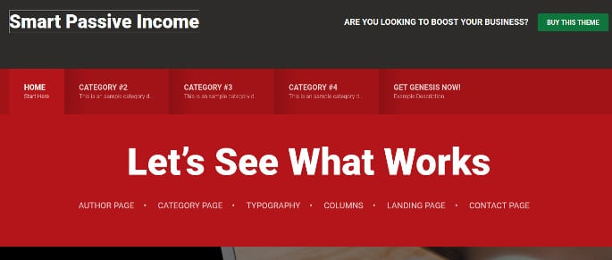
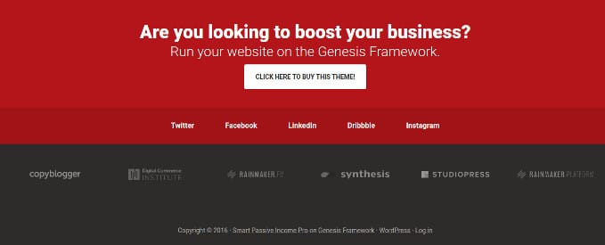

StupdioPress has launched the new Smart Passive Income Pro theme which resembles the blog of famous blogger Patt Flynn. For those who don't know, Patt is one of the smartest affiliate marketing professionals who has been making over $100000 every month through his Smart Passive Income blog. Patt Flynn has earned over a 3 million dollars so far because of his great strategies and smart design of his blog.

The highlighting feature of SPI Pro theme is its large fonts in the footer, sidebar, and header section. The big size immaculate fonts give a distinct look to the blog using the SPI Pro template.

The StudioPress Genesis SPI Pro theme is easy to install. Configuration is easy because you just have to enable or disable features you would like to use.

Like other Genesis Child Theme, the SPI Pro template provides a theme options page where the user can configure the following modules on their site.

### Header

The Smart Passive Income Pro theme from StudioPress flaunts an XL size header and a big footer section. You can add primary/secondary navigation system aka menubar to the header from the theme settings panel. SPI Pro theme uses black and maroon color for the header background.

The theme lets you use an image logo in the background. If you don't have one, the theme shows a textual logo using a font of your choice.

**Demo or download**

### Layouts

The Smart Passive Income Pro theme supports self or right sidebar at a time. It has full-width layout option wherein the theme removes the sidebar.

The theme ships with important widgets such as Newsletter subscription, social icons, recent posts, search, etc. It offers eight predefined areas for the widgets.

### Footer

The StudioPress Smart Passive Income Pro WordPress theme allows you to show the list of websites where your article or work was featured. IT supports horizontal menubar as well. The footer lets you add a call-to-action button and social media icons.

See SPI WordPress template **download or demo here**

### Homepage

One thing that attracted my attention was the theme's beautiful homepage design. The homepage is so beautiful that you cannot describe it in words.

### Responsive and page speed

StudioPress SPI Pro is fast loading WordPress theme which supports all popular browsers. It has Google Friendly code. Hence, the theme passes with flying colors on testing with various tools.

### Support

A bunch of experienced WordPress developers/users manage the StudioPress theme development company. The support provided by them has been appreciated by people all over the world. The template package packs a documentation that helps you understand various functions. If you still have doubts, you can contact the StudioPress support team.

### Pricing

The Genesis child theme SPI Pro costs **$99 here on StudioPress marketplace**. If you own the Genesis Framework, you can get the latest **SPI Pro template for below 40 USD here**.
