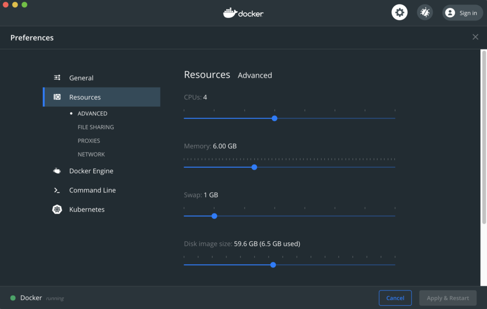
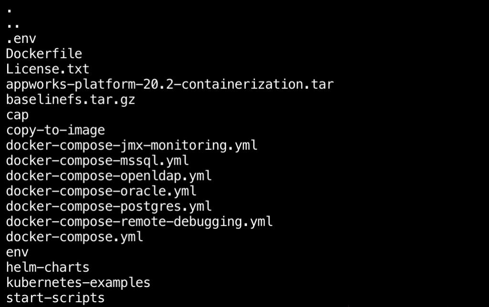
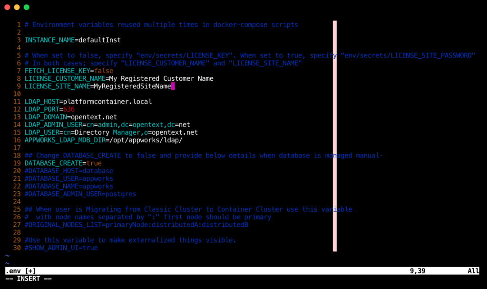
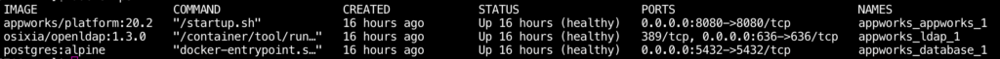

The latest version of OpenText AppWorks Cloud Edition (CE) 20.2 was recently released and promises to improve "developer agility through simplification and improved visibility with a new List Designer, new Action Bar Designer and added support for full translation of layouts." In addition this release comes available packaged in a Docker container, which makes it much easier to setup locally as a development environment or to simply try out the new features of this release.

## Grabbing the Download

If you are a licensed customer, you can grab a copy of the containerized version of AppWorks directly via your OpenText MySupport portal by navigating to Resources -> Downloads -> AppWorks Platform. The 20.2 release provides complete documentation as well as a Linux, Windows and Container download. In addition to this you'll need to have your license information handy including your registered customer name, site name, and license key. The documentation OpenText provides is more than enough to get you up and running quickly and also provides in-depth information should you need to customize your setup.

## Configuring Docker

My experience was generally straight forward on my local computer (which happens to be a MacBook Pro). You will need to install Docker and I highly encourage you to review the quick start guide if you are unfamiliar working with containers. One snag I hit early on was with my Docker version. I was running edge, which is the latest and greatest, but also prone to bugs or other issues. After I installed the stable release I was able to successfully follow the instructions and get AppWorks up and running correctly. In order to successfully run AppWorks, you will need. a minimum of 4096Gb assigned to your containers. To ensure you have enough memory, I highly recommend reserving at least 6Gb to ensure you have enough to run all of the associated containers.

<figure>



<figcaption>

Docker Resource Settings

</figcaption>

</figure>

## Setting Environmental Variables

After you have downloaded the container archive from OpenText MySupport (see above), you will need to untar it by issuing the command below. Make sure you have placed the tar file inside the directory you will to unarchive its contents (for example I created ~/code/appworks and ran the command from that location).

```bash
tar zxvf appworks-platform-20.2-containerization.tar
```

You should end up with the following directory structure:

<figure>



<figcaption>

AppWorks Directory Structure

</figcaption>

</figure>

Next you will need to add your registered customer name, site name, and license key as environmental variables in your local version of AppWorks. First of all open the .env file to modify the customer name and site name variables. You should be able to edit this using your favorite text editor.

<figure>



<figcaption>

AppWorks License Information

</figcaption>

</figure>

Note: you do not need to wrap either of these in quotes. Once you have saved your .env file, navigate over to env/secrets. In here you should see the following files:

- DATABASE\_ADMIN\_PASSWORD
- DATABASE\_PASSWORD
- KEYSTORE\_PASSWORD
- LDAP\_ADMIN\_PASSWORD
- LDAP\_CONFIG\_PASSWORD
- LICENSE\_KEY
- LICENSE\_SITE\_PASSWORD
- PLATFORM\_PASSWORD

You are going to edit the LICENSE\_KEY and enter the key provided by OpenText (see above). Your license key is a long series of numbers and letters separated by dashes. It is very easy to make a mistake if here, which will cause your container to not start, so pay particular attention as you complete this step. While you are here, go ahead and view the PLATFORM\_PASSWORD file and take note of the username and password (you'll need these credentials to login to your AppWorks instance). Once you have completed this, you are ready to build and start your AppWorks containers.

## Building the AppWorks Image and Starting the Containers

In order to build the image you will need to run the following docker-compose command directly from your AppWorks directory:

```bash
docker-compose -f docker-compose.yml build
```

Docker will grab the necessary downloads and will take a few minutes to completed. Once this process has finished, enter the following command to start your containers:

```bash
docker-compose -f docker-compose.yml -f docker-compose-openldap.yml -f docker-compose-postgres.yml up -d
```

When this completes you can verify your running containers by issuing the following command:

```bash
docker ps
```

After a while you should see three different containers for the web application, LDAP, and database. The documentation states this can take up to ten minutes and they weren't kidding.

<figure>



<figcaption>

Docker Container List

</figcaption>

</figure>

The LDAP and PostGres containers will become 'healthy' quickly, however you will need to wait some time before the web application (appworks/platform:20.2) becomes heathy. The reason for this is due to a large number of libraries and dependencies being installed into the container behind the scenes. If you're impatient like me and want to see what is happening, you can run the logs command (replacing containerid with your actual container id):

```bash
docker logs containerid
```

Once all three containers show as healthy, you should be able to directly access your new freshly installed AppWorks 20 at http://localhost:8080/home/system. You'll need the credentials from earlier (env/secrets/PLATFORM\_PASSWORD) to login. You should hopefully be good to go!

## Debugging / tips

Should you run into any problems along the way, here are a few tips:

### Docker Logs

Logs are your best friend when a container is either not healthy or continues to restart. When. I first setup my local AppWorks, I incorrectly entered the license key information, which was quickly apparent as soon as I viewed the logs for the appworks/platform:20.2 container. Thankfully most errors are quickly apparent once you take the time to review the log information.

### Check docker version

Like I said earlier, I ran into several issues when running the edge release of Docker. Issues can also happen if your Docker installation is not up to date. This is especially true with the LDAP container when errors like this can derail your installation. Be sure to check the current version at docker.com before proceeding with any of the steps above.

### Search OpenText knowledge base & support forums

By all means, take advantage of your OpenText MySupport account. I was able to find related issues others had faced when installing AppWorks in a container, which was helpful. The knowledge base is extensive and the community is invaluable.
