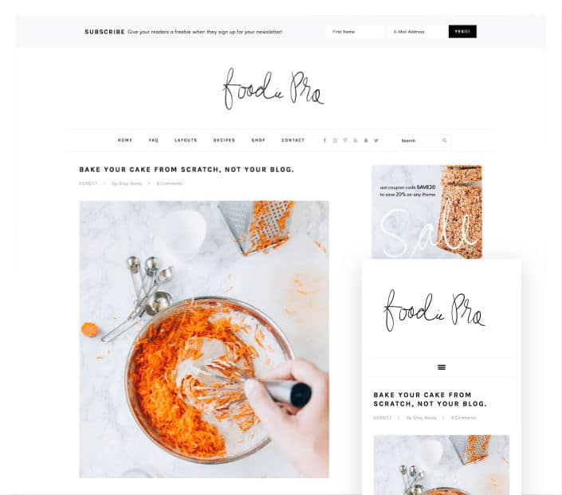

Unlike tech and WordPress niche, food blogging is not a competitive niche. Hence, if you share unique recipes on the food blog, you can make good money online.

If you're planning to start a food blog or you already own a food blog, your objective should be to get as many loyal visitors as you can and make money from the site without affecting the visitor experience. To get desired results, you must use a powerful and SEO friendly food blog theme. One of the best templates for the recipe sites is Foodie Pro.

Foodie Pro is a widely used Genesis child theme. It is designed for food bloggers by experts. Here's my review of this template.

## Foodie Pro review

### Customizable home page

Like other top Genesis themes, Foodie Pro theme lets you customize the homepage with powerful widgets. You can use this feature to display featured posts containing affiliate links or ads, your new or evergreen articles, etc. If you place the widgets wisely on the home page, a visitor will explore more pages on your website. Thereby reducing the bounce rate. A site with a high bounce rate is less likely to perform well in the SERPs.

To customize the home page, drag and drop the widgets which you want to see on the home page. You can configure the Foodie Pro template to show posts in a grid layout with up to 6 columns.

The theme allows users to add widgets directly below the post. This position is very important and highly converting for any site. It is the place where smart bloggers place AdSense ad units or newsletter subscription form. After post widget area feature is exclusive to only Genesis Framework. I've used several premium themes. None of the themes provide this feature.

See demo here

To place the ad unit or a subscription form below the post, I used to edit the theme's single.php page. If you are using the Foodie Pro theme, you don't have to edit pages. Simply drag and drop the widget of your choice. You can also experiment with different widgets to know what widgets or ad units are performing well.

The Foodie Pro theme allows you to place widgets in the footer area. You can add social network profile widgets, 728 x 90 ad unit, featured posts, Instagram feed, etc.

### Design

Foodie Pro Theme supports 6 layouts. You can configure this food theme to show sidebar to the right or left of the blog post. You can also place sidebars side by side.

The Foodie Pro WP theme supports full-width layout.

Foodie Pro theme is based on HTML5 markup. It has a responsive design. Hence, the page elements will be automatically resized when the user is browsing your site on a tablet or a mobile device. The FP theme lets you create a stylish menu bar that features social network icons and a search box.

The theme employs white color scheme so that you can flaunt your work and recipe photos with pride. The theme doesn't use heavy pictures nor does it transfers large stylesheets to the client device. Hence, it opens quickly on desktops and mobile devices.

Foodie Pro provides three color styles it allows you to set featured images for blog posts.

### Archives

When the readers find your recipe unique and interesting, they'll explore archive pages on your site to find more cool recipes. To give the visitors a quick look at the recipe, Foodie Pro theme displays your recipes in a beautiful grid layout. You can configure this template to display the recipe post excerpt below the image. The theme lets you add widgets to the archive pages.

Buy FP theme here

### Subscription box in the header

The Foodie Pro WP theme can display a full width newsletter signup box above the menubar and the site logo.

### Translation

Foodie Pro theme enables you to translate the text content from one language to another. It also allows you to change the font and set website logo.

See demo here

### Other features

Foodie Pro ships with the free easy recipe plugin through, which you can create SEO friendly recipes. The recipes created with this plugin are powered by the Schema.org microdata.

The theme allows you to setup your shop online for free with the WooCommerce plugin. Once your Woocommerce shop is live, you can sell your recipe books or any other product online.

Foodie Pro supports threaded comments. It is compatible with several premium plugins. It allows food bloggers to import demo layout so that they don't have to waste time in setting up the site.

### Price

Foodie Pro is a premium theme that costs $130 on StudioPress.com. StudiioPress has launched 20+ powerful WP templates. If you keep changing themes, you must join the StudioPress Pro Plus Membership program that costs $499. Once you become a Pro Plus member, you'll have access to all premium themes that you'll find on Studiopress.com.

**Conclusion**: If you are a great cook or you're learning to cook food, you can share your experience or cool with the world through the StudioPress Foodie Pro theme.
