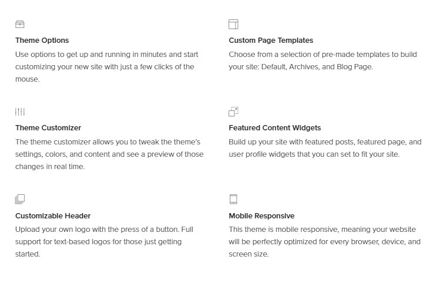
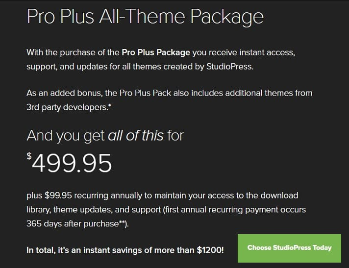

StudioPress Genesis Framework powers 1000s of WordPress sites. It is better than Thesis and many other WP frameworks. It is SEO friendly, mobile optimized, lightweight, and fast. SGF includes several intuitive features. It includes special modules that save your money. Example, you won't need a premium opt-in form aka newsletter plugin if you use SGF. Many top bloggers who earn six figure income per month use SGF. StudioPress Genesis is the highest rated and most successful WordPress product.

The Genesis Framework costs 59 USD. The basic package includes only one theme. If you want to make your website look stunning, consider buying one of these Genesis Child Themes. Below picture describes the various features offered by Premium child templates.

The problem with a single child theme is that you will have to use it forever or buy another WP Premium template. StudioPress has a special Pro package plan in which the users gets the below super benefits:

### Unlimited access to the world's best WP themes

StudioPress has published plenty of top WordPress themes under its Genesis Framework brand.

If you have one or more than one sites, the **Pro Plus package** gives you the freedom of switching to another Child Theme. You will not have to spend a penny for this.

Imagine that you own a news website. If you have bought a premium WP theme, you will have to use the template forever or buy a new one if it does not turn out be a successful investment. If you have bought the Genesis Pro Plus package, you can try out various News Child themes.

StudioPress keeps introducing new themes every year. The **Pro Plus package** users will have unlimited access to these themes as well.

People waste 1000s of dollars in hiring freelance developers or companies to customize their existing templates.

### Detailed theme tutorials

Genesis Pro Plus package allows the user to go through high-quality tutorials published by StudioPress. You will get good knowledge on the various modules of the Genesis Framework. The complete theme tutorials are beneficial for developers as they can learn Genesis Framework for developing their own child themes.

### Huge saving

The **Pro Plus pack** from StudioPress costs just $500. You can purchase individual child themes for $59. More than 50 Premium Child themes for Genesis Framework have been made available by StudioPress and third-party developers. If you buy the themes individually, you will be spending a whopping $2500. If you get the Pro Plus package, you will save over $1000. You can invest the saved money in your other projects.

### Unlimited updates

StudioPress releases updates for its Child themes whenever a new bug the developers find new bugs or they add a new feature. As a Pro Plus All Theme Pack user, you will get new updates for all your sites. You will also enjoy unlimited support from the SGF development team.

As you can see above, the All theme pack ships with several benefits. **Click here to buy all themes from StudioPress (Pro Plus pack)** and save over 1000 dollars.
