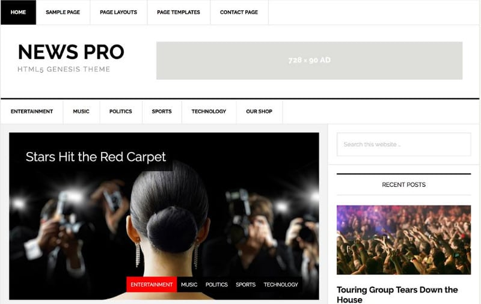
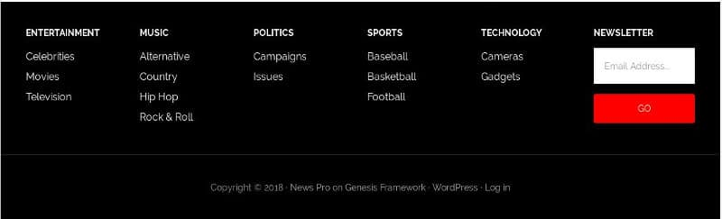

News Pro is one of the flagship StudioPress themes. It is also one of the most widely used WP magazine templates. Powered by the HTML5 markup, StudioPress NP is based on minimal flat responsive design. It is ideal for magazine sites that cover a variety of topics.

NP is built on Genesis Framework which powers 100K+ sites. Is the News Pro theme suitable for your site? Is it easy to use and SEO friendly? Let's find it out:

### News Pro review

StudioPress WordPress templates are easy to install and NP is no exception. Once you download the theme's ZIP file from StudioPress.com, upload the file to the wp-content/themes folder using an FTP tool. You can also use the built-in WordPress theme installer utility to install this template.

### Features

To customize News Pro, open the WordPress live customizer tool or head over to the theme's settings page. Below are the various sections of the theme and their features:

## Header area

**Logo**: The News Pro WordPress template provides an option to add a logo to your site. The logo will appear in the header section.

**Top bar**: Above the logo or site title, NewsPro WP theme flaunts a top bar where you can add links to the most important pages of your site (menu bar).

**Main navigation**: Below the logo, you'll find a beautiful navigation bar, which has the same width and height as the top bar. The theme supports multi-level menus. NewsPro lets you specify the menu bar which it should display on a mobile device.

**Breadcrumbs**: Breadcrumbs improve the user experience. It also helps modern search engines understand the structure of the site. NewsPro theme has a built-in breadcrumb system. Hence, you don't have to use a third-party plugin or edit the theme files to add breadcrumb functionality to your news site/blog. Breadcrumbs in this theme appear below the main navigation bar.

Download News Pro theme here

## Layouts

Like other Genesis Child themes, News Pro supports multiple layouts. Depending on your requirements, the sidebar can appear on the right or left side of the site. You can also configure News Pro to hide the sidebar (use the sidebar's space for displaying the content). To change the layout, the user must navigate to NewsPro's settings panel.

### Homepage

The StudioPress theme allows users to customize its homepage by dragging/dropping widgets at the positions of their choice. It lets users show featured images and titles of certain posts as an interactive slideshow. It also has an option to display a featured post and its excerpt on the home page.

See News Pro template demo here

## Footer area

**Multi-column footer:** A news site may have posts of various types. To make sure that the user doesn't leave the site quickly, the NewsPro theme features a multi-column footer section where you can add categories, tags, featured/trending posts, etc. You can also add an opt-in form to this section.

**Dedicated copyright area**: News Pro enables users to display copyright notice and symbol below the footer section.

### Ad spaces (monetization)

The StudioPress theme offers several ad slots. It lets you place a horizontal banner in the header section and a rectangle/horizontal/square banner in between the comments and posts. The theme ships with a special widget that lets you add up to 4 square banners (125 x 125 size). You can place this widget in the sidebar area or the home page to maximize the earnings.

Download the theme here

### What did I like about the theme?

**Features**: Unlike some themes that provide tons of confusing/useless options, News Pro is easy to configure. You don't have to waste your precious time in configuring options that won't help your website's ranking in search engines or visitor.

**Stylesheet size**: The theme's stylesheet size is just 10 kilobytes. Furthermore, it doesn't employ heavy or complex JS code. Hence, the site powered by the StudioPress NewsPro template will load quickly in the browser and score great in Google Page Speed tests.

**SEO Friendly**: News Pro is a responsive and SEO friendly magazine theme. The post title is embedded in the HTML h1 tag. H1 is one of the most important HTML elements on a web page. Many themes use display post title in the H2 tag, which is considered as inferior to H1 by many SEO experts. One more reason to use StudioPress NewsPro is that the theme passes Google structured data tests with flying colors.

Buy News Pro template here on StudioPress.com.

**Conclusion**: News Pro is lightweight magazine theme for the WordPress platform. It has several layouts, dedicated ad slots, and search engine friendly/responsive design.
