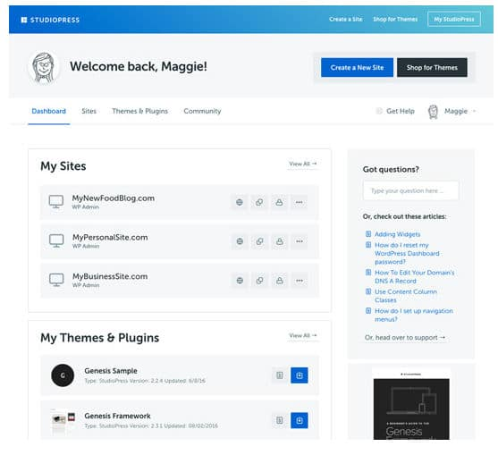
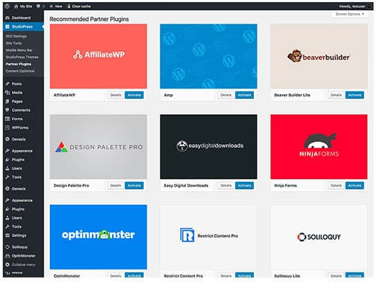

StudioPress is a popular name in the world of WorldPress. It has launched several SEO optimized WordPress themes. Popular blogs and news websites use its themes.

Last year, Copyblogger Media, the company that owns StudioPress had launched StudioPress sites, a great and cheaper alternative to managed WordPress hosting.

Managed WordPress hosting from a reputed company costs no less than $25. For example, KINSTA and WP Engine are two of the most popular managed hosting providers. Their subscription fee starts at $100 and $29 per month.

StudioPress Sites pricing starts at $27 per month. If you go for the yearly plan, you'll have to pay just $24 dollars every month. StudioPress not only saves your money, it gives you access to sexiest and most powerful premium WordPress themes. The templates have responsive design. They provide a great experience to users browsing from a mobile device or the desktop.

Each theme is powered by the Genesis Framework. For those who aren't aware, Genesis Framework is the flagship product of StudioPress. It powers several high-traffic and popular websites.

If you're planning to launch an eCommerce site for selling digital products such as eBooks, software, templates, then StudioPress Sites is an excellent option for you. SP Sites provides a special eCommerce plan that allows you to launch WordPress powered eCommerce websites.

### Hosting

Your site is hosted on a server optimized for the WordPress content management system. Unlike shared hosting companies that impose bandwidth and visitor limitations, StudioPress Sites don't warn users when there is a huge surge in traffic.

Most importantly, you don't have to follow any tutorials on installing WordPress, plugins, etc.

StudioPress Sites provide a wizard-based interface for installing and configuring WordPress. Hence, your site will be live on a few clicks of a button.

Once your site is ready, all you have to worry about is content. You don't have to log in to the server through CPanel or Terminal for editing configuration files to make the website faster. SPS caches static pages of your sites by default. It provides an option to clear cached content in the WP dashboard.

Also read: OptinMonster review: Powerful lead generation plugin

### Support

StudioPress employees take care of configuration tasks. They work 24 x 7 to ensure that your site is always up and serving the visitors. In case you're facing some issues or need help, drop an email to the support team. They'll get back to you soon.

Click here to try StudioPress Sites

### Security and backup

WordPress updates address security issues and bugs that researchers and WP experts have recently discovered. It also provides new features to the users.

If you're using shared or unmanaged hosting, you'll have to update WP manually from the WordPress dashboard. If you use StudioPress Sites, you don't have to worry about updates. SPS updates WordPress automatically whenever Automattic introduces a new version of WordPress.

Every day, we get to hear about sites being hacked or attacked by DDOS attacks. Whether it is new or old, Websites are always on the target of hackers. To make sure that your website is always yours, StudioPress Sites have installed powerful firewalls on their servers. They employ smart name servers to block DDOS attacks.

StudioPress Sites servers have a special script that runs every day to backup your database and files. Hence, you don't have to worry about backups. Other managed hosting firms may charge you for daily backups, but SP Sites won't.

Signup for StudioPress Sites

### Managing themes and plugins

As mentioned earlier, StudioPress Sites allow gives users access to premium StudioPress theme. To enable a template or switch to another theme, log into to your WP dashboard and click on the StudioPress option on the left sidebar. Now, select the StudioPress Theme option.

SP Sites provide a one-click option to enable or disable premium WP plugins. Some of the plugins are free. Some plugins require you to provide API key. To get the key, you'll have to purchase the plugin. SPS allow you to use free plugins published in the WordPress repository. If the plugin isn't supported by the SP Sites platform, you'll be asked to remove it.

See full features of StudioPress Sites here

### Managing sites

If you're planning to launch an extra website, you'll have to buy a new plan. Once you launch a new site, you can manage it from the StudioPress Sites dashboard.

### Canceling account and demo

SP Sites don't allow users to see the demo of their service. However, if you signup for StudioPress sites, you'll get 30 days money back guarantee. For some reasons, you don't like SP Sites, you can ask for a refund. The service provides an option to cancel their account.

### Pros and Cons

Pros:

- Support for high traffic websites.
- No bandwidth, server resource usage limitations.
- Access to premium StudioPress themes.
- Dashboard for managing websites.
- Free daily backups.
- Cheaper than the best managed WP hosting service providers.

Cons:

- None.

Signup for StudioPress Sites

**Conclusion**: If you're searching for a cheaper alternative to managed WordPress hosting services, you should try out StudioPress Sites. SPS provides a user-friendly interface for managing portals. It enables users to install and use third-party WP plugins.

Also read: Elegant Themes Review
