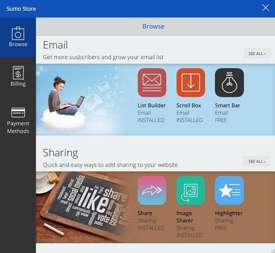
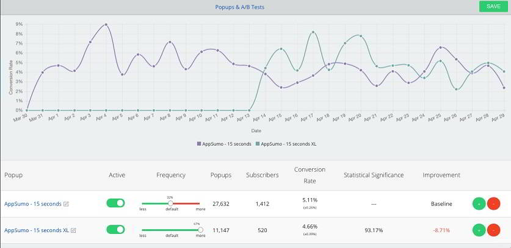

Suomeme is an awesome all in one plugin for promoting blog posts. It has a powerful sharing button that not only looks great but also allows users to share posts on top social networks without adding a lot of weight on your pages.

This plugin lets users add a floating bar in the header or footer area of your blog. Thus you can use it as an alternative to hellobar. Sharing images from your blog posts is possible with Sumome. The buttons for the same will appear automatically when the user hovers mouse cursor on the picture.

Sumome supports click to tweet, and it makes possible for users to check analytics dashboard in the WordPress Admin panel. You can use it along with digg digg plugin.

Sumome supports some of the best premium list building plugins like Mailchimp, Aweber, CM and CC (constant contact). Its module for the same will allow you to create beautiful popups in which the visitor will enter his email address to subscribe to your blog posts and updates. If you have HTML skills, you can quickly change the appearance of the popup.

Sumome tracks how many new subscribers you've added in a given period. It supports call to action feature in which the visitor will be shown a full-screen CTA for increasing the subscriber base.

If you want to increase adsense revenue and conversion, you should enable the heatmap feature in sumome. This function will be active 24 x 7, and it will make you aware of the hot spots on your website. You should try out the heatmap feature as it is very useful.

The sumome plugin can be configured to load at a time when the user is about to hit the back button to the website or he finished reading your article. This is a smart module and promises good user experience for the visitor.

Unlike other similar plugins, Sumome supports color customization. Thus you can design it to suit your theme foreground and background color.

Download the plugin.

The devlopers of this free WordPress plugin claims that Sumome's social sharing feature is actively used on many top websites.
