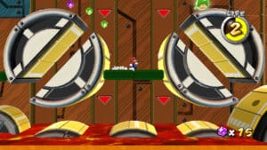
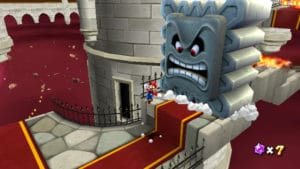

Since its announcement, Super Mario Galaxy generates almost more confusion than curiosity in the hearts of players. The system evolution at the heart of this might he not have to change, or worse, distorting the very spirit of the series and the formula for Super Mario 64? Legitimate concerns, but in vain, since the idea to move Mario in a galaxy appears to be the key that opens the very doors of renewal and that allows him to leave behind him all his previous adventures.

The space was the idea that was essential to put in place to expand the scope of our heroes, the land no longer imposes any constraint to a space that Mario is now faced with the most unthinkable. Gaming consisting of a cluster of galaxies, themselves composed of stars more or less close to each other, the first novelty is that it is possible and indeed common 's set off a small planet to another within the same level. Action made possible by the concept of gravity which, by its mere presence enriches the gameplay in a hallucinating way. Exploited in a very subtle throughout the game, the gravity's role is first to guarantee the attachment points on these small asteroids that you explore, from the tiny to those that extend to the eye. Like a Little Prince wandering to the discovery of beings inhabiting the stars of the galaxy, Mario surveyed territories much more varied than in all his past adventures. Current merrily around the celestial spheres, the plumber is often upside down to make that jump back or on the surface of the planet or on a nearby star which have entered the field of attraction.

There is no doubt that those carrying out to have surpassed propose environments such wealth and such inventiveness. The universe takes a perverse pleasure to visit some beautiful and sometimes repulsive, for a journey of astonishing diversity. Difficult to find better on Wii, although obviously the technical won’t impress hardly regulars competing machines.

The ultimate success of gameplay, here it is. Super Mario Galaxy takes the best of his elders while optimizing the findings using completely new. Those who were annoyed by the previous management manual shutters can thank this opus to provide automated cameras to a result that can regulars as impressive of its kind. The challenge has been carefully designed to satisfy all types of players. If the sixty stars required to complete the game in a straight line is easy to recover, the real challenge starts only with the research on different stars and comets is a real challenge even for connoisseurs. Redo adventure allows players to rediscover the game a little simpler but much more interesting than it seems on paper.

Nintendo continues to make in the tale for children, but the ambient naivety is essential to the magic that includes the game and it is hard to complain when they see this entire little world evolve with tenderness and sincerity. And when Toad and chubby-cheeked star alongside obese and fungi fur, it asks for. The 20 out of 20 could have easily become if the 19 were not already explicit enough to convince you of the obvious qualities of the Super Mario Galaxy. The vastness of space finally gives the plumber the freedom to express his talent by making gender a new dimension that will be difficult to approach in the future. As for the laws of gravity, they give rise to a multitude of situations that will surprise you until the end. Super Mario Galaxy is by far the very best Mario which I could play.
