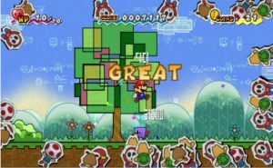

Super Paper Mario retains a focus on running the adventure, but separated from its background on the role play, starting with the fighting in turn-based. A change that should delight all those for whom the name of Mario is totally separated from the platforms type, which at least has the merit of renewing a few things. It is hoped however that Nintendo has not drawn a line on the concept of the Mario RPG, but it is likely that the next title will be rather light on DS. Nevertheless, Super Paper Mario is not just a platform game, it is above all a constant source of amazement as it demonstrated creativity in both its playful design and design graph. The result is very refreshing and proves that the field of video game is full of hidden concepts waiting to finally be exploited.

Having got wind of an odious marriage between his tender Peach, Bowser and his rival, Mario, burst into the castle of the infamous deal him for his account. He then realizes that he is not in question, and that the person responsible for the abduction of the princess is a Count Niark seeking the heart of chaos. Begins an adventure where unexpected plumber is going to be coerced and forced to ally himself with the formidable if he wants to thwart Bowser's plans Count. No way to start such a business alone and the game includes no fewer than four playable characters, among which it is possible to switch at any time. Mario will be joined by Princess Peach, whose dress is still legendary office parachute to glide through the air. But the girl also has the advantage of being a girl, which could serve him well once or twice. Although terribly stupid and slow to move his heavy frame, Bowser will mean more or less office joker used to spit flames on the toughest opponents. Finally, while making a late arrival on the scene, the friend Luigi finds his talents as an athlete and we share his technique somewhat academic jump height.

Admittedly, the game is far from impressive on purely technical grounds, but Nintendo knows how to move the player without him pull the wool over the eyes. The realization is full of incredible visual tricks, when they are not outright tributes to earlier parts of the series. The gameplay is its effectiveness in the ingenious use of the passage between the two dimensions. Super Paper Mario is the first game using it really subtle complementarily between the 2D and 3D, offering a new vision of the game platforms. The change of characters and the system symbolized by the allies Pixels enrich much progress.

Allow about 15 hours to finish the game unless you absolutely want to see everything and collect all the hidden and optional items. Multiplayer options would have been superfluous to inflate a little more life. You will find immediately the noise level, with themes and characteristics of the sound universe of the plumber, even if it is not that great. More than the story itself, it is really absurd and parodic side of this title that make it completely awesome. It is one surprise after another and enjoy each new discussion with special attention.

Super Paper Mario sits smoothly on the podium of the best titles available on Wii, and showed such creativity we necessarily want to pay tribute. Re so amazing with the universe of the platform, the title gives us a whole new kind of approach, imposing a concept that no one had ever attempted. The result is impressive and successful control in addition to bathing in a totally pleasant atmosphere shifted.
