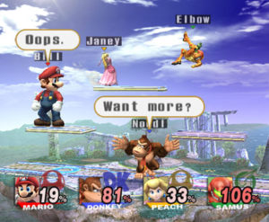
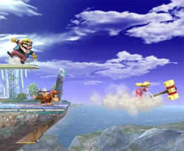

It was discovered in 1999 on N64, and nearly ten years, the series will count as three episodes, each on different mediums. But when we see how it has evolved in that time, we see that Nintendo has made the right choice by focusing on quality over quantity. Super Smash Bros. Brawl succeeds an episode GameCube already very convincing and dethrones without difficulty. Just start the software, the player is literally bombarded by an avalanche of game modes, new to most, and can only kneel before the proper amazing range of characters available.

If beat'em is the ultimate player, Super Smash Bros. Brawl also offers a fascinating spectacle for those who recklessly to get behind the game screen and inevitably end up typing the lever, seduced by the improbability clashes. Still very nervous and chaotic from the outside, the fighting is still very fine for the player who has warned his marks on the previous parts of the series. In addition to offering a fantastic gameplay, Super Smash Bros. Brawl is above all an ode to the game in the sense that it does not only known series of characters but also their world and their soundtrack. Remixed by many different composers, these themes take on a scale irresistible to whoever heard at the time of the NES or Super Nintendo. With over 300 tracks in total, the pretty nice original soundtrack is also accessible via the Sound Test game mode, and it is breathtaking for the nostalgic. The most beautiful medley of Mario, Zelda or Donkey Kong alongside totally unexpected remix of the old Tetris or Super Mario Land, not to mention the lyrical versions of Fire Emblem and the main theme of Super Smash Bros. Brawl. Never before seen in a video game! On a visual level, Super Smash Bros. Brawl is what we have seen more success on Wii since Super Mario Galaxy. The situations are so delusional that sometimes more time to zoom in to take pictures to play! If the general gameplay has not really changed since the previous part, there is always impeccable and few worries camera just blacken the table if you play in coop mode in the adventure. The GameCube or Classic Controller is ideal for playing Super Smash Bros. Brawl.

The app has so many bonuses, so many trophies, and so many modes to play, so secret that it takes months to play around. Nothing but the adventure mode alone provides more than 20 hours of play, it speaks volumes about how this title is complete. And that's without counting the multiplayer and online parties. With over 300 songs to unlock the Sound Test, the soundtrack for Super Smash Bros. Brawl is the eighth wonder of the world nostalgic for the player. Between the themes remixed so totally unexpected (Tetris, Super Mario Land, Fire Emblem ...) Medleys and transcended by the genius of composers passionate (Zelda, Mario, Donkey Kong), one reaches the pinnacle of what the music search fan of the Nintendo universe.

Its history is indeed so improbable, so burlesque, that has a desire, is to return to after all the cinematic scenes in the game ... If you're not afraid to spend the summer without putting your nose out because of Super Smash Bros. Brawl, do not hesitate. This episode easily outperforms its predecessor by having a monumental adventure, an incredible range of characters and the ability to play online multiplayer. We also appreciate being able to play coop on most game modes, and bow respectfully to the collector of the soundtrack of the game
