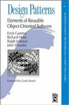
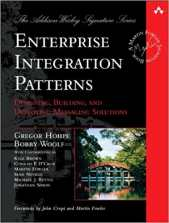

_**This post contains affiliate links. If you click through and make a purchase, I may receive a commission (at no additional cost to you). As an Amazon Associate I earn from qualifying purchases. This helps support the blog and allows me to continue to make free content. Thank you for your support!**_

* * *

One of the benefits of working at a large organization is the opportunity to work with a considerable number of very bright and talented individuals. Recently I went through a role transition from traditionally supporting web based content management systems to supporting large interconnected systems. I was fortunate to connect with a colleague during that transition time who was well versed on the latest technologies and approaches in software development, specifically with a focus on distributed systems and modern systems integration. This post highlights five main areas that are worth research and understanding if modern-day systems integration projects is something you might be involved with in your current work or in the near future. My disclaimer is that I am not an expert in any of these domains, however I want to pass along good material that I will be studying further and is hopefully of benefit to others.

### Software Design Patterns

Knowing and speaking fluently on many software design and architecture patterns will provide a solid foundation for anyone starting with software architecture. The Gang of Four book, Design Patterns: Elements of Reusable Object-Oriented Software, was one of the first books I read on the subject and has proven to be the fundamental authority over time. If you are a .NET person, you might want to also check out Professional ASP.NET Design Patterns, which I read several years ago and found it very informative. It is however quite dated now discussing older libraries so you might want to check out the newer .NET Design Patterns, which was just released last year (2017). The Gang of Four book is quite old now, but many of the fundamentals in the patterns covered are still very relevant today. It is also worth researching and looking up newer websites and resources that re-look at them in new contexts or languages (such as the .NET books above or other literature for different platforms). Another good resource is the POSA (Pattern-Oriented Software Architecture) books, which have been around for a long time and set a solid basis of understanding for architecture patterns. Finally, if you want to stay up to date on the latest on your commute to work, be sure to check out the Software Engineering Radio, which has good podcasts on these and various other applied technologies/frameworks/patterns. My personal favorite Podcast, .NET Rocks is also a valuable resource to help keep you fresh on the latest technologies in the .NET world.

### Enterprise Integration Patterns

When talking systems integration, it is important to understand the foundation of enterprise integration patterns. I have been advised on two excellent places to start. The first is Enterprise Integration Patterns by Gregor Hohpe. The book provides a "consistent vocabulary and visual notation framework to describe large-scale integration solutions across many technologies." In addition to the book, there is an accompanying website called enterpriseintegrationpatterns.com, which covers many of these concepts with accompanying diagrams and examples. Secondly, the SOA Patterns book and site from Thomas Erl is a good way to look at those same concepts with Service Oriented Architecture. These same concepts are equally relevant to (HTTP) APIs, and products/frameworks providing "API Management" in enterprises. I've been advised that Gartner and Forrester reports are good sources for articulating the scope and value of these emerging trends and cataloging the landscape. In recent years these APIs have been typically fronting micro-services. The stark difference being that SOAs were designed to share as much as possible with broader enterprise clients, while micro-services lean more towards sharing as little as possible, and simplify their interface and encapsulating their data. See Microservices vs SOA: What’s the Difference? for a better breakdown on this.

### Modern Service Discovery Approaches

A third area worth some research in this domain is the concept of modern service discovery approaches. I was told that it's worth looking up Consul, Eureka and Spring Cloud's use of that and other Netflix OSS tools. From the .NET side of things, Steeltoe, is a good equivalent for service discovery framework described as, "an open source project that enables .NET developers to implement industry standard best practices when building resilient microservices for the cloud."

 A good way to dig into some of these is through containers (detailed more below). A solid understanding of a containerization technology such as Kubernetes and how services work and provide discovery of containers deployed as services on the platform is eye opening. Project Istio builds on Kubernetes to provide even better options for interaction and mediation of containers and services within the Kubernetes echosystem.

### Data and ETL

Extract, Transform, and Load (ETL) is the process of "gathering data from multiple sources, in multiple formats, and move it to one or more data stores." In recent years with changes in modern software architecture, there have been a number of newer ways to do "ETL". The concept of ETL has morphed into more of a "data pipeline" or stream of data through a pipeline. Many emerging technologies such as Apache Storm, Apache NiFi, Spring Cloud Data Flow, Apache Spark, and their equivalent cloud versions including AWS Data Pipeline, AWS Kinesis, Azure Data Factory, and Azure Stream Analytics are definitely worth some research. These are becoming the foundation of modern big data infrastructure and should be understood in terms of their applicability to your own project requirements and constraints. Some recently popular architecture patterns that touch on a lot of this (which may not be a good thing, adding so much complexity to one implementation) are Command and Query Responsibility Segregation (CQRS) and Event Sourcing. They can be used independently or together.

### Containers

I mentioned Kubernetes above. If you want to learn some of these technologies, there is no better way to do this than to experiment and run them for yourself. It is fairly easy to get up and running with Kubernetes locally or even OpenShift Origin. There are also free cloud options at Azure or AWS to get started deploying independent services and data stores as containers. If you don't mind paying for it, AWS recently launched their self-managed Kubernetes service EKS. I was advised to try to build micro-services in .net core or the language of your choice for those services. The idea would be to essentially glue them together with messaging and queuing systems like RabbitMQ or Kafka or AWS SQS. The goal would be to have them call each others' API RESTFul endpoints. One scenario could be to setup micro-services in order to dump data into a queue or data pipeline to move and transforms from one point to the other. The options are endless. With the cheap cost of the cloud and the ability to setup containers locally, this opens a whole range of choices in the types of infrastructure you can dig into and learn in your own time.
