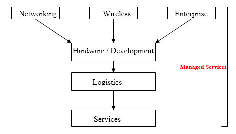

Marconi is a Telecommunication and Networking solutions organization involved in new technology products and solutions as well as the service to provide invaluable support to its customers.  Marconi was originally a division of the former General Electric Corp (GEC) of Great Britain.  Several years ago, the newly installed executive management of GEC realized that the conglomerate was essentially a slow growth entity with poor shareholder growth prospects.  Several of the companies that were a part of the GEC, had a foundation of a strong telecommunications and networking business, one with rapid growth performance and prospects.

Over the months to follow GEC divested itself of its various operating groups until finally emerging in December 1999 as a new company, Marconi.  In anticipation of this transformation GEC made sever acquisitions within the US including FORE Systems, which is based in Warrendale, Pennsylvania.

During the summer of 2001 I worked for Marconi in Warrendale, which was formally the Fore Systems acquisition.  The reason I decided to base this report on team structures and dynamics is because Marconi is a relatively new organization.  As such the overall structure of the business is substantially flatter than the traditional GEC.  While discussing mainly aspects of what I experienced throughout their Internship program, I will also focus on the organization looking through the eyes of an employee as regards to their understanding of Marconi.  When I first entered the company, I was informed about how much development and interpersonal relationships within work teams were an important part of the company.

As part of entry into the organization by new employees, Marconi informs them of the following about career advancement in a team based environment\[1\]:

- **Smooth assimilation**: A ‘buddy’ is assigned to all new employees to show them around, answer questions and introduce them to co-workers and team members in the various groups they will become involved within.
- **Performance Management**:  Each business unit has a management system in place to help define goals and priorities, and navigate to the road of success.
- **Mentoring**:  A mentor is identified who can serve as an objective partner in employee career development.
- **Global Orientation Event**:  Travel to hear about strategic direction of the company from the senior executives of Marconi and network with other recent graduates from all businesses and geographies within the Marconi family.

When I began working for Marconi, as part of the Internship program I was allocated a mentor to guide me throughout the summer.  Mentoring at Marconi meant that managers would receive training in integrating mentoring techniques into their relationships with interns. The idea behind this was to ensure that interns were welcomed to Marconi and assimilated into the work environment.  Mentoring also meant  advise on career opportunities, offered support, challenges and guidance, as well as exposure to new ideas, perspectives and standards within their area of development.  On top of this, summer social and networking events were part of the experience with structured development and socialization opportunities being a key success factor.

Marconi is very interested not only in the development of their teams, but obviously also the performance.  Their internship program highlights two main areas of continuing education and personal management emphasis\[2\].

- **Continuing Education**: Interns will participate in a series of courses that will offer a balanced program of Leadership, Technology and Communication. Each course will be a one-day development workshop taught by Marconi’s Professional Development team.
- **Performance Management**: Marconi’s performance management tool is used to determine and monitor progress through the 12-week internship.

Immediately I found myself getting involved with all kinds of different people across the organization and in many different team settings.  All of the networking events involved me within a team of other interns across the company through which I got to know in a short time frame, the main service group I worked within the company had me working in several teams also which I will go into more depth later on, and training team settings also became familiar to me.

Marconi falls under the category of a team-based organization structure whereby there is a flat span of control and relatively little formalization.  There are many self directed work teams and other service teams who work together to provide improvements to the company.  The main structure of Marconi falls under three broad areas dealing with the selling of communication products and services to business customers:

1. **Networking**:  Focused on customers with a Telecommunications license that do not predominantly rely on wireless.
2. **Wireless**:  Focused on Telecommunications customers that rely on wireless communications
3. **Enterprise**:  Focused on customers without a Telecommunications license.

The areas mentioned above outline the different types of product or service group that Marconi offers to different kinds of businesses.  In order to gain an understanding of how these three main areas are integrated through a team based structure within the organization, it needs to be broken down further:

The three groups of Hardware, Logistics and Services exist within Marconi that aim to work together in producing the end product and service for the customer within Networking, Wireless and Enterprise.  Managed services is strictly a services group with the main purpose to support the other groups in any way they can.  Managed services was the area I worked within during the summer and as such the main project we worked on was for use of the Logistics and Services departments.

Although Marconi is a telecommunications and networking specialist, the main strength within the organization today is its services department.  Marconi prides itself in being one of the industry leaders in its field to provide exceptional quality service to its customers.  A real person answers all service calls that come through to the organization within 40 seconds, rather than the industry standard of several minutes.  Although there is a cost that goes along with this service to the customers, most businesses are willing to pay highly for this and it has become a known strength of Marconi within the industry.  The Technical Assistance Center (TAC) is the main services department for Marconi.  This group is divided into 3 main teams, each of which have 2 team leaders within the Warrendale center.  The teams are level 1, 2 and 3 service Technical Assistant groups.  Level 1 employees are at the front line of all service calls and as such open any cases that come through from customers.  If they are not able to assist right away, the call is passed onto a level 2 service engineer who will then take over the case.  If there are still problems here, highly specialized engineers in level three will assist to remedy any problems that the customer may be having.

As part of the jobs of these support employees, as a level 1 engineer, 80% of time is allocated to helping customers and 20% of time is used to split down the team into smaller work groups and allocate lab time to learn the technologies for preparation of progression to level 2 which motivates employees to help each other out within these teams.  Level 2 engineers are allocated 60% of time to customer queries and 40% to the labs in their small work teams and Level 3 engineers spend most of their time researching within their own specialized area.

As mentioned earlier, I worked within the Managed Services group.  Managed Services can be thought of as a Self-Designing work team.  Their main purpose is to support all the other existing groups within Marconi.  It is further split down into teams of project managers who have the authority to allocate employees throughout the organization, to specific projects requiring diverse skill sets.  These projects are in turn developed to aid or enhance / improve other areas of the business by increasing productivity and ensuring highest efficiency and effectiveness throughout.  As part of the project I worked on during the summer I was made leader of a project given direction from one of the project managers to assist mainly the service department of the organization as well as logistics.  The project comprised mainly of consolidating key metric information from many Oracle CRM and Remedy Databases into a simple easy to follow interface for executive management.  In order to achieve this, many meetings had to be set up with different personnel across the organization in order to gain access to the information we required.  As part of my internship, I was also involved with Level 1 training groups which gave me a better understanding of the Technical Assistant Center overall and greatly helped the project.

It is not always possible for team members within Marconi to be located within the same physical environment.  Virtual teams are a big part of the company as they have some of the most sophisticated teleconferencing equipment available.  Many meetings take place with members of the Managed Services department in the Dallas offices through teleconferencing, as it would be to time and money wasting to fly out to the different locations.

Managing Interpersonal relationships is one of Marconi’s key focuses on its employees.  In order to have both efficient and effective work teams, it is necessary that dysfunctional conflict is kept to a minimum.  As such, one of the requirements of all employees is to get involved with seminars that are held locally at the organization dealing with this very topic.  As in intern, I was involved with all the other interns at the beginning of the summer in many different training work groups and one of the main seminars dealt with individual behavioral tests and profiles in order better understand strengths and weaknesses when dealing with other people in teams.  Everyone had to take a Dimensions of Behavior test provided by Carison Learning company and when the results came through we were involved in more seminars concerning relationships with other people.  The main goals of these seminars both for interns and employees of the company were\[3\]:

- Understand your behavioral tendencies and develop an understanding of how your behavior affects others.
- Understand, respect, appreciate, and value individual differences.
- Develop strategies for working together to increase productivity.
- Enhance your effectiveness in accomplishing tasks by improving your relationships with others.

All of this helped me a great deal in the early days of my internship.  I had already been through all the stages of group development of forming, storming, norming and performing in the seminars, so when it became time to apply this to my job, I was already very confident in working with the various people across managed services.  My initial project as mentioned earlier only involved me being in a team with two other interns with a project manager to guide us.  However through resources and expert input into our project from various employees across the business, it wasn’t long before we were running meetings with average of 6 to 8 people involved.  Rich Liebsher, who was our project leader, brought both interpersonal and leadership skills to our project and helped guide us toward our main goal.  Both myself and the other interns involved brought about technical and conceptual problem solving skills.  Our continuous team training throughout the internship encompassed all of this.

While I worked within the managed services, I also became involved with another team within TAC.  This was the level 1 training that I mentioned earlier, and 3 other interns were also involved with this.  At first the training sessions involved weekly lectures regarding the various products and networking configurations available with weekly quizzes to test how well the team members were gaining an understanding of everything.  It progressed into workshops whereby everyone would be involved in the lab configuring real hardware and performing real tests.  For the most part, the interns worked well with the regular employees, but toward the end of the training there was some conflict from regular employees who were unhappy that the interns were allowed to try new and different courses from them.  The reason behind this was because the interns only had the summer to learn and the employees would eventually take part in that training within the near future.  This issue became dissolved in a very short amount of time and other than that – everyone worked together well in their teams.

Unfortunately I did not have much experience working within the Logistics or Hardware groups.  The reason for this was because I concentrated mostly on the services end, which is by far the largest group, and other team members concentrated on Logistics.  This project did not involve Hardware, as it was a service tool designed to be used mainly by logistics and services executives.  Although I did not work directly within these groups, several meetings required advice and information from employees out of those areas to help better our understanding of the database systems used throughout the company.

Through these involvements, it was easier for me to paint a conceptual view of how each of these departments interacted and supported the three main groups of Networking, Wireless and Enterprise.  Most importantly I was beginning to understand exactly how Managed Services was really an effective group that could support all other departments within the business continually through many different projects.

When conceptually understanding how all the teams and departments work together, it is vitally important to understand the overall conceptual goal of the organization also with everyone working together to achieve this.  During the summer one of the training courses involved learning all about the organization and its goals, so it was clear to understand long term goals along with the short run projects all the interns were involved with.  Marconi use the term “Our Finest Hour’ which is made aware to all employees within the business, almost as part of the organizational culture.  “Our Finest Hour” is intended to showcase Marconi’s ability to create individual moments for their customers and their customer’s customers.  In other words, to provide exceptional quality of service that will spread out to other businesses.  In order to achieve this, they need to continue to produce industry-leading products, a workforce of experienced and dedicated people, and a corporation with all the necessary technical and financial resources to ensure overall success.  Marconi is a company that is not encumbered by revenue streams or technology constraints from legacy, old technology product lines due to the fact that the company in itself is so new.  Within a short amount of time, Marconi became a Top Tier competitor in the telecommunications industry.

Marconi has shown many times that it is committed to its employees success.  Through its team based structure and dedication to employees, this has ensured a much more efficient workforce.

It has been unfortunate that this industry took a huge hit toward the middle of the summer due to over-inflated and also falling stock prices, with less confidence within the market, and Marconi has not escaped this.  Although the company had performed exceptionally well until this year, it has been hurt greatly in lost revenues.  Many people had to be laid off in the summer with the possibility of future job cuts.  I have been in touch with some of the employees since I left and have been told that the motivation levels have dropped dramatically within their departments.  However there are other telecommunication companies that are in a much worse situation.  I believe through Marconi’s dedication to its work force and its enforcement of teams, it will be flexible enough to change to its environment and continue to provide networking and telecommunications solutions and services well into the future.

\[1\] Marconi Recruitment Information

\[2\] Marconi Internship Program Documentation

\[3\] Managing Interpersonal Relationships, Marconi
