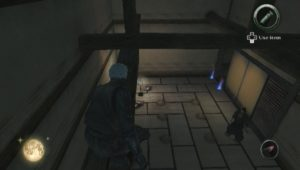
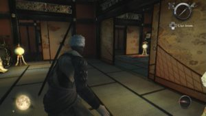

After a flash on Xbox 360, Tenchu arrives at as a wolf on Wii. Scheduled for March 5th, Tenchu Shadow Assassins has the honor of a preview after what it achieved at the last Tokyo Game Show. The result seems always so convincing? This is the question that the following attempt to answer.

The first strong point of the game is to return to a more classical style than Tenchu Z which included creating your own ninja. A point of creation but the possibility to find the cheap Rikimaru and Ayame adorable. Originality, it is very nice because we don’t face a narrative echoing like those of the other episodes but on the contrary, the pleasure of the reunion is indeed real. In addition, it helps to consolidate a mythology implementation that is over 10 years old. It will therefore not be surprised to find Lord Goda, for who the knights of the shadow work, or the princess Kiku who don’t find anything better than to be kidnapped early in the game.

You can use several objects, some unpublished. I am referring to a fishing rod which you can retrieve objects from a distance, cats (it is possible to embody it a moment) to distract the guards or even the bottle of water to extinguish the useful torches. In this regard, remember also to blow out the candles to create zones of shadows, this is the most important of the game. As long as you stay in the shade (Rikimaru becoming opaque), you cannot be spotted by a guard. Available to you in this case along the walls to move from grove to grove (thanks to a short stroke with the Wiimote) or jump from beam to beam to reach your target and eliminate him as discreetly as possible. The furtive dead performed with the simplest way with a little manipulation of the Nunchuk and the Wiimote, it will be easy to leave behind a river of corpses. This is just the criticism of the Assassins Tenchu Shadow which is sometimes a little too lax, the guards are not particularly intrigued by the body of one of their comrades lying on the ground. Suddenly, AI suffers as the impression of danger is almost nonexistent. It's far from certain very stressful levels in the first versions on PS1. However, we pest against throwing shuriken, which is here extremely difficult to guard. This strange weapon is primarily used to extinguish candles at a distance.

Yes, there are many techniques to go unnoticed in Tenchu 4. Hiding in pots, under floors, everything is good for our target and expects to render life in a stylized slow motion. In this regard, note that the layout of the title is the most fun, the graphics unit providing an undeniable stamp. However, some animations are jerky, especially when you're hanging from a beam. Speaking of that, it is unfortunate to note that Rikimaru, once arrived at a corner, cannot continue to grow, and then allow the player to go up on the beam and jump to the next. I admit I quibbling since almost all the gestures made with a simple press of a button, they vary depending on where Rikimari is. So, what class to see our ninja jump in the air in a corner and remain suspended while it guards pass underneath. On this point, it is a fact, Tenchu Assassins is strong. It may be criticized several graphical bugs or too easy but for the time being the charm operates through an excellent game, music and a sumptuous ambiance successful.
