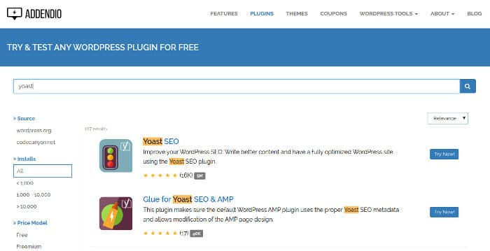

If your site is getting good traffic, and if a new version of the plugin you're using has been launched, you'll have the following two questions in the mind:

1. Will the plugin break your site?
2. Is the plugin worth installing?

Even though the plugins are thoroughly tested before launch, it may have some bugs. If you install the update, your site may crash or it may add HTML code which may affect your site's ranking in Google or Bing.

To make sure that your site's search engine ranking isn't impacted by the broken plugin and the user experience isn't affected, you must test the plugin before installing it on a live site.

Most people will enable maintenance mode on their site or they'll install WordPress on their PC for testing the plugin. The two approaches are good, but they have some drawbacks.

If you turn on maintenance mode, visitors will not be able to access your site. Installing WordPress in the localhost environment is not a piece of cake.

A developer has launched a new tool called Addendio that allows WordPress users to test the plugins before installing on their website.

### How to test plugins with Addendio?

Addendio is an intuitive tool. It has a search option to find the plugin or theme. Users must enter the name of the plugin in the box and then, they must click on the search box.

Addendio will display a list of plugins. Users must click on the "Try Now" button beside the plugin which they want to test. When they do so, Addendio will open a new page in the browser. It will display options to select WordPress version, language, and email address. It will also display a button.

Enter your email address and click on the button. Addendio will display the sandbox URL and the login credentials for a test website. Click the URL. You'll now see a WordPress test site. Log in to this site with the password/username and start testing the plugin.

You can test the plugin for 15 minutes. After 15 mins, the site/sandbox will be destroyed.

Conclusion: Addendio is a great tool to test plugins before you install them on your website. It is free and easy to use. Apart from plugins, you can test free WordPress themes available in the WordPress repository with this tool.
