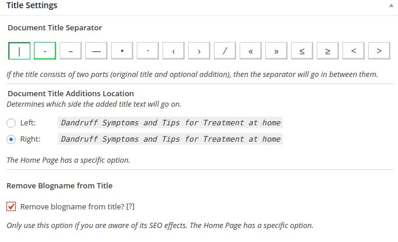
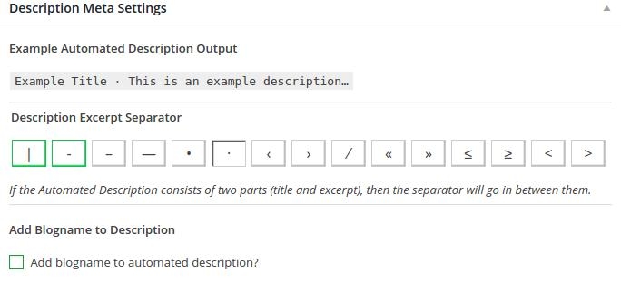
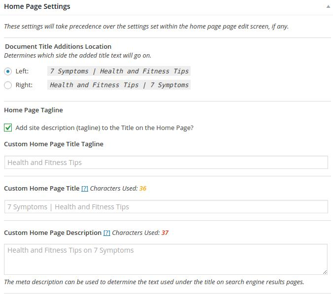
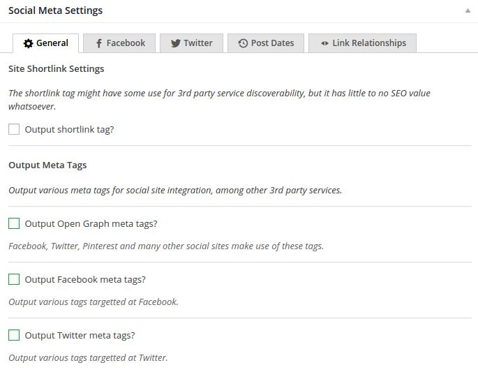
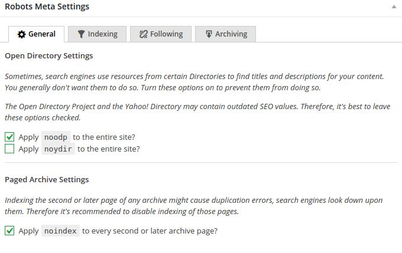
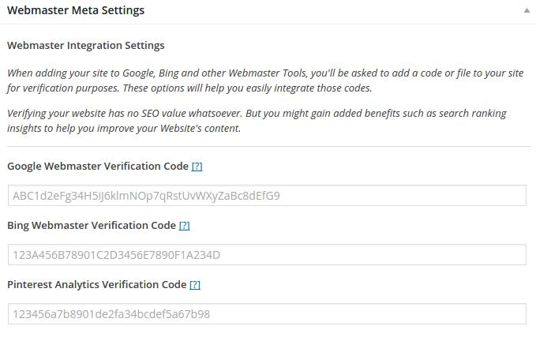
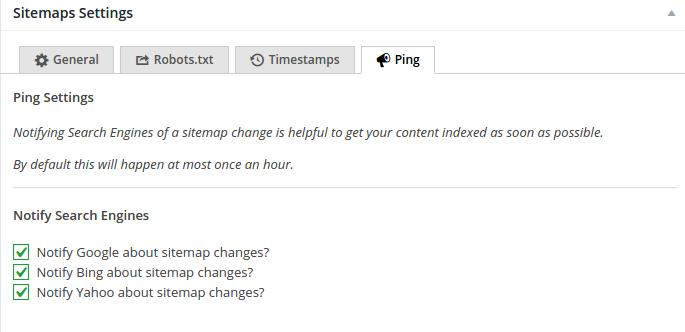
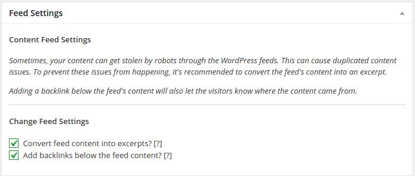

Yoast is no doubt the best SEO plugin, but its version 3.0.x has disappointed a lot of WordPress users. The plugin is useful, but you cannot get support from Joost De Valk and his team unless you're a premium user. Because of these two reasons, many people have switched from Yoast to its alternatives.

A new plugin called the SEO framework is getting a good response from the WordPress community and it is emerging as an excellent alternative to Yoast. Is this plugin right for you? Check out the below review to know this.

### Review and how to use the plugin?

The plugin adds a sidebar shortcut in the WordPress to configure SEO settings. Unlike Yoast and AIOS, there are no tabs in TSF. A single page displays all options.

### Title Settings

The plugin lets you specific a title separation and location (right or left side of the blog name). Example:

This is the 1st post | HostileBlog

HostileBlog | This is the 2nd type.

There are 15 separator types to choose from. If you don't want the title tag to include the site name, the SEO framework plugin has an option to remove it.

### Description Settings

Along with the Title Tag, the description is one of the most important HTML element of a web page. For making sure that the article's meta description has the important keywords, the SEO framework plugin will automatically insert it in the desc tag. It will also add a small excerpt to keep the description unique on each page.

This function is useful for large sites that have 1000s of articles. For smaller sites, the page or post edition will display a field to add meta description manually.

### Homepage tagline

No matter what the domain is, Google will always rank the home page on the 1st page of search results. If your website is famous and many people visit it by simply entering the domain name in Google Search, the SEO framework has tagline settings that let you make the site tagline more interesting by allowing the user to enter the custom home page title and description.

The plugin has options to add noindex, nofollow or noarchive robots meta tag to the homepage.

### Social Meta settings

The plugin can generate and insert open graph meta tags Facebook, Twitter, and Google plus. To use this function, you must enter your Facebook, Google plus or twitter profile links in their respective fields.

The plugin can insert post published and modified date in the <head></head> section of the site. It can also add the rel="next" or rel="prev" tags when you've split a long post into multiple sub-pages.

Like Yoast, the SEO Framework plugin can add knowledge graph meta tags.

### Robots Meta Settings

To prevent duplicate content, the SEO Framework includes an option to add noindex robot tag to the archive, author, category, tag, attachment, date and search pages of a website. You can also add a nofollow attribute to them. The plugin lets you insert noodp and noydir robots tag to the entire site.

### Webmaster meta settings

If you use the Bing or Google Webmaster tools, you can easily verify your website with the SEO Framework plugin. You can also add the Pinterest analytics code if you want to check how your site is performing on the Pinterest.

### Sitemap

Like other SEO plugins, TSF can generate a sitemap for Google, Bing, and other search engines. If you want your new articles to get indexed quickly in the modern search engines, you can enable the ping Google and ping Bing and Yahoo options.

### Feed:

Many websites scrape your content and publish it without your permission. The scraping is done by a software or a web application. To make sure that a link to your website is added when an article has been scraped, the plugin features the add backlink below feed content option.

**Other important functions:**

- Displays potential SEO issues in the post section of WordPress dashboard.
- Adds breadcrumbs automatically for each post.

The plugin looks promising, and it has very useful features.

**Download the plugin here.**

#### Am I using it?

No, but I may use its next edition. I don't want to see titles in the meta description of the blog posts. The SEO framework has no option to turn off breadcrumbs. Because of these two missing features, I'm still a Yoast user.
