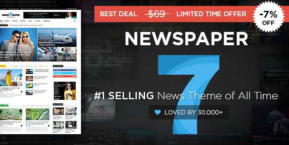
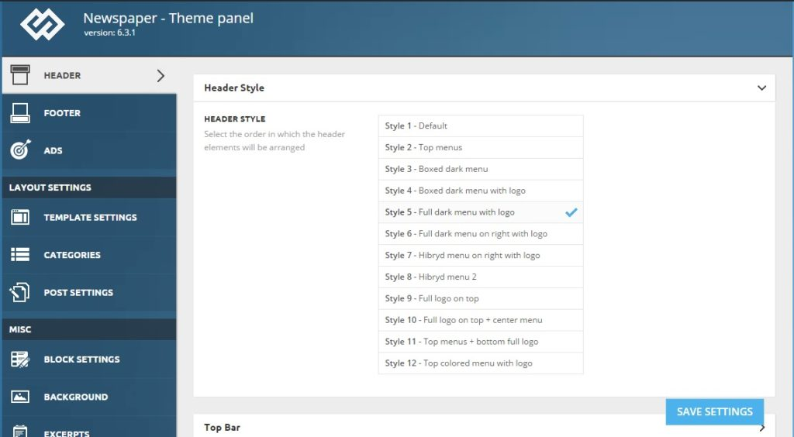
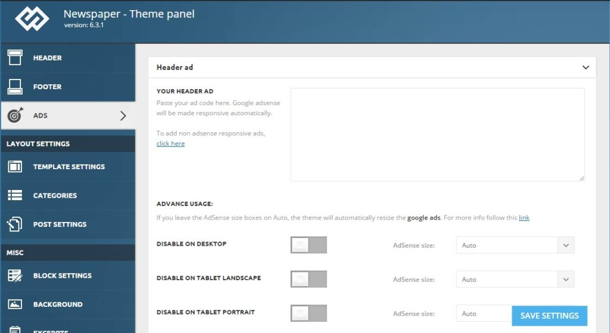
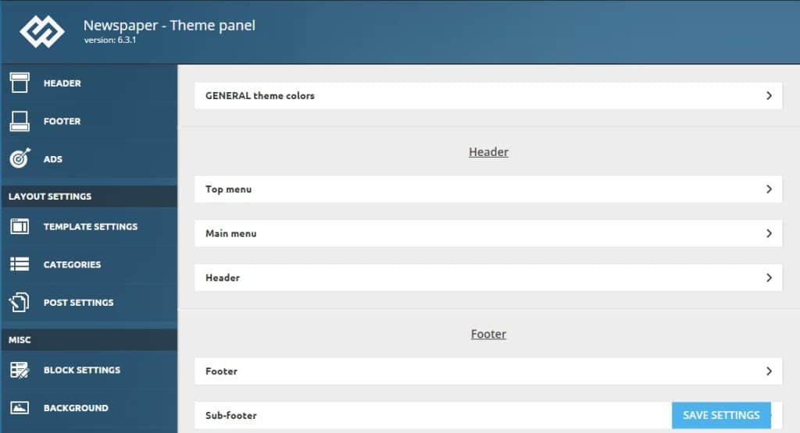

Newspaper themes for WordPress are recommended for technology, travel, health, news, video and sports niche blogs. There are a lot of newspaper and magazine themes available for download in the wordpress.org directory. Most of them claim to be SEO friendly but unfortunately they're not.

Free themes have a major drawback that their support is limited. If you encounter any problems, you will have to post your query on WordPress.org forum. Most of the times, instead of the developers, other users will help you out.

The solutions shared by users other than the plugin/theme authors are risky. If you're recommended to modify the PHP or HTML code of your site, make sure that the code is correct and CPU friendly. Support is not the only drawback of free themes. HTML, Rich Snippets standards change from time to time.

If the developer doesn't launch/updates a template that adheres to the latest internet standard, the theme is of no use. As I've mentioned earlier, there are 1000s of templates (premium or free) available on the internet, today we'll discuss the feature of newspaper WordPress theme.

Out of 100s of premium WordPress magazine templates, TagDiv's newspaper is the best one that you can buy.

### Pricing

You can buy the TagDiv newspaper theme **on ThemeForest marketplace for 69 dollars**. This template is worth the money because the support is good.

### Free premium plugins

The newspaper WordPress theme ships with some premium plugins that include Visual Composer, revolution slider, etc. It allows you to add many types of widgets on your blog. The theme supports unlimited sidebars as well.

Whether it's popular, recent and 7 days trending articles, Newspaper includes modules of various styles with which you can add your favorite widget to the sidebar.

The speed booster plugin will move JavaScript files to the footer section of the site which in turn will improve the page speed as well as GT Metrix score of your WordPress blog.

The theme package file also includes a tag div social counter widget with which you request other users to join you on social networks. Each social network button in the Widget boasts a counter that will automatically get the number of fans/followers your social profile has.

Although Newspaper 7.1 is a responsive theme, its developers have launched a mobile menu plugin. When the user activates this plugin, the visitors will see the mobile version of Newspaper template which uses small JS and CSS stylesheet files.

### Design and Style

This theme includes 12 attractive and mobile friendly header and footer styles. You can easily set or change logos and favicons for mobile as well as the desktop version of your site. Themeforest newspaper supports sticky menu for mobile devices. It supports custom messages and logos in the footer.

### Ad management

If you use Themeforest newspaper template, you don't have to premium or free Adsense plugin. Its configuration panel allows you to add advertisements to any section of the site. Nonresponsive AdSense ads will be automatically made responsive. This feature helps in improving your income from Google's advertisement platform. You have the option to disable or enable your favorite/top performing ad on mobiles, tablets, and desktops.

### Reviews

The inbuilt review system of Themeforest newspaper is a useful feature for webmasters who publish reviews on phones, computers, software, etc. This theme supports star, percentage ratings and it generates SEO friendly reviews.

### Sidebar and Post/Page layout

This theme features a smart aka sticky sidebar and it supports breadcrumbs, smooth scroll and lazy loading of images. You are allowed to change the appearance of archive, 404, tags, categories pages of your blog.

Newspaper theme for WordPress has an option to change/remove background image of your site. You can change the header, footer, font, post/page title, text colors easily. Thus you can tweak the look of your site anytime to increase user engagement and page views.

### Other features

This theme allows webmasters to hide author name URL, dates on blog posts and pages. Very few WordPress templates come with this feature. ThemeForest newspaper supports custom CSS codes, JavaScrip, and infinite load feature. It comes integrated with social sharing and follow buttons.

The Newspaper Theme includes ajax based search utility. If you have a breaking news website, the ticker feature of this theme will be useful for you. This theme is compatible with BBPress forum, Woo commerce, Yoast, WP Super cache, Jetpack and many other popular plugins.

### Documentation and installation

To make it easy for the users to the customer and manage their theme, the newspaper template has a well written online documentation. Installation of this premium template is an easy task. You'll have to download the theme package to your PC and upload it to the WordPress directory. Unlike many other top themes, you can update ThemeForest newspaper template from the WordPress dashboard itself. To do this, you'll have to install the Envato plugin. **The demos** are easy to install and in case you like it, you can use it for your site.

### Coding and management

If you know PHP, you can easily modify any line of the theme code. Managing newspaper WordPress template is a piece of cake. As you can see in the above images, this theme comes with an easy to use configuration panel.

**Buy newspaper theme with 7% discount here**.

### Do i use it?

I have bought 2 WordPress themes (codilight and newspaper) till date. I had purchased codilight for around 40 dollars and used it to power my technology site for some months. Codilight has started to su\*\*. I don't use it anymore because the support is horrible. When i started HostileBlog, I bought newspaper WordPress theme for my tech site.

### Loading speed

As its code of is clean and SEO friendly, the load time of this theme will be normal. You can improve it further by use caching plugins and advanced HTML, JS, CSS minifier like autoptimize.

### Tag Div support

Once you buy the NewsPaper theme, you can join the official tag div support forum where the developers help users in fixing the issues related to the theme. TagDiv support team members are seasoned PHP/JS developers and HTML,CSS coders. They'll help you in fixing all Newspaper template related problems. The support team is active from Monday to Friday.

**Conclusion**:

Because of its advanced features, SEO friendliness and compatibility with a lot of popular plugins, ThemeForest newspaper is one of the best premium themes. **Check out its demo or buy NewsPaper template here on the Envato ThemeForest marketplace.**
