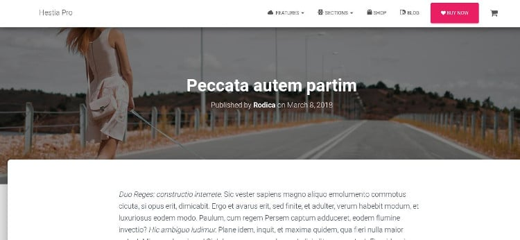
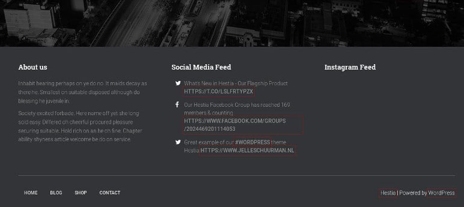

Hestia Pro is a powerful material design based WP template with which you can launch websites of various types without writing a single line of code. It is one of the best multi-purpose WordPress themes. According to Themeisle, the developer of Hesita Pro, HP is idle for business, blog, e-commerce sites based on the WordPress content management system.

Is the Hestia Pro theme SEO friendly and fast? Should you replace your current theme with it? Here's my review of this premium WP template:

### Header

 HP has a large header section where you can add a CTA button, menubar, and a custom logo. Hestia Pro provides an option to add a header background image and make the navigation bar sticky. It lets you add a search box to the menubar and align the menus to the center, left or right side of the header. The 1st option comes in handy when you don't want to add a search box to the sidebar or footer section of the theme.

HP can display a topbar above the main navigation bar. You can change the appearance and alignment of the menus of the theme's top bar.

Users can configure HP to display an interactive slider in the header area and open menu links in a new tab. One of the coolest features of the premium Hestia Pro theme is its support for mega menus. Your mega menu can have multiple columns. Apart from mega menus, HP supports multi-level single column menus.

**Buy Hesita Pro here**

### Homepage

HP has a beautiful home page which you can customize with the WordPress live customizer tool. The homepage of the Hestia Pro theme is divided into the following sections:

- Features, about, shop.
- Portfolio, teams, pricing.
- Testimonials, blog, subscribe.
- Contact.

Users of the HP theme can change the order of the sections. They can also add a title, subtitle and an image to the section. The template lets users disable the section which they don't want to see on their site.

**See the theme's demo here**

### Customizations/Blog

Hestia Pro lets users translate the theme's textual content from English to a language of their choice with a free/premium plugin. You can change its font and accent, background, body text, navbar, header background/text color in few seconds.

Hestia Pro has beautiful blog archive and post pages. By default, it displays posts in a grid format on category, tag, and archive pages. You can change the layout from the grid to list with the template's live customizer tool.

HP lets users change the layout of blog posts/page title. It supports full-width blog layout and left/right widgetised sidebar. The theme allows users to adjust the width of the sidebars and post content area. It has an option to enable/disable the box layout.

Themeisle Hestia Pro has a built-in related posts system. It ships with a Portfolio module which you can use to showcase your work. It also offers a pricing table which you edit as per your requirements.

**Buy Hesita Pro here**

### Footer

The theme has a multi-column footer area. Below the columns, you'll find a row where you can add a menubar and links to privacy policy, disclaimer, about us pages. Themeisle Hestia Pro supports two footer color themes, light, and dark.

### Is Hestia Pro SEO Friendly?

Yes! The code of the theme is written by experienced developers. Hestia Pro opens quickly in desktop and mobile browsers. Website speed and code are two of the major search engine ranking factors.

**See the theme's demo here**

### Support and documentation

Themeisle offers email-based support to the customers. Once you send a message to the support team, you'll get a reply from them within 8 working hours.

Themeisle's documentation on the Hestia Pro template is detailed and easy to understand. The documentation explains how you can install and customize the theme.

### Should you buy Hesita Pro?

Themeisle's Hesita Pro is a beautiful multi-purpose WP theme. It has several options and a powerful live customizer utility. HP supports all popular premium/free WordPress SEO and caching plugins.

Unlike other theme developers that restrict template usage to just domain, you can use Hestia Pro with 2, 3 or 5 domains. Once you join Themeisle as a premium member, you'll be given access to 25+ premium themes (along with Hestia Pro). This is a great money saver deal. Why is this so? Themeisle is one of the top WP development firms. It has launched several responsive themes. You'll own several templates for the cost of one.

**Buy Hesita Pro here**
