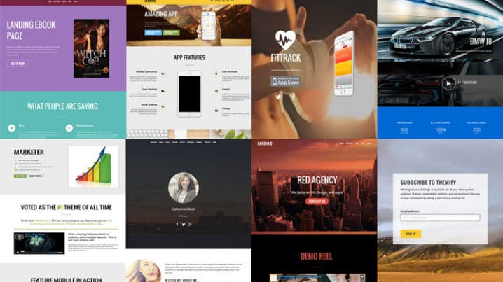
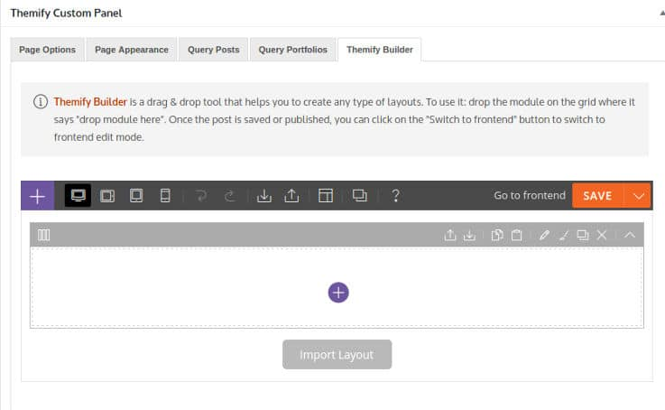
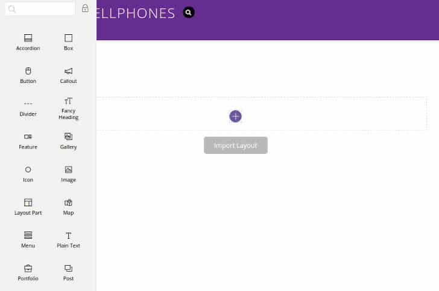
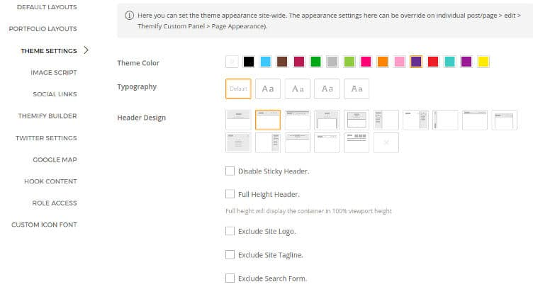
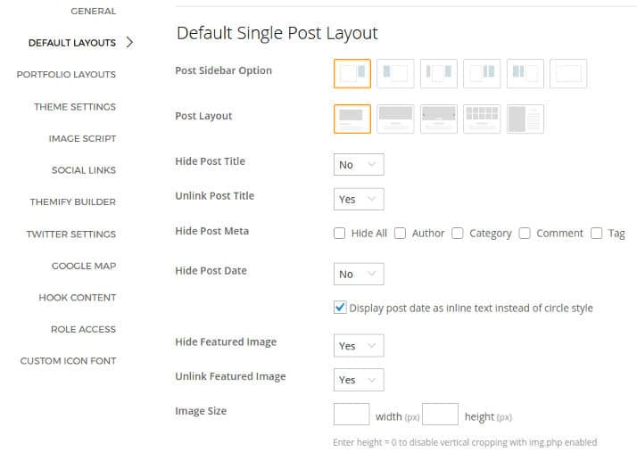
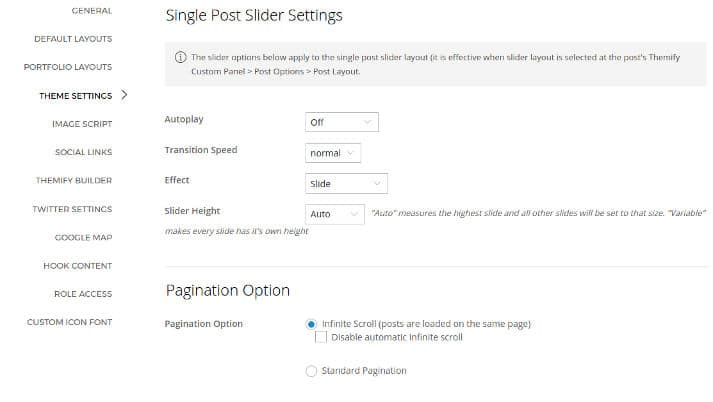
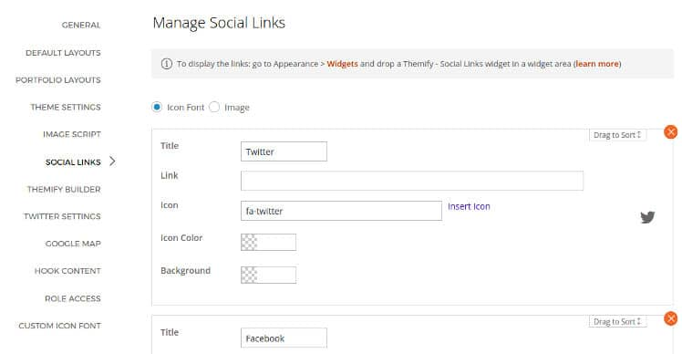
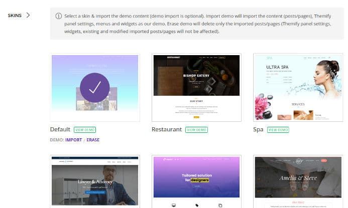

WordPress theme development companies don't run for a long time unless they offer quality support to the customers or launch products that are worth the money.

Themify is one of the most successful WP theme development firms. It has introduced several themes till date. The themes launched by this firm are active on 50000+ sites.

The most popular theme from Themify is the Ultra theme. I had purchased the WordPress Ultra theme a few months back and I'm using it on two sites.

Ultra is a versatile theme that you can use on any type of site. Ever since it has been launched, Themify has updated the Ultra template every 1 or 2 months. They have added plenty of features. Thereby making Ultra one of the best premium templates for WordPress.

Here's my review of this premium WP theme.

### Themify Ultra Review

Ultra is a powerful multi-purpose WordPress template. It has numerous features and plenty of customization options. The most important feature of the theme is the drag and drop page builder tool.

See the theme demo here

### Drag and drop builder

Themify Builder is a powerful tool for creating new pages or customizing the existing pages. If you buy it individually, the builder will cost you $39. Buy if you buy the Ultra Theme, you'll get it for free. The page builder from Themify is easy to use.

Users can access the page builder while editing the post or page or by clicking on the Turn on Builder option from the WordPress admin menu.

The builder allows you to import layout from one page to another. It lets you clone and customize the blocks (elements). You can specify the number of rows or columns your page must have.

You can add the following elements to the page with the page builder tool.

- Accordion, box, button.
- Divider, callout, fancy heading.
- Featured post, image gallery, map.
- Menu, text, video, slider, tab, etc

The builder tool allows you to generate shortcodes for the above elements. It supports font and color customization. The Ultra theme provides 15+ premium Themify Builder extensions, which you can use to create powerful and beautiful business websites. You can use Themify Builder on posts as well as pages.

If you don't want to create pages manually, head over to the theme settings panel. The panel has 10+ tabs. Each tab provides a different option.

Download the theme here

### Themify settings panel

The settings panel of Themify Ultra has a tabbed interface. You can change the theme's appearance, layout, colors with it.

### Header

The Themify Ultra theme provides 15 different header styles. It allows you to the change the color of the header elements. You can configure the theme to display social network icons, mega menu, and WordPress widgets in the header.

Ultra provides 1-click option to show or hide the site logo and main menu.

Also read: Elegant Themes Review

### Body

The Ultra Theme offers five different single post styles. It supports full-width layout and provides an option to hide post title, data, post meta links, featured images, etc. The theme lets users specify the featured image size. It enables you to hide or show post navigation i.e. next and previous links.

Ultra allows users to disable post comments. Unlike many multi purpose themes, Ultra supports two adjacent sidebars. You can also configure it to show left or right sidebars or both at the same time.

### Footer

Like the header section, you can customize the footer area of your site from the settings panel. The footer section supports widgets. You can configure it to show the website logo, copyright notice, a custom text message, etc.

See the demo of the theme here.

### Minification and built-in caching

A premium theme may have large JS and stylesheet file. To make sure that the CSS and JS files loaded by the theme don't affect the website speed, Ultra provides an option to enable caching of builder components, minification, and gzip compression.

### Social icons

Themify users don't have to install third-party social icons plugin because the theme has this feature built-in. The theme settings page allows users to configure social network icons. You can customize the background and icon color. You can also specify an icon for the social media icons.

Must see: Mythemeshop Review 

### Image script

Themify Ultra theme allows you to use custom size photos in blog posts. It also enables you to add widgets containing thumbnails. Suppose the size of an image is 720 x 300 pixels. Although you can use JS or CSS to resize the image, it wouldn't be feasible to use the same image in the div having width of 500 and height 200 pixels.

When you switch themes, the new theme may not support the image size supported by the previous theme. Here's when the thumbnail regenerator plugin comes into the picture. When the plugin is active, you can resize images in bulk.

The Ultra theme is powered by a script that resizes and reduces the size of images dynamically. This feature ensures that images fit perfectly in a div. Hence, if you're using Ultra template, you don't have to use WP plugins for generating thumbnails or changing image size in a bulk.

Click here to buy the theme.

### Demos

### Support

Once you join Themify, you'll get access to the highly active Themify support forum. Each theme has a different forum. The Ultra theme's support forum has 100s of threads. If you're finding it difficult to customize the theme, you can get help from the tech support staff by creating a new thread.

The forum has a search option. Before creating a thread, use this option to check whether the question you're going to post has been answered or not.

Also read: Divi WordPress theme review

### Pricing

The Ultra Theme costs $49 on themify.com. If you buy this theme, you'll get a free premium theme worth $49. Themify also offers a special membership program called Themify Club. If you join this program, you'll get access to all premium Themify themes. The subscription cost for the same is $79.
