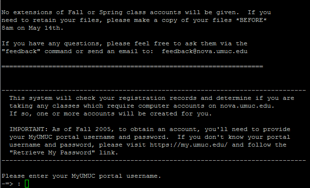

Nova is a Unix based web server which is used through various computer studies courses at UMUC. If you are taking one of my web design classes or are enrolled in another UMUC class that uses Nova, the information provided here should be helpful. Nova is the server you will be using to setup your web directories for publishing content online. In order to set up a Nova account you will need you MyUMUC login and password. Once created you will be assigned a unique Nova login account.

To set up Nova you will need to use an SSH (Secure SHell) client. If you are a Windows user you will need to download an SSH client. I highly recommend PuTTY, which is is a free program that you can download from https://www.chiark.greenend.org.uk/~sgtatham/putty/latest.html.

Mac Users: you do not need to download PuTTY as SSH is built in. You can connect by using the Mac Terminal (Under Utilities) and entering the command 'ssh username@nova.umuc.edu'. For your account setup you will enter 'ssh newclass@nova.umuc.edu' to run the **newclass** command (outlined in the video). Let me know if you run into any problems.

<iframe width="560" height="315" src="https://www.youtube.com/embed/upyOgCB0hXY?rel=0" frameborder="0" allow="accelerometer; autoplay; encrypted-media; gyroscope; picture-in-picture" allowfullscreen></iframe>

## Step 1 Create your Nova Login

SSH into nova.umuc.edu. If you are a Mac user, open Terminal and enter the following command:

```
ssh newclass@nova.umuc.edu
```

If you are a Windows user, open PuTTY and enter nova.umuc.edu in the hosts field. Click 'Open'. Once you are connected to Nova, either via the Mac SSH Client or PuTTY, at the login prompt type

```
newclass
```

and press enter

- The 'newclass' command will prompt you to supply your MyUMUC login credentials, which is the same username and password you use to access LEO.
- If you cannot remember your MyUMUC (Portal) login information click here:http://www.umuc.edu/suppserv/it/hosts/itfaq.html#myumucpassword



## Step 2 Verify Account Creation

- Your student information will be verified and classes for which you are currently registered will be listed. You will receive one of the following messages:
    - **Account not needed:** No computer account is required for this class, or if an account is required, it is not the type created by the newclass system.
    - **Account already exists:** You have already used newclass to create an account for this class.
    - _**Account will be created:** An account will be created for this class during this newclass session._
- You should receive the third message since this is a new account for the class.
- Press enter and your account will be created (please allow several minutes for this process to complete).
- You will need to accept UMUC's computer user policy at which point please type accept and press enter

**Write down your user account name and password. You will need this to log back into Nova. Press enter to end the newclass session**

## Step 3 Create your www folder and set Unix Permissions

Login to Nova with your new credentials (obtained above). At the Nova Prompt \[username@nova ~\] enter the following commands one at a time. (Be sure to include the period in the second command).

```
cd
chmod 711 .
mkdir www
chmod 711 www
```

**Explanation of commands**

- **cd** (change directory) - with no further specified directory, Linux changes your current directory to your home folder / directory
- **chmod 711 .** changes permissions of the current directory you are in (.) to 711
- **mkdir www** creates a directory called www
- **chmod 711** www changes permissions of the www directory to 711

At this point your account is setup and ready for you to upload files. Be sure to upload all files into www. Your homepage is http://nova.umuc.edu/~ct385xx (replace xx with your ID). So if you upload index.html to www your homepage will be http://nova.umuc.edu/~ct385xx/index.html or simply just http://nova.umuc.edu/~ct385xx (as the index.html file is known by convention).

For more information on permissions, see Unix Permissions for UMUC's Nova Server Explained.
