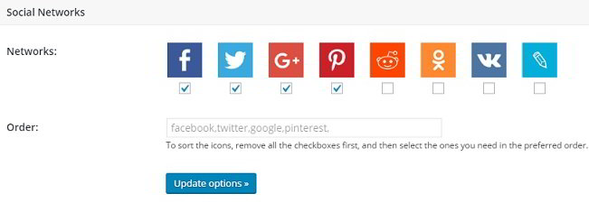
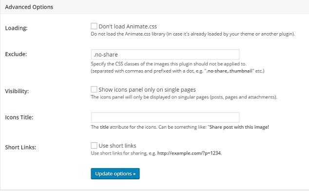
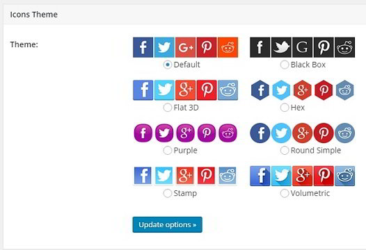
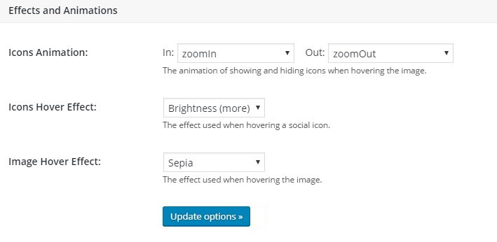

A blog post is incomplete without images. Imagine if a site has no photos, will you spend your time going through the content?

A visitor to your website might be impressed with the picture you've embedded in the blog post. He may want to share the image on social networks. Some users may not waste their time in copying the photo URL by right clicking on the page. They may exit your website and use Google image search to get a link to the picture.

To avoid this scenario, download and activate on of the below best image sharing plugins for WordPress:

### Cool Image Share

I have tested this plugin on one of my blogs. It works well. Cool Image Share plugin adds a settings page to your website where you can manage the appearance, position, effects of the social buttons. It uses CSS3 to add icons at one of the below positions when user hovers his mouse cursor on the picture:

- Botton right, top left.
- Top Right, Center.
- Top Left.

You are allowed to set icon's orientation to horizontal or vertical and change its default size with this plugin. Cool Image Share can be configured by the users to add social buttons on pictures with a particular size and disable showing of icons on mobile devices.

This free WordPress plugin allows you to choose the below social networking buttons for your website:

- Facebook, Twitter, Google Plus.
- Pinterest, Reddit, Odnoklassniki.
- Vkontakte, LiveJournal.

Users are allowed to change the order in which the buttons should appear. LinkedIN/WhatsApp button is not available and drag and drop of buttons are not supported yet.

The free plugin supports eight unique button styles. It has advanced settings where you can configure Cool Image Share to:

- Disable loading of animate.css file.
- Prevent adding social sharing buttons on photos with specific CSS class.
- Specify a title for the buttons.
- Enable Shortlink support for sharing.

The Image Share Plugin lets you specify icon animations and hover effects for the sharing buttons. It offers more than ten eye catchy animations and effects for you to choose.

This plugin nofollows social media website links in the sharing buttons. It settings page flaunts a preview image for testing the configuration.

CIS is a free plugin. You can download its Zip package file here from the WordPress.org website.

There are some plugins like this one on the WordPress repo. Unfortunately, the plugins have poor rating and users doesn't seem to be satisfied with them. CIS is a new plugin, but it works great. Try it out.

In case you want your website to have additional social network sharing features, (Ex click tracking, native buttons, color customization, support for all major social networks and more) go through our detailed reviews on ElegantThemes Monarch and Easy Social Share Buttons for WordPress plugins.
