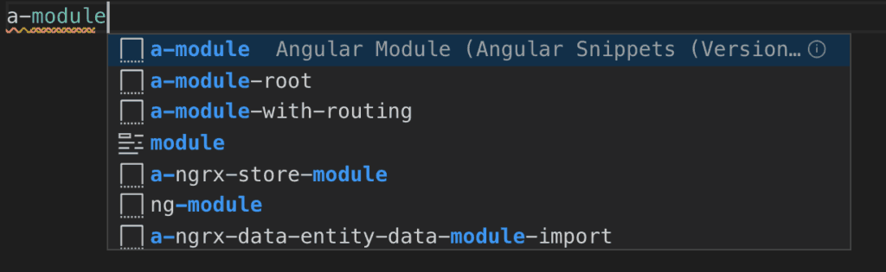
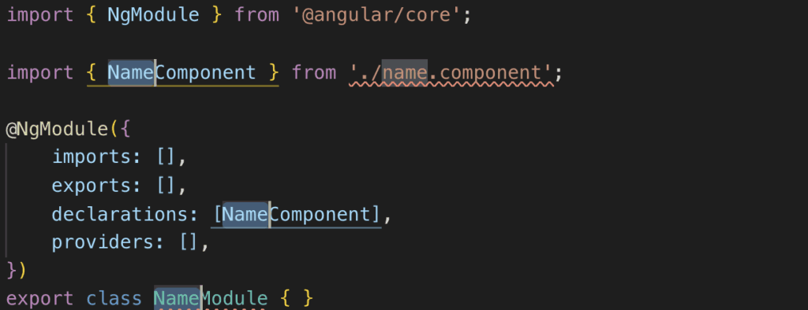
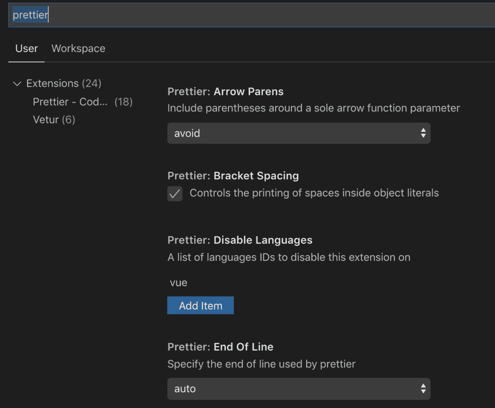
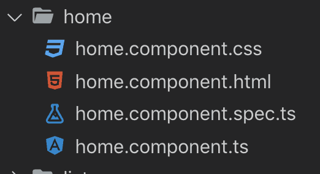

If you've been doing any development in Angular, the chances are you have been using Visual Studio Code (VS Code) for your editor. If you haven't been using Visual Studio Code, I highly recommend checking it out. There are a number of extensions that I have come to rely on that greatly simplify my development workflow listed below. I've included my favorite top ten with their descriptions and links below. To install them, simply start VS Code and open the command palette (Ctrl-Shift\-P) Windows / Linux or (Cmd-Shift\-P) Mac, and select Install Extension. Choose the extension name from the list and once installed reload/restart Visual Studio Code. Hopefully you will find these extensions as useful I do.

## Angular Snippets

This excellent extension written by John Papa provides a great way to access shortcut snippets of Angular code that are commonly used in development ranging from Typescript snippets to Ngrx, JavaScript and HTML. Once installed you simply start typing a- (a dash) and the snippet name. For example if I wanted to scaffold a new module, I simply type a-module and select the snippet.

As you can see from the screenshot below, the snippet code is provided and ready to customize for your own use case.

**Link: Angular TypeScript Snippets for VS Code**

## Angular Files

Angular Files is another extension that you will come to love if you aren't already using it. It simply extends functionality of the Angular CLI directly into the VS Code explorer by providing shortcut menu items to create new Angular files. Simply right click in the explorer where you would normally create a new file and you will be presented with an additional list of generate options. The extension will enable you to be able to directly scaffold code for components, directives, pipes, services, and modules. In addition to Angular specific files, you will also be able to directly generate TypeScript classes, enums, interfaces and routes.

**Link: VS Code Angular Files**

## Angular Language Service

This extension gives you Intellisense within Angular templates, which provides nice auto-completion options. The main features include access to completion lists, AOT Diagnostic messages, quick info, and go to definition. These features are especially useful in many use cases. For example, if you are accessing an object where you need to select a specific property, these will be displayed in drop-down selections.. The extension provides some of the rich editing experience directly in your templates that were only possible in your main ts code files before.

**Link: Angular Language Service**

## Angular2 Switcher

Don't be confused by the name. This extension fully works in later versions of Angular. It provides a quick set of keyboard shortcuts to navigate between .ts, .html, .css, and .spec.ts files within your modules quickly.

- alt+o (Windows) shift-alt-o (Mac): Switch to Template / .html
- alt+i (Windows) shift-alt-i (Mac): Switch to Styles / .css
- alt+u (Windows) shift-alt-u (Mac): Switch to TypeScript / .ts
- alt+p (Windows) shift-alt-p (Mac): Switch to Tests / spec.ts

By selecting the shortcuts above a second time, you will be returned to the previous file you were editing. As soon as you start using these shortcuts, you will quickly realized how much more efficiently you will be able to navigate within your modules!

**Link: Angular2 Switcher**

## Auto Rename Tag

Not an Angular specific extension, but a must for any tag based development in VS Code. The extension does exactly what it name implies, auto-renames tags (when you change the name of one tag, the other tag in the pair will also be updated).

**Link: Auto Rename Tag**

## Bracket Pair Colorizer

Have you ever been writing code where there are many embedded brackets and it's difficult to keep track of where they are opening and closing? Thanks to this nice extension you will have an easier time. Bracket Pair Colorizer simply colorizes your bracket pairs so you can keep track of them. It also lets you customize the matches should you not be happy with the out-of-the box configuration.

**Link: Bracket Pair Colorizer**

## Debugger for Chrome

This extension provides an easy way to debug your JavaScript code directly from within VS Code. You get all of the features you would come to expect from a debugging tool including the ability to see the call stack in progress, step and out of code, and view details of objects and variables. See How to set up the debugger for Chrome extension in Visual Studio Code for a solid tutorial on getting started with debugging in VS Code using this extension. The extension homepage (below) also provides great documentation.

**Link: Debugger for Chrome**

## Path Intellisense

If you use a lot of imports in your code or simply references to other assets such as CSS or JS files, you will find this extension extremely helpful. Path Intelllisense provides shortcut suggestions for finding your way through your file system. Simply start typing in your path in a link reference or import statement and you will be presented with an easy to navigate dropdown.

**Link: Path Intellisense**

## Prettier

Prettier is my favorite code formatter and integrates nicely into VS Code with the associated extension. Once installed you can configure many of the settings (ctrl+,) Windows/Linux, (cmd+,) Mac, search for Prettier and customize as needed.

In the settings I would also recommend searching for 'format on save' and update this setting to true. If you don't like auto formatting on save, you can simply use Prettier at any time with the format shortcut (shift-alt-f) Windows/Linux, or (shift-option-f) Mac.

## Material Icon Theme

Finally, this extension is more of an optional / nice to have feature for VS Code. I like it as it makes my file system / explorer nicer to look at and I have grown used to having it over time. The theme essentially uses Google's Material design library to add nice icons to the explorer.

Icons are provided for both files and folders and you can even customize the colors as needed. For more information on customization options, see the extension documentation provided in the link below.

**Link: Material Icon Theme**

## Wrap up

Finally, to wrap this up there are other extensions you will most likely come across to make your workflow more efficient. This is by no means a definitive list, however the extensions here are ones that I use frequently in my work. I would also recommend looking at other linting extensions such as the terrific TSLint extension, however keep in mind that TSLint is being deprecated and eventually be replaced by ESLint. I would also be remiss to not mention the excellent Angular Essentials, which comes along with many of the extensions mentioned here along with recommended settings. If there are other extensions you find useful in your own Angular development, feel free to share them in the comments section below.
