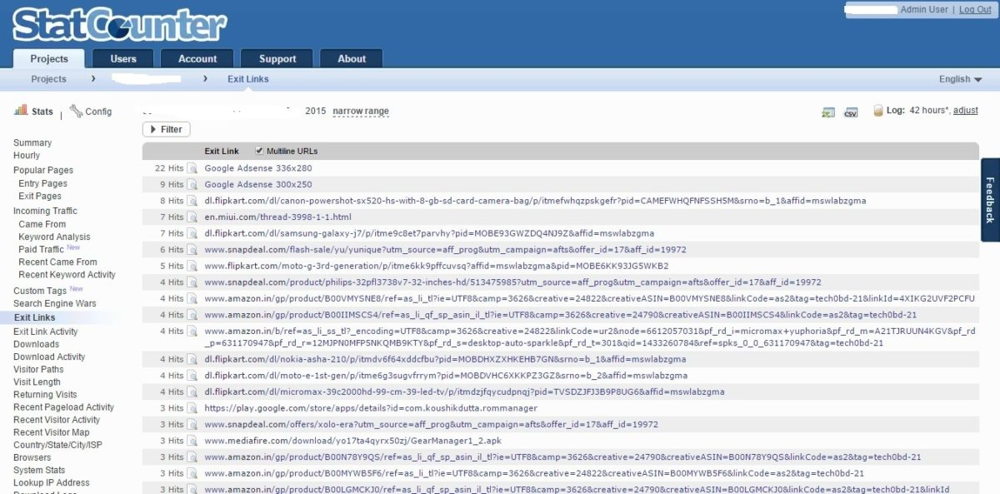
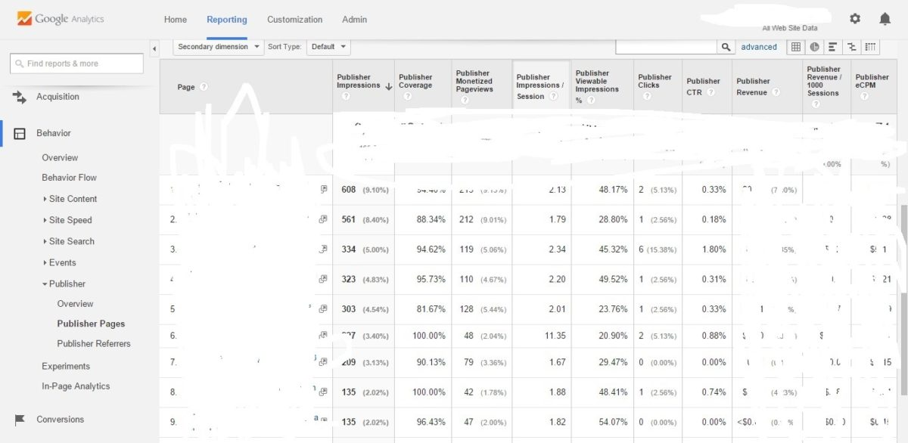

When you own an AdSense account, it's up to you to safeguard it. Many accounts get banned every day because they take AdSense program lightly. There are two ways you can keep your account safe i.e., avoid clicking on your ads and report invalid activity to Google. The 1st method is easy to follow because you just have to install an ad blocker plugin on your browser. The browser will prevent ads from loading on websites.

The 2nd method is critical because you'll have to track AdSense click bombing activity at any cost.  Most of the users don't track the clicks because they don't know the right tools for the same. Below are the **tools that allow you to track clicks on AdSense ad units**.

### Statcounter:

This is an analytic tool that can be used free of cost. The only disadvantage of the free account is that your site will pass page rank and link juice to statcounter.com. You can't remove the code embedded in <noscript> tags.

To modify the code, you should be a premium subscriber/user. Statcounter will not cost you 100s of dollars. You can pay just 5 dollars to track AdSense clicks and identify the users that are trying to ban your Adsense account. The 5 dollars will make StatCounter log 5000 records. If you want this tool to maintain more data, you'll have to signup for the 9 dollar plan.

Statcounter comes with many advantages. It has an easy to use dashboard that generates many types of useful reports on your demand. It has exit links report that will make you aware of all external link clicks (including AdSense clicks). When a report is displayed, you can easily get the IP address of the visitor by clicking on the magnifying glass icon.

**There's no cheaper or good StatCounter alternative** as this is the only tool that can track clicks made on ad units. The script provided by this web analytics application is easy to implement. You can place the code in the header or the footer section.

I've used this service for 12 months, and it never affected the performance of my blog. Visit StatCounter here.

### Google Analytics (GA):

This is the **best analytics tool for websites, apps, and blogs**. It is entirely free. GA is the perfect tool because it provides users a lot of details on their website traffic data.

It is capable of generating 50+ types of report. You can use the reports to improve your website performance, bounce rate, conversion rate, etc. As this is a Google service, it is up all the time, and the tracking script will load very fast.

To track AdSense clicks with GA, you should link your both accounts. You can follow this tutorial for the same

Tracking clicks are not easy. Although GA will maintain ad click data and it will make you aware of culprit's city, time, browser, OS, etc, you will have to track down the IP address of the user.

You can do this only by referring the raw access logs. I use Hostgator, and this web hosting service supports traffic logging. You'll have to enable it via your CPanel if your hosting service supports traffic logging. Finding IP address of the person behind invalid click activity will be an easy task if you have knowledge on UNIX commands and pipes. For a regular user, this will be time-consuming because the user will have to go through heaps of data to find the IP address. If you face any difficulties for the same, you can contact me.

When you find the culprit, make Google AdSense team aware of it using the link I've shared in the 1st paragraph. Make sure that you attach the log snapshot and block the IP address permanently to avoid similar activity in the future. Visit Google Analytics here.

**Bonus Tip**: Use any of the above tools right from the day one you add Adsense code to your blog/website.

**Conclusion**: Google Adsense is the principal source of income for many bloggers around the world. To make sure that it doesn't get banned for invalid click activity, use any of the above tools and keep your account safe. Please share this post if you've found it useful.
